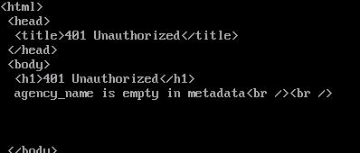
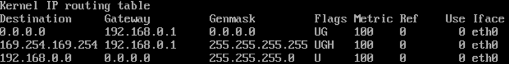
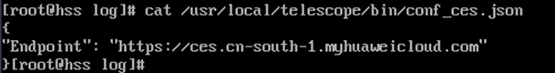
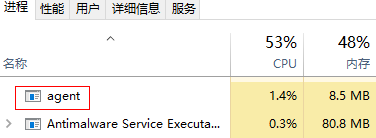
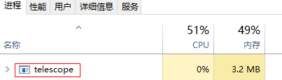
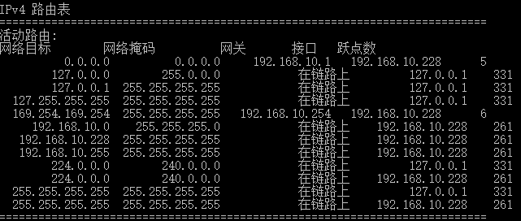

# Agent一键修复后无监控数据问题排查

## 问题现象

Agent一键修复后运行正常，但仍然没有监控数据。

## 问题分析

弹性云服务器或裸金属服务器安装Agent后仍然无操作系统监控数据时，一般考虑有如下几个原因：

-   Agent进程运行状态异常
-   委托异常
-   路由配置异常导致的获取临时AK/SK失败
-   网络问题

## 问题解决（Linux）

1.  以root用户登录弹性云服务器或裸金属服务器。
2.  执行如下命令，检查telescope进程是否存在：

    **ps** **–ef** **|grep** **telescope**

    当显示如下内容时，表示telescope进程正常。

    

    -   进程正常：请执行[4](#li92115274812)。
    -   进程异常：请执行[3](#li1716894718917)。

3.  如果进程异常，执行如下命令，启动Agent。

    **/usr/local/telescope/telescoped** **start**

4.  执行如下命令，确认云服务器委托已创建。

    **curl**  http://169.254.169.254/openstack/latest/securitykey

    -   当有数据返回时，表示获取AK/SK正常。排查结束。
    -   调用失败或者回显如下时，请执行[5](#li46361415407)。

        

5.  在管理控制台的云监控服务页面，选择“主机监控 \> 弹性云服务器”，选择对应的目标云服务器并单击“修复插件配置”。
    -   问题解决，排查结束。
    -   未解决，请执行[6](#li58131029155010)。

6.  执行如下命令，检查路由：

    **route** **–n**

    当返回如下信息时，表示路由正常：

    

    -   路由正常：排查结束。
    -   路由异常：请执行[7](#li165521549125117)。

7.  当路由不存在时，执行如下命令，添加路由：

    **route** **add** **-host 169.254.169.254** **gw** **_192.168.0.1_**

    > **说明：**   
    >上述命令斜体部分_192.168.0.1_为云服务器的网关，请根据实际情况修改配置。  

    问题是否解决？

    -   解决：排查结束。
    -   未解决：执行[8](#li693615335521)。

8.  执行如下命令，打开telescope的配置文件。

    **cat** **/usr/local/telescope/bin/conf\_ces.json**

9.  获取telescope配置文件中的Endpoint。

    

10. 执行如下命令，确认DNS解析是否正常。

    **ping** **_ces.cn-sourth-1.myhuaweicloud.com_**

    -   网络正常：排查结束。
    -   网络无法访问：[修改DNS配置](https://support.huaweicloud.com/usermanual-ces/zh-cn_topic_0150354069.html)或CES的终端节点。

        > **说明：**   
        >各区域对应的云监控服务的Endpoint请参考“[地区和终端节点](https://developer.huaweicloud.com/endpoint?CloudEye)”。  

## 问题解决（Windows）

1.  以administrator权限用户登录弹性云服务器或裸金属服务器。
2.  进入任务管理器，查看telescope进程是否存在

    当包括如下两个进程时，表示telescope进程正常。

    

    

    -   进程正常：请执行[4](#li92115274812)。
    -   进程异常：请执行[3](#li1716894718917)。

3.  双击start.bat，启动Agent。
4.  访问[http://169.254.169.254/openstack/latest/meta\_data.json](http://169.254.169.254/openstack/latest/meta_data.json)，确认云服务器委托已创建。
    -   可访问：表示委托正常，排查结束。
    -   不可访问：请执行[6](#li58131029155010)。

5.  执行如下命令，检查路由：

    **route** **print**

    当返回如下信息时，表示路由正常：

    

    -   路由正常：排查结束。
    -   路由异常：请执行[7](#li165521549125117)。

6.  当路由不存在时，执行如下命令，添加路由：

    **route** **add** **-host 169.254.169.254** **gw** **_192.168.0.1_**

    > **说明：**   
    >上述命令斜体部分_192.168.0.1_为云服务器的网关，请根据实际情况修改配置。  

    问题是否解决？

    -   解决：排查结束。
    -   未解决：执行[7](#li1666114891714)。

7.  打开telescope安装包存放目录**bin/conf\_ces.json**配置文件。
8.  获取telescope配置文件中的Endpoint。

    \{"Endpoint":"https://ces.cn-north-4.myhuaweicloud.com"\}

9.  执行如下命令，确认DNS解析是否正常。

    **ping** **_ces.cn-sourth-14.myhuaweicloud.com_**

    -   网络正常：排查结束。
    -   网络无法访问：[修改DNS配置](https://support.huaweicloud.com/usermanual-ces/zh-cn_topic_0150366044.html)或CES的终端节点。

        > **说明：**   
        >各区域对应的云监控服务的Endpoint请参考“[地区和终端节点](https://developer.huaweicloud.com/endpoint?CloudEye)”。  

