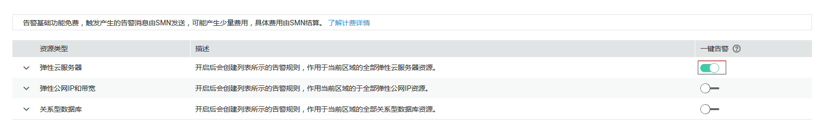

# 一键告警

## 应用场景

一键告警为您提供针对服务下所有资源快速开启告警的能力，旨在帮助用户快速建立监控告警体系，在资源异常时可以及时获得通知。一键式告警和普通告警的主要差异点如[表1](#table48631177916)所示。

**表 1**  一键告警和告警对比一览表

<table><thead align="left"><tr id="row186311174912"><th class="cellrowborder" valign="top" width="13.089999999999998%" id="mcps1.2.6.1.1">
告警类型

</th>
<th class="cellrowborder" valign="top" width="28.560000000000002%" id="mcps1.2.6.1.2">
主要目标

</th>
<th class="cellrowborder" valign="top" width="24.23%" id="mcps1.2.6.1.3">
范围

</th>
<th class="cellrowborder" valign="top" width="18.22%" id="mcps1.2.6.1.4">
告警对象

</th>
<th class="cellrowborder" valign="top" width="15.9%" id="mcps1.2.6.1.5">
告警触发方式

</th>
</tr>
</thead>
<tbody><tr id="row9863181715919"><td class="cellrowborder" valign="top" width="13.089999999999998%" headers="mcps1.2.6.1.1 ">
一键告警

</td>
<td class="cellrowborder" valign="top" width="28.560000000000002%" headers="mcps1.2.6.1.2 ">
当重要事件发生时，立即触发告警通知。

优势：配置简单，一键式打开开关。

</td>
<td class="cellrowborder" valign="top" width="24.23%" headers="mcps1.2.6.1.3 ">
弹性云服务器、弹性公网IP和关系型数据库的重要事件。支持的事件列表请参考<a href="#section99289219443">支持的产品及规则详情</a>。

</td>
<td class="cellrowborder" valign="top" width="18.22%" headers="mcps1.2.6.1.4 ">
事件监控

</td>
<td class="cellrowborder" valign="top" width="15.9%" headers="mcps1.2.6.1.5 ">
立即触发

</td>
</tr>
<tr id="row18633172918"><td class="cellrowborder" rowspan="2" valign="top" width="13.089999999999998%" headers="mcps1.2.6.1.1 ">
普通告警

</td>
<td class="cellrowborder" valign="top" width="28.560000000000002%" headers="mcps1.2.6.1.2 ">
根据设置的告警策略触发告警。例如：CPU利用率在5分钟内的平均值连续5次&gt;=80%时发送告警通知。

优势：告警策略更加灵活，可根据业务情况灵活配置。

</td>
<td class="cellrowborder" valign="top" width="24.23%" headers="mcps1.2.6.1.3 ">
所有支持监控的服务。

</td>
<td class="cellrowborder" valign="top" width="18.22%" headers="mcps1.2.6.1.4 "><ul id="ul12551192901316"><li>主机监控</li><li>云服务监控</li><li>自定义监控</li><li>站点监控</li><li>日志监控</li></ul>
</td>
<td class="cellrowborder" valign="top" width="15.9%" headers="mcps1.2.6.1.5 ">
累计触发

</td>
</tr>
<tr id="row178642171997"><td class="cellrowborder" valign="top" headers="mcps1.2.6.1.1 ">
当事件发生时，立即触发或者累计触发告警通知。

优势：灵活配置，仅支持事件告警。

</td>
<td class="cellrowborder" valign="top" headers="mcps1.2.6.1.2 ">
支持事件监控的服务，请参考<a href="事件监控支持的事件说明.md">事件监控支持的事件说明</a>。

</td>
<td class="cellrowborder" valign="top" headers="mcps1.2.6.1.3 ">
事件监控

</td>
<td class="cellrowborder" valign="top" headers="mcps1.2.6.1.4 ">
立即触发或累计触发（可配置）

</td>
</tr>
</tbody>
</table>

本章节介绍如何使用一键告警功能一键开启关键监控项告警的服务。

## 使用约束和限制

-   一键告警当前只发送告警通知，不发送告警恢复。
-   一键告警的所有告警规则均为立即触发，即按照阈值直接触发。

## 操作步骤

1.  登录管理控制台。
2.  单击“管理与部署 \> 云监控服务”。
3.  单击左侧导航栏的“告警 \> 一键告警”，进入一键告警界面。
4.  单击需要开启的云服务资源所在行右侧的一键告警开关，开启一键告警。

    一键告警支持的产品及规则详情请参见[支持的产品及规则详情](#section99289219443)。

    **图 1**  开启一键告警  
    

5.  单击一键告警左侧的下拉按钮，可查看自动生成的告警规则。

    > **说明：**   
    >一键式告警规则的通知对象为“云账号联系人”，即当前登录管理控制台的账号联系人。如果联系人配置了短信或邮箱，告警通知会发送到对应的手机号码或邮箱。  

    **图 2**  查看告警规则  
    

## 支持的产品及规则详情

**表 2**  弹性云服务器

<table><thead align="left"><tr id="row172117482273"><th class="cellrowborder" valign="top" width="14.09%" id="mcps1.2.5.1.1">
告警名称

</th>
<th class="cellrowborder" valign="top" width="18.8%" id="mcps1.2.5.1.2">
告警策略

</th>
<th class="cellrowborder" valign="top" width="32.39%" id="mcps1.2.5.1.3">
规则说明

</th>
<th class="cellrowborder" valign="top" width="34.72%" id="mcps1.2.5.1.4">
处理步骤

</th>
</tr>
</thead>
<tbody><tr id="row721164815275"><td class="cellrowborder" valign="top" width="14.09%" headers="mcps1.2.5.1.1 ">
alarm-StartAutoRecovery

</td>
<td class="cellrowborder" valign="top" width="18.8%" headers="mcps1.2.5.1.2 ">
弹性云服务器-开始自动恢复

立即触发

</td>
<td class="cellrowborder" rowspan="2" valign="top" width="32.39%" headers="mcps1.2.5.1.3 ">
弹性云服务器所在的主机出现故障时，系统会自动将弹性云服务器迁移至正常的物理机，该过程会导致云服务器重启，并发送一个“开始自动恢复”的事件，当迁移完成后，并发送一个“结束自动恢复”的事件，表示已恢复正常。

</td>
<td class="cellrowborder" valign="top" width="34.72%" headers="mcps1.2.5.1.4 ">
当收到“开始自动恢复”时，说明已发生故障，该机器无法使用，需要考虑更换弹性云服务器，或考虑将流量导至其他机器。

</td>
</tr>
<tr id="row192111048152715"><td class="cellrowborder" valign="top" headers="mcps1.2.5.1.1 ">
alarm-EndAutoRecovery

</td>
<td class="cellrowborder" valign="top" headers="mcps1.2.5.1.2 ">
弹性云服务器-结束自动恢复

立即触发

</td>
<td class="cellrowborder" valign="top" headers="mcps1.2.5.1.3 ">
当收到“结束自动恢复”时，说明该ECS已正常工作，可继续使用。

</td>
</tr>
</tbody>
</table>

**表 3**  弹性公网IP和带宽

<table><thead align="left"><tr id="row10756173111518"><th class="cellrowborder" valign="top" width="15.45%" id="mcps1.2.5.1.1">
告警名称

</th>
<th class="cellrowborder" valign="top" width="17.61%" id="mcps1.2.5.1.2">
告警策略

</th>
<th class="cellrowborder" valign="top" width="32.05%" id="mcps1.2.5.1.3">
事件说明

</th>
<th class="cellrowborder" valign="top" width="34.89%" id="mcps1.2.5.1.4">
处理步骤

</th>
</tr>
</thead>
<tbody><tr id="row107572371519"><td class="cellrowborder" valign="top" width="15.45%" headers="mcps1.2.5.1.1 ">
alarm-BlockEIP

</td>
<td class="cellrowborder" valign="top" width="17.61%" headers="mcps1.2.5.1.2 ">
弹性公网IP-EIP封堵

立即触发

</td>
<td class="cellrowborder" rowspan="2" valign="top" width="32.05%" headers="mcps1.2.5.1.3 ">
带宽超过5G就会封堵，相当于把流量直接丢弃，说明带宽严重超限或收到攻击，一般是受到了DDoS攻击。

收到EIP解封事件时，说明封堵已被解封。

</td>
<td class="cellrowborder" valign="top" width="34.89%" headers="mcps1.2.5.1.4 ">
需要更换EIP，避免业务受到影响，同时查看事件中的封堵原因，进行相应处理。

</td>
</tr>
<tr id="row575715312156"><td class="cellrowborder" valign="top" headers="mcps1.2.5.1.1 ">
alarm-UnblockEIP

</td>
<td class="cellrowborder" valign="top" headers="mcps1.2.5.1.2 ">
弹性公网IP-EIP解封

立即触发

</td>
<td class="cellrowborder" valign="top" headers="mcps1.2.5.1.3 ">
可以换回EIP，可以将被解封EIP重新进行使用，避免资源浪费。

</td>
</tr>
<tr id="row375833161515"><td class="cellrowborder" valign="top" width="15.45%" headers="mcps1.2.5.1.1 ">
alarm-EIPBandwidthOverflow

</td>
<td class="cellrowborder" valign="top" width="17.61%" headers="mcps1.2.5.1.2 ">
弹性公网IP-EIP带宽超限事件

立即触发

</td>
<td class="cellrowborder" valign="top" width="32.05%" headers="mcps1.2.5.1.3 ">
收到该事件，说明带宽已超过购买的带宽，可能会导致网络变慢或丢包发生。

</td>
<td class="cellrowborder" valign="top" width="34.89%" headers="mcps1.2.5.1.4 ">
需要检查EIP带宽是否一直增加，业务是否正常，需要考虑进行扩容。

</td>
</tr>
</tbody>
</table>

**表 4**  关系型数据库

<table><thead align="left"><tr id="row1048941111518"><th class="cellrowborder" valign="top" width="15.73%" id="mcps1.2.5.1.1">
告警名称

</th>
<th class="cellrowborder" valign="top" width="17.09%" id="mcps1.2.5.1.2">
告警策略

</th>
<th class="cellrowborder" valign="top" width="32.2%" id="mcps1.2.5.1.3">
事件说明

</th>
<th class="cellrowborder" valign="top" width="34.98%" id="mcps1.2.5.1.4">
处理步骤

</th>
</tr>
</thead>
<tbody><tr id="row1549011110154"><td class="cellrowborder" valign="top" width="15.73%" headers="mcps1.2.5.1.1 ">
alarm-CreateInstanceFailed

</td>
<td class="cellrowborder" valign="top" width="17.09%" headers="mcps1.2.5.1.2 ">
关系型数据库-创建实例业务失败

立即触发

</td>
<td class="cellrowborder" valign="top" width="32.2%" headers="mcps1.2.5.1.3 ">
创建实例失败产生的事件，一般是磁盘个数、配额很小，底层资源耗尽导致。

</td>
<td class="cellrowborder" valign="top" width="34.98%" headers="mcps1.2.5.1.4 ">
检查磁盘个数、配额大小，释放资源后重新创建。

</td>
</tr>
<tr id="row114917110151"><td class="cellrowborder" valign="top" width="15.73%" headers="mcps1.2.5.1.1 ">
alarm-FullBackupFailed

</td>
<td class="cellrowborder" valign="top" width="17.09%" headers="mcps1.2.5.1.2 ">
关系型数据库-实例全量备份失败

立即触发

</td>
<td class="cellrowborder" valign="top" width="32.2%" headers="mcps1.2.5.1.3 ">
单次全量备份失败产生的事件，不影响以前成功备份的文件，但会对“时间点恢复”的功能有一些影响，导致“时间点恢复”时增量备份的回复时间延长。

</td>
<td class="cellrowborder" valign="top" width="34.98%" headers="mcps1.2.5.1.4 ">
重新发起一次手工备份。

</td>
</tr>
<tr id="row154910113155"><td class="cellrowborder" valign="top" width="15.73%" headers="mcps1.2.5.1.1 ">
alarm-ActiveStandBySwitchFailed

</td>
<td class="cellrowborder" valign="top" width="17.09%" headers="mcps1.2.5.1.2 ">
关系型数据库-主备切换异常

立即触发

</td>
<td class="cellrowborder" valign="top" width="32.2%" headers="mcps1.2.5.1.3 ">
主备切换异常是由于网络、物理机有某种故障导致备机没有接管主机的业务，短时间内会恢复到原主机继续提供服务。

</td>
<td class="cellrowborder" valign="top" width="34.98%" headers="mcps1.2.5.1.4 ">
检查应用和数据库之间的连接是否重新建立了连接。

</td>
</tr>
<tr id="row7491215152"><td class="cellrowborder" valign="top" width="15.73%" headers="mcps1.2.5.1.1 ">
alarm-AbnormalReplicationStatus

</td>
<td class="cellrowborder" valign="top" width="17.09%" headers="mcps1.2.5.1.2 ">
关系型数据库-复制状态异常

立即触发

</td>
<td class="cellrowborder" valign="top" width="32.2%" headers="mcps1.2.5.1.3 ">
即主备之间复制时延太大（一般在写入大量数据，或者执行大事务的时候会出现），在业务低峰期备机会逐渐追上主机。还有另一种可能是主备间的网络中断，导致主备复制异常。但不会导致原来单实例的读写中断，客户的应用是无感知的。

</td>
<td class="cellrowborder" valign="top" width="34.98%" headers="mcps1.2.5.1.4 ">
提交工单处理。

</td>
</tr>
<tr id="row14492191131512"><td class="cellrowborder" valign="top" width="15.73%" headers="mcps1.2.5.1.1 ">
alarm-FaultyDBInstance

</td>
<td class="cellrowborder" valign="top" width="17.09%" headers="mcps1.2.5.1.2 ">
关系型数据库-实例运行状态异常

立即触发

</td>
<td class="cellrowborder" valign="top" width="32.2%" headers="mcps1.2.5.1.3 ">
由于灾难或者物理机故障导致单机或者主实例出现故障时会上报本事件，属于关键告警事件，有可能导致数据库服务不可用。

</td>
<td class="cellrowborder" valign="top" width="34.98%" headers="mcps1.2.5.1.4 ">
检查是否有设置自动备份策略，并且提交工单处理。

</td>
</tr>
<tr id="row1149218101520"><td class="cellrowborder" valign="top" width="15.73%" headers="mcps1.2.5.1.1 ">
alarm-SingleToHAFailed

</td>
<td class="cellrowborder" valign="top" width="17.09%" headers="mcps1.2.5.1.2 ">
关系型数据库-单实例转主备实例失败

立即触发

</td>
<td class="cellrowborder" valign="top" width="32.2%" headers="mcps1.2.5.1.3 ">
即创建备机或者备机创建完成后在主备机之间配置同步有故障，一般是由于备节点所在数据中心资源不足导致，转主备失败不会导致原来单实例的读写中断，客户的应用是无感知的。

</td>
<td class="cellrowborder" valign="top" width="34.98%" headers="mcps1.2.5.1.4 ">
提交工单处理。

</td>
</tr>
<tr id="row1549219121514"><td class="cellrowborder" valign="top" width="15.73%" headers="mcps1.2.5.1.1 ">
alarm-ReplicationStatusRecovered

</td>
<td class="cellrowborder" valign="top" width="17.09%" headers="mcps1.2.5.1.2 ">
关系型数据库-复制状态异常已恢复

立即触发

</td>
<td class="cellrowborder" valign="top" width="32.2%" headers="mcps1.2.5.1.3 ">
即复制时延已回到正常范围内，或者主备之间的网络通信恢复。

</td>
<td class="cellrowborder" valign="top" width="34.98%" headers="mcps1.2.5.1.4 ">
不需要处理。

</td>
</tr>
<tr id="row44920131520"><td class="cellrowborder" valign="top" width="15.73%" headers="mcps1.2.5.1.1 ">
alarm-DBInstanceRecovered

</td>
<td class="cellrowborder" valign="top" width="17.09%" headers="mcps1.2.5.1.2 ">
关系型数据库-实例运行状态异常已恢复

立即触发

</td>
<td class="cellrowborder" valign="top" width="32.2%" headers="mcps1.2.5.1.3 ">
针对灾难性的故障，RDS有高可用工具会自动进行备机重建，重建完成之后即会上报本事件。

</td>
<td class="cellrowborder" valign="top" width="34.98%" headers="mcps1.2.5.1.4 ">
不需要处理。

</td>
</tr>
</tbody>
</table>

