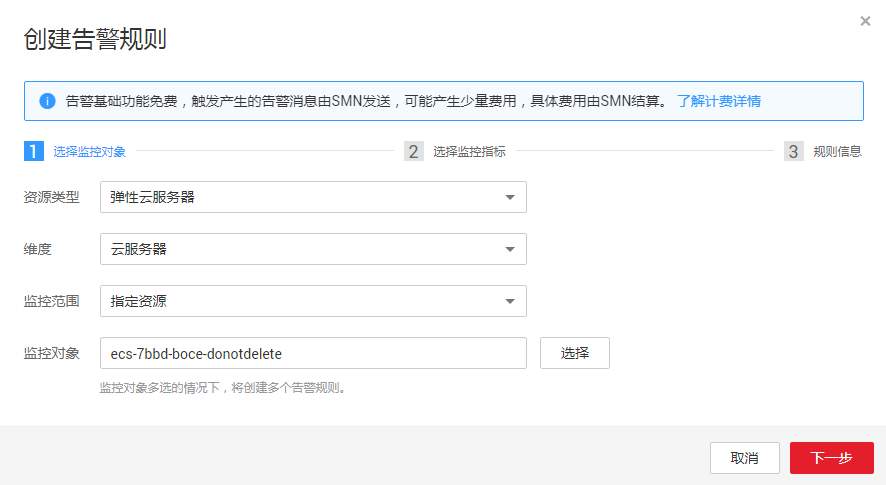
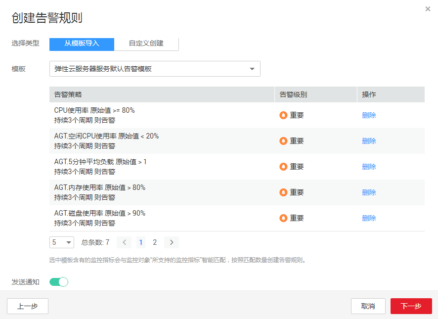

# 使用告警模板创建告警规则

云监控提供使用告警模板创建告警规则的功能，能够让用户在为资源或者云服务添加告警规则时轻松自如，特别是对于大批量资源或者云服务同时创建告警规则，或是在日常运维中对多个资源或者云服务修改告警规则，都能够提供极大的工作便利。

本章节主要为您讲述如何使用默认告警模板为云服务资源添加告警规则。

## 创建告警规则

1.  登录管理控制台。
2.  单击“管理与部署 \> 云监控”。
3.  在“告警 \> 告警规则”界面，单击“创建告警规则”。
4.  在“创建告警规则”界面，根据界面提示配置参数。
    1.  选择监控对象，根据界面提示配置参数，如[表1](#table2902443185911)所示。然后单击“下一步”。

        **图 1**  创建告警规则（使用告警模板）  
        

        > **说明：**   
        >当监控对象为弹性云服务器和裸金属服务器时支持通过名称、ID和私有IP地址搜索，其他云服务仅支持通过ID搜索。  

        **表 1**  配置参数

        
        <table><thead align="left"><tr id="row59044436596"><th class="cellrowborder" valign="top" width="16.6%" id="mcps1.2.4.1.1">
参数

        </th>
        <th class="cellrowborder" valign="top" width="50.07%" id="mcps1.2.4.1.2">
参数说明

        </th>
        <th class="cellrowborder" valign="top" width="33.33%" id="mcps1.2.4.1.3">
取值样例

        </th>
        </tr>
        </thead>
        <tbody><tr id="row139086431592"><td class="cellrowborder" valign="top" width="16.6%" headers="mcps1.2.4.1.1 ">
资源类型

        </td>
        <td class="cellrowborder" valign="top" width="50.07%" headers="mcps1.2.4.1.2 ">
配置告警规则监控的云服务资源类型。

        </td>
        <td class="cellrowborder" valign="top" width="33.33%" headers="mcps1.2.4.1.3 ">
弹性云服务器

        </td>
        </tr>
        <tr id="row491164325912"><td class="cellrowborder" valign="top" width="16.6%" headers="mcps1.2.4.1.1 ">
维度

        </td>
        <td class="cellrowborder" valign="top" width="50.07%" headers="mcps1.2.4.1.2 ">
用于指定告警规则对应指标的维度名称

        </td>
        <td class="cellrowborder" valign="top" width="33.33%" headers="mcps1.2.4.1.3 ">
云服务器

        </td>
        </tr>
        <tr id="row1025034911317"><td class="cellrowborder" valign="top" width="16.6%" headers="mcps1.2.4.1.1 ">
监控范围

        </td>
        <td class="cellrowborder" valign="top" width="50.07%" headers="mcps1.2.4.1.2 ">
告警规则适用的资源范围，可选择资源分组或指定资源。

        
 说明： 
<ul id="ul64399549269"><li>当选择资源分组时，该分组下任何资源满足告警策略时，都会触发告警通知。</li><li>资源分组不支持通过模板创建告警规则。</li><li>监控范围暂只支持华南-广州、华东-上海二，其他区域暂不支持。</li></ul>
        

        </td>
        <td class="cellrowborder" valign="top" width="33.33%" headers="mcps1.2.4.1.3 ">
指定资源

        </td>
        </tr>
        <tr id="row2912164313591"><td class="cellrowborder" valign="top" width="16.6%" headers="mcps1.2.4.1.1 ">
监控对象

        </td>
        <td class="cellrowborder" valign="top" width="50.07%" headers="mcps1.2.4.1.2 ">
用来配置该告警规则针对的具体资源，可以是一个或多个。

        </td>
        <td class="cellrowborder" valign="top" width="33.33%" headers="mcps1.2.4.1.3 ">
-

        </td>
        </tr>
        </tbody>
        </table>

    2.  选择监控指标，选择“从模板导入”，参照[表2](#table17310615145610)完成参数配置。

        **图 2**  从模板导入  
        

        **表 2**  配置参数

        
        <table><thead align="left"><tr id="row1830881513561"><th class="cellrowborder" valign="top" width="17%" id="mcps1.2.4.1.1">
参数

        </th>
        <th class="cellrowborder" valign="top" width="50%" id="mcps1.2.4.1.2">
参数说明

        </th>
        <th class="cellrowborder" valign="top" width="33%" id="mcps1.2.4.1.3">
取值样例

        </th>
        </tr>
        </thead>
        <tbody><tr id="row143081615195619"><td class="cellrowborder" valign="top" width="17%" headers="mcps1.2.4.1.1 ">
选择类型

        </td>
        <td class="cellrowborder" valign="top" width="50%" headers="mcps1.2.4.1.2 ">
选择从模板导入。

        </td>
        <td class="cellrowborder" valign="top" width="33%" headers="mcps1.2.4.1.3 ">
从模板导入

        </td>
        </tr>
        <tr id="row230841525618"><td class="cellrowborder" valign="top" width="17%" headers="mcps1.2.4.1.1 ">
模板

        </td>
        <td class="cellrowborder" valign="top" width="50%" headers="mcps1.2.4.1.2 ">
选择需要导入的模板。

        </td>
        <td class="cellrowborder" valign="top" width="33%" headers="mcps1.2.4.1.3 ">
-

        </td>
        </tr>
        <tr id="row19309615185617"><td class="cellrowborder" valign="top" width="17%" headers="mcps1.2.4.1.1 ">
发送通知

        </td>
        <td class="cellrowborder" valign="top" width="50%" headers="mcps1.2.4.1.2 ">
配置是否发送邮件、短信、HTTP和HTTPS通知用户。

        
选择“是”（推荐选择），会发送通知；选择“否”，不会发送通知。

        </td>
        <td class="cellrowborder" valign="top" width="33%" headers="mcps1.2.4.1.3 ">
是

        </td>
        </tr>
        <tr id="row183911859182819"><td class="cellrowborder" valign="top" width="17%" headers="mcps1.2.4.1.1 ">
生效时间

        </td>
        <td class="cellrowborder" valign="top" width="50%" headers="mcps1.2.4.1.2 ">
该告警规则仅在生效时间内发送通知消息。

        
如生效时间为00:00-8:00，则该告警规则仅在00:00-8:00发送通知消息。

        
 说明： 

生效时间暂只支持华南-广州、华东-上海二，其他区域暂不支持。

        

        </td>
        <td class="cellrowborder" valign="top" width="33%" headers="mcps1.2.4.1.3 ">
-

        </td>
        </tr>
        <tr id="row831016155567"><td class="cellrowborder" valign="top" width="17%" headers="mcps1.2.4.1.1 ">
主题通知

        </td>
        <td class="cellrowborder" valign="top" width="50%" headers="mcps1.2.4.1.2 ">
需要发送告警通知的主题名称。

        
当发送通知选择“是”时，需要选择已有的主题名称，若此处没有需要的主题则需先创建主题，该功能会调用消息通知服务（SMN），创建主题请参见《消息通知服务用户指南》。

        </td>
        <td class="cellrowborder" valign="top" width="33%" headers="mcps1.2.4.1.3 ">
-

        </td>
        </tr>
        <tr id="row531041519563"><td class="cellrowborder" valign="top" width="17%" headers="mcps1.2.4.1.1 ">
触发条件

        </td>
        <td class="cellrowborder" valign="top" width="50%" headers="mcps1.2.4.1.2 ">
可以选择出现告警、恢复正常，作为说明触发告警的条件。

        </td>
        <td class="cellrowborder" valign="top" width="33%" headers="mcps1.2.4.1.3 ">
-

        </td>
        </tr>
        </tbody>
        </table>

    3.  规则信息，根据界面提示配置参数，如[表3](#table10391431667)所示。配置完成后，单击“添加”，完成告警规则的添加。

        **表 3**  配置参数

        
        <table><thead align="left"><tr id="row133921438611"><th class="cellrowborder" valign="top" width="16.42%" id="mcps1.2.4.1.1">
参数

        </th>
        <th class="cellrowborder" valign="top" width="50.62%" id="mcps1.2.4.1.2">
参数说明

        </th>
        <th class="cellrowborder" valign="top" width="32.96%" id="mcps1.2.4.1.3">
取值样例

        </th>
        </tr>
        </thead>
        <tbody><tr id="row3396331612"><td class="cellrowborder" valign="top" width="16.42%" headers="mcps1.2.4.1.1 ">
名称

        </td>
        <td class="cellrowborder" valign="top" width="50.62%" headers="mcps1.2.4.1.2 ">
系统会随机产生一个名称，用户也可以进行修改。

        </td>
        <td class="cellrowborder" valign="top" width="32.96%" headers="mcps1.2.4.1.3 ">
alarm-b6al

        </td>
        </tr>
        <tr id="row1739693467"><td class="cellrowborder" valign="top" width="16.42%" headers="mcps1.2.4.1.1 ">
描述

        </td>
        <td class="cellrowborder" valign="top" width="50.62%" headers="mcps1.2.4.1.2 ">
告警规则描述（此参数非必填项）。

        </td>
        <td class="cellrowborder" valign="top" width="32.96%" headers="mcps1.2.4.1.3 ">
-

        </td>
        </tr>
        </tbody>
        </table>

告警规则添加完成后，当监控指标触发设定的阈值时，云监控会在第一时间通过消息通知服务实时告知您云上资源异常，以免因此造成业务损失。

