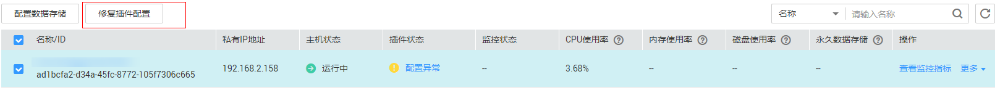

# 修复插件配置

## 操作场景

本章节主要介绍安装Agent后，修复插件配置，免去手动配置Agent的步骤。

> **说明：**   
>"批量修复插件配置"针对1.0.5及以上版本的Agent，低于该版本请升级Agent后再执行"批量修复插件配置"，或参考[手动配置Agent](手动配置Agent.md)手动配置Agent。  
>"批量修复插件配置"暂不支持裸金属服务器，裸金属服务器配置Agent，请参见[手动配置Agent](手动配置Agent.md)章节。  

## 操作步骤

1.  登录管理控制台。
2.  单击“管理与部署 \> 云监控 \> 主机监控”。
3.  在主机监控界面，勾选已安装插件的主机，单击"修复插件配置"，在弹出页面上，单击"一键修复"，完成配置Agent。

    **图 1**  修复插件配置  
    

