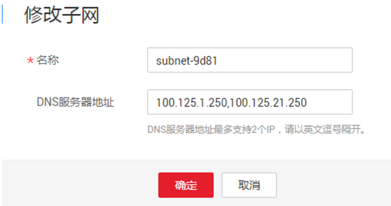

# 修改DNS与添加安全组

## 操作场景

本章节指导用户为Linux系统的ECS或BMS主机添加域名解析并添加安全组，防止下载Agent安装包与采集监控数据时出现异常。

> **说明：**   
>添加DNS服务解析和配置安全组针对的是主网卡。  

## 操作步骤

1.  VNC方式登录Windows弹性云服务器。
2.  打开“控制面板 \> 网络与共享中心”，单击“更改适配器配置”。
3.  右键单击使用的网络，打开设置，按如下所示配置DNS。

    **图 1**  添加域名解析地址  
    

    > **说明：**   
    >不同区域nameserver不同，如下所示：  
    >华北-北京一：100.125.1.250,100.125.21.250  
    >华北-北京四：100.125.1.250,100.125.129.250  
    >华东-上海二：100.125.17.29,100.125.135.29  
    >华南-广州：100.125.1.250,100.125.136.29  
    >亚太-香港：100.125.1.250,100.125.3.250  
    >亚太-曼谷：100.125.1.250,100.125.3.250  

4.  在管理控制台修改子网DNS服务器地址。
    1.  在管理控制台左上角单击图标，选择区域和项目。
    2.  选择“服务列表 \> 计算 \> 弹性云服务器”。

        弹性云服务器列表中，单击ECS名称查看详情。

    3.  在“虚拟私有云”项单击“vpc-ces”，进入“虚拟私有云”界面。如[图2](#zh-cn_topic_0150354069_fig0772121318363)所示。

        **图 2**  虚拟私有云  
        

    4.  在“VPC名称/ID”列表中，单击“vpc-ces”。
    5.  在“子网”列表中，单击“subnet-3e3b”所在行“修改”。

        弹出“修改子网”对话框，修改“DNS服务器地址1”为“100.125.1.250”。如[图3](#zh-cn_topic_0150354069_fig6241144284010)所示。

        > **说明：**   
        >-   subnet-3e3b为该ECS的子网。  
        >-   DNS服务器地址与[2](修改DNS与添加安全组.md#zh-cn_topic_0078544024_li30189854165124)中的nameserver保持一致。  

        **图 3**  修改DNS服务器地址  
        

    6.  单击“确定”，保存设置。

        > **说明：**   
        >在控制台修改DNS需重启ECS或BMS后生效。  

5.  在管理控制台修改ECS使用的安全组规则。
    1.  在ECS详情页，单击安全组页签，进入安全组列表页。
    2.  单击具体的安全组名，单击“更改安全组规则”，进入安全组详情页。
    3.  在该安全组详情页，单击“出方向规则 \> 添加规则 ”，按[表1](#zh-cn_topic_0150354069_table89472534275)所示添加规则。

        **表 1**  安全组规则

        
        <table><thead align="left"><tr id="zh-cn_topic_0150354069_row12943453152710"><th class="cellrowborder" valign="top" width="11%" id="mcps1.2.5.1.1">
方向

        </th>
        <th class="cellrowborder" valign="top" width="11.43%" id="mcps1.2.5.1.2">
协议

        </th>
        <th class="cellrowborder" valign="top" width="8.21%" id="mcps1.2.5.1.3">
端口

        </th>
        <th class="cellrowborder" valign="top" width="69.36%" id="mcps1.2.5.1.4">
说明

        </th>
        </tr>
        </thead>
        <tbody><tr id="zh-cn_topic_0150354069_row49431153112718"><td class="cellrowborder" valign="top" width="11%" headers="mcps1.2.5.1.1 ">
出方向

        </td>
        <td class="cellrowborder" valign="top" width="11.43%" headers="mcps1.2.5.1.2 ">
TCP

        </td>
        <td class="cellrowborder" valign="top" width="8.21%" headers="mcps1.2.5.1.3 ">
80

        </td>
        <td class="cellrowborder" valign="top" width="69.36%" headers="mcps1.2.5.1.4 ">
用于从OBS桶下载Agent包到ECS或BMS中、获取ECS或BMS的元数据信息与鉴权信息。

        </td>
        </tr>
        <tr id="zh-cn_topic_0150354069_row6944145315277"><td class="cellrowborder" valign="top" width="11%" headers="mcps1.2.5.1.1 ">
出方向

        </td>
        <td class="cellrowborder" valign="top" width="11.43%" headers="mcps1.2.5.1.2 ">
TCP、UDP

        </td>
        <td class="cellrowborder" valign="top" width="8.21%" headers="mcps1.2.5.1.3 ">
53

        </td>
        <td class="cellrowborder" valign="top" width="69.36%" headers="mcps1.2.5.1.4 ">
用于DNS解析域名，下载Agent时解析OBS地址、发送监控数据时解析云监控服务Endpoint地址。

        </td>
        </tr>
        <tr id="zh-cn_topic_0150354069_row19947105314275"><td class="cellrowborder" valign="top" width="11%" headers="mcps1.2.5.1.1 ">
出方向

        </td>
        <td class="cellrowborder" valign="top" width="11.43%" headers="mcps1.2.5.1.2 ">
TCP

        </td>
        <td class="cellrowborder" valign="top" width="8.21%" headers="mcps1.2.5.1.3 ">
443

        </td>
        <td class="cellrowborder" valign="top" width="69.36%" headers="mcps1.2.5.1.4 ">
采集监控数据到云监控服务端。

        </td>
        </tr>
        </tbody>
        </table>

