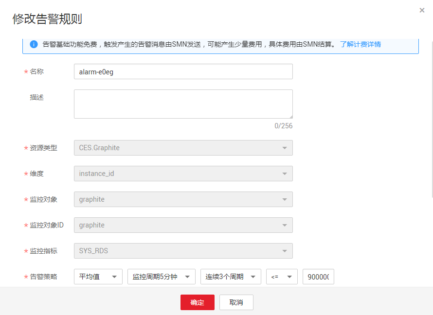

# 修改告警规则

## 操作步骤

1.  登录管理控制台。
2.  单击“管理与部署 \> 云监控”。
3.  单击“告警 \> 告警规则，进入告警规则界面。
4.  你可以选择以下两个路径进入告警规则修改页面：
    -   在“告警规则”界面，单击待修改告警规则所在行的“修改”按钮；
    -   在“告警规则”界面，选择待修改告警规则名称，进入告警规则详情页面，单击右上角“修改”。

5.  在弹出的“修改告警规则”对话框中修改告警规则配置参数，如[表1](#table4593201331917)所示。

**图 1**  修改告警规则  

**表 1**  配置参数

<table><thead align="left"><tr id="row19594161331919"><th class="cellrowborder" valign="top" width="27.272727272727277%" id="mcps1.2.4.1.1">
参数

</th>
<th class="cellrowborder" valign="top" width="45.45454545454546%" id="mcps1.2.4.1.2">
参数说明

</th>
<th class="cellrowborder" valign="top" width="27.272727272727277%" id="mcps1.2.4.1.3">
取值样例

</th>
</tr>
</thead>
<tbody><tr id="row1760171341916"><td class="cellrowborder" valign="top" width="27.272727272727277%" headers="mcps1.2.4.1.1 ">
名称

</td>
<td class="cellrowborder" valign="top" width="45.45454545454546%" headers="mcps1.2.4.1.2 ">
系统会随机产生一个名称，用户也可以进行修改。

</td>
<td class="cellrowborder" valign="top" width="27.272727272727277%" headers="mcps1.2.4.1.3 ">
alarm-b6al

</td>
</tr>
<tr id="row196021313131913"><td class="cellrowborder" valign="top" width="27.272727272727277%" headers="mcps1.2.4.1.1 ">
描述

</td>
<td class="cellrowborder" valign="top" width="45.45454545454546%" headers="mcps1.2.4.1.2 ">
告警规则描述（此参数非必填项）。

</td>
<td class="cellrowborder" valign="top" width="27.272727272727277%" headers="mcps1.2.4.1.3 ">
-

</td>
</tr>
<tr id="row86021713171911"><td class="cellrowborder" valign="top" width="27.272727272727277%" headers="mcps1.2.4.1.1 ">
资源类型

</td>
<td class="cellrowborder" valign="top" width="45.45454545454546%" headers="mcps1.2.4.1.2 ">
配置告警规则监控的服务名称。

</td>
<td class="cellrowborder" valign="top" width="27.272727272727277%" headers="mcps1.2.4.1.3 ">
Elastic Cloud Server

</td>
</tr>
<tr id="row1160314138193"><td class="cellrowborder" valign="top" width="27.272727272727277%" headers="mcps1.2.4.1.1 ">
维度

</td>
<td class="cellrowborder" valign="top" width="45.45454545454546%" headers="mcps1.2.4.1.2 ">
用于指定告警规则对应指标的维度名称。

</td>
<td class="cellrowborder" valign="top" width="27.272727272727277%" headers="mcps1.2.4.1.3 ">
ECS

</td>
</tr>
<tr id="row5604161321912"><td class="cellrowborder" valign="top" width="27.272727272727277%" headers="mcps1.2.4.1.1 ">
监控对象

</td>
<td class="cellrowborder" valign="top" width="45.45454545454546%" headers="mcps1.2.4.1.2 ">
用来配置该告警规则针对的具体资源，可以是一个或多个。

</td>
<td class="cellrowborder" valign="top" width="27.272727272727277%" headers="mcps1.2.4.1.3 ">
-

</td>
</tr>
<tr id="row247871852614"><td class="cellrowborder" valign="top" width="27.272727272727277%" headers="mcps1.2.4.1.1 ">
监控对象ID

</td>
<td class="cellrowborder" valign="top" width="45.45454545454546%" headers="mcps1.2.4.1.2 ">
资源ID。

</td>
<td class="cellrowborder" valign="top" width="27.272727272727277%" headers="mcps1.2.4.1.3 ">
-

</td>
</tr>
<tr id="row3604111316198"><td class="cellrowborder" valign="top" width="27.272727272727277%" headers="mcps1.2.4.1.1 ">
监控指标

</td>
<td class="cellrowborder" valign="top" width="45.45454545454546%" headers="mcps1.2.4.1.2 ">
例如：

<ul id="ul36061513161912"><li>CPU使用率
该指标用于统计测量对象的CPU使用率，以百分比为单位。

</li></ul>
<ul id="ul1260741314197"><li>内存使用率
该指标用于统计测量对象的内存使用率，以百分比为单位。

</li></ul>
</td>
<td class="cellrowborder" valign="top" width="27.272727272727277%" headers="mcps1.2.4.1.3 ">
CPU使用率

</td>
</tr>
<tr id="row345848174113"><td class="cellrowborder" valign="top" width="27.272727272727277%" headers="mcps1.2.4.1.1 ">
告警策略

</td>
<td class="cellrowborder" valign="top" width="45.45454545454546%" headers="mcps1.2.4.1.2 ">
触发告警的告警策略。

例如：监控周期为5分钟，连续三个周期原始值≥80%

</td>
<td class="cellrowborder" valign="top" width="27.272727272727277%" headers="mcps1.2.4.1.3 ">
-

</td>
</tr>
<tr id="row108721617134814"><td class="cellrowborder" valign="top" width="27.272727272727277%" headers="mcps1.2.4.1.1 ">
告警级别

</td>
<td class="cellrowborder" valign="top" width="45.45454545454546%" headers="mcps1.2.4.1.2 ">
根据告警的严重程度不同等级，可选择紧急、重要、次要、提示。

</td>
<td class="cellrowborder" valign="top" width="27.272727272727277%" headers="mcps1.2.4.1.3 ">
重要

</td>
</tr>
<tr id="row26099137193"><td class="cellrowborder" valign="top" width="27.272727272727277%" headers="mcps1.2.4.1.1 ">
发送通知

</td>
<td class="cellrowborder" valign="top" width="45.45454545454546%" headers="mcps1.2.4.1.2 ">
配置是否发送邮件、短信通知用户或发送HTTP、HTTPS消息给服务器。

</td>
<td class="cellrowborder" valign="top" width="27.272727272727277%" headers="mcps1.2.4.1.3 ">
-

</td>
</tr>
<tr id="row79896198452"><td class="cellrowborder" valign="top" width="27.272727272727277%" headers="mcps1.2.4.1.1 ">
生效时间

</td>
<td class="cellrowborder" valign="top" width="45.45454545454546%" headers="mcps1.2.4.1.2 ">
该告警规则仅在生效时间内发送通知消息。

如生效时间为00:00-8:00，则该告警规则仅在00:00-8:00发送通知消息。

</td>
<td class="cellrowborder" valign="top" width="27.272727272727277%" headers="mcps1.2.4.1.3 ">
-

</td>
</tr>
<tr id="row545132284319"><td class="cellrowborder" valign="top" width="27.272727272727277%" headers="mcps1.2.4.1.1 ">
主题通知

</td>
<td class="cellrowborder" valign="top" width="45.45454545454546%" headers="mcps1.2.4.1.2 ">
需要发送告警通知的主题名称。

当发送通知选择“是”时，需要选择已有的主题名称，若此处没有需要的主题则需先创建主题，该功能会调用消息通知服务（SMN），创建主题请参见《消息通知服务用户指南》。

</td>
<td class="cellrowborder" valign="top" width="27.272727272727277%" headers="mcps1.2.4.1.3 ">
-

</td>
</tr>
<tr id="row1976684444420"><td class="cellrowborder" valign="top" width="27.272727272727277%" headers="mcps1.2.4.1.1 ">
触发条件

</td>
<td class="cellrowborder" valign="top" width="45.45454545454546%" headers="mcps1.2.4.1.2 ">
可以选择“出现告警”、“恢复正常”两种状态，作为触发告警通知的条件。

</td>
<td class="cellrowborder" valign="top" width="27.272727272727277%" headers="mcps1.2.4.1.3 ">
-

</td>
</tr>
</tbody>
</table>

1.  单击“确定”，完成告警规则的修改。

