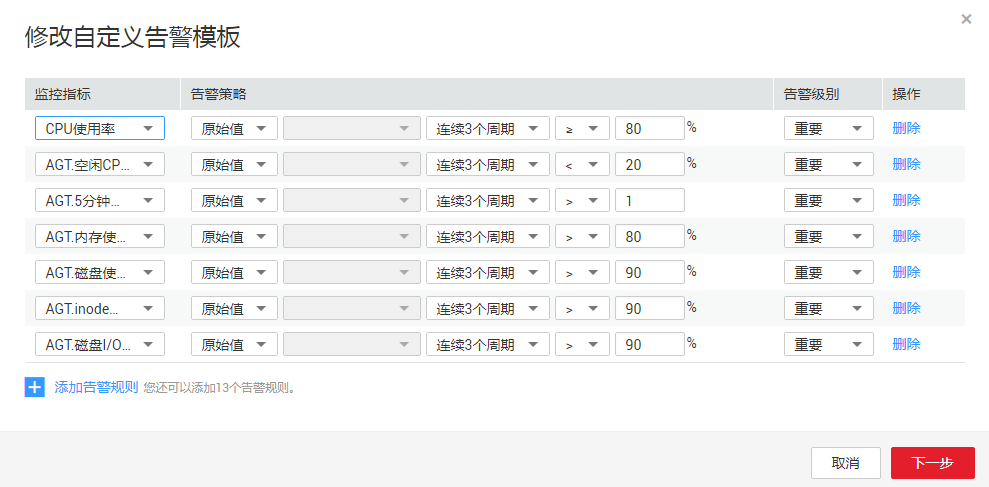

# 修改自定义告警模板

1.  在“告警 \> 告警模板 \> 自定义告警模板”界面，单击告警模板所在行的“修改”按键。
2.  进入“修改模板”界面，参考[表2](创建自定义告警模板.md#table691022118227)，对监控指标进行重新配置。

    **图 1**  修改自定义告警模板  
    

3.  配置完成后，单击“下一步”，进入“模板信息”界面，参考[表3](创建自定义告警模板.md#table722215293225)完成模板信息修改。

