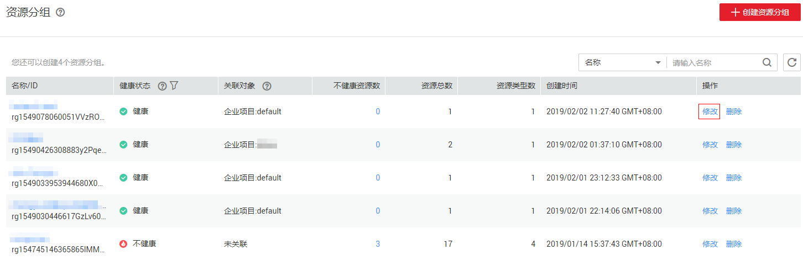

# 修改资源分组

## 操作步骤

1.  登录管理控制台。
2.  在管理控制台左上角单击图标，选择区域和项目。
3.  单击“管理与部署 \> 云监控”。
4.  单击页面左侧的“资源分组”，进入“资源分组”界面。
5.  单击需要修改的分组行的“操作”列的“修改”按钮。

    **图 1**  修改资源分组  
    

6.  按照界面提示，在编辑页面进行分组内容的修改。
7.  单击“立即修改”，完成资源分组的修改。

