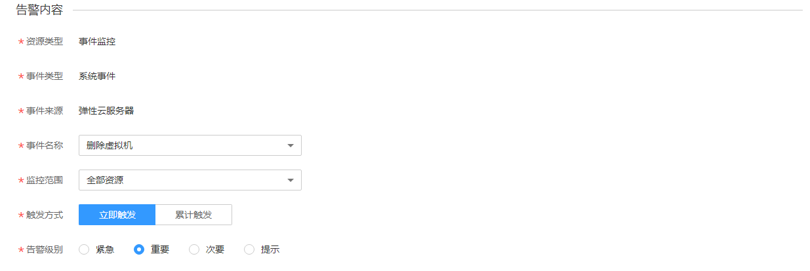
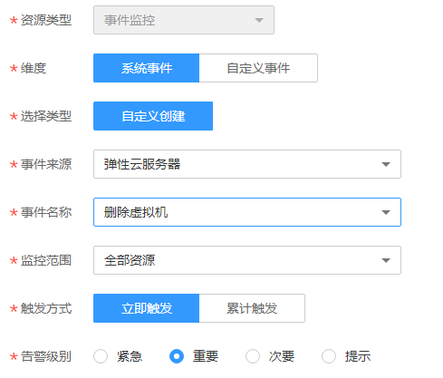

# 创建事件监控的告警通知

## 操作场景

本章节指导用户针对事件监控创建告警规则。

## 操作步骤

1.  登录管理控制台。
2.  单击“管理与部署 \> 云监控服务”。
3.  单击页面左侧的“事件监控”。
4.  在事件列表页面，单击相应事件右侧的创建告警规则。
5.  在“创建告警规则”界面，根据界面提示配置参数。
    1.  根据界面提示，配置规则信息参数。

        **图 1**  配置事件监控的告警规则基本信息  
        

        **表 1**  事件监控的告警规则基本信息配置说明

        
        <table><thead align="left"><tr id="row18694135418312"><th class="cellrowborder" valign="top" width="19.21%" id="mcps1.2.3.1.1">
参数

        </th>
        <th class="cellrowborder" valign="top" width="80.78999999999999%" id="mcps1.2.3.1.2">
参数说明

        </th>
        </tr>
        </thead>
        <tbody><tr id="row17694105423111"><td class="cellrowborder" valign="top" width="19.21%" headers="mcps1.2.3.1.1 ">
名称

        </td>
        <td class="cellrowborder" valign="top" width="80.78999999999999%" headers="mcps1.2.3.1.2 ">
系统会随机产生一个名称，用户也可以进行修改。

        </td>
        </tr>
        <tr id="row13694165413316"><td class="cellrowborder" valign="top" width="19.21%" headers="mcps1.2.3.1.1 ">
描述

        </td>
        <td class="cellrowborder" valign="top" width="80.78999999999999%" headers="mcps1.2.3.1.2 ">
告警规则描述（此参数非必填项）。

        </td>
        </tr>
        </tbody>
        </table>

    2.  选择监控对象，配置告警内容参数。

        **图 2**  配置事件监控的告警内容  
        

        **表 2**  事件监控告警内容参数说明

        
        <table><thead align="left"><tr id="row6587347154311"><th class="cellrowborder" valign="top" width="19.09%" id="mcps1.2.3.1.1">
参数

        </th>
        <th class="cellrowborder" valign="top" width="80.91000000000001%" id="mcps1.2.3.1.2">
参数说明

        </th>
        </tr>
        </thead>
        <tbody><tr id="row15621154718433"><td class="cellrowborder" valign="top" width="19.09%" headers="mcps1.2.3.1.1 ">
资源类型

        </td>
        <td class="cellrowborder" valign="top" width="80.91000000000001%" headers="mcps1.2.3.1.2 ">
配置告警规则监控的服务名称。

        </td>
        </tr>
        <tr id="row1264004774318"><td class="cellrowborder" valign="top" width="19.09%" headers="mcps1.2.3.1.1 ">
维度

        </td>
        <td class="cellrowborder" valign="top" width="80.91000000000001%" headers="mcps1.2.3.1.2 ">
用于指定告警规则对应指标的维度名称。

        
取值样例：系统事件

        </td>
        </tr>
        <tr id="row16651184714314"><td class="cellrowborder" valign="top" width="19.09%" headers="mcps1.2.3.1.1 ">
选择类型

        </td>
        <td class="cellrowborder" valign="top" width="80.91000000000001%" headers="mcps1.2.3.1.2 ">
选择自定义创建。

        </td>
        </tr>
        <tr id="row6659184717435"><td class="cellrowborder" valign="top" width="19.09%" headers="mcps1.2.3.1.1 ">
事件来源

        </td>
        <td class="cellrowborder" valign="top" width="80.91000000000001%" headers="mcps1.2.3.1.2 ">
事件来源的云服务名称。

        
取值样例：弹性云服务器

        </td>
        </tr>
        <tr id="row1967024718433"><td class="cellrowborder" valign="top" width="19.09%" headers="mcps1.2.3.1.1 ">
事件名称

        </td>
        <td class="cellrowborder" valign="top" width="80.91000000000001%" headers="mcps1.2.3.1.2 ">
用户操作系统资源的动作，如用户登录，用户登出，为一个瞬间的操作动作。

        
事件监控支持的操作事件请参见<a href="事件监控支持的事件说明.md">事件监控支持的事件说明</a>。

        
取值样例：删除虚拟机

        </td>
        </tr>
        <tr id="row36841447164320"><td class="cellrowborder" valign="top" width="19.09%" headers="mcps1.2.3.1.1 ">
监控范围

        </td>
        <td class="cellrowborder" valign="top" width="80.91000000000001%" headers="mcps1.2.3.1.2 ">
创建事件监控针对的资源范围。

        
取值样例：全部资源

        </td>
        </tr>
        <tr id="row569424784317"><td class="cellrowborder" valign="top" width="19.09%" headers="mcps1.2.3.1.1 ">
监控对象

        </td>
        <td class="cellrowborder" valign="top" width="80.91000000000001%" headers="mcps1.2.3.1.2 ">
当选择指定资源时需配置该参数。

        </td>
        </tr>
        <tr id="row19705144712437"><td class="cellrowborder" valign="top" width="19.09%" headers="mcps1.2.3.1.1 ">
触发方式

        </td>
        <td class="cellrowborder" valign="top" width="80.91000000000001%" headers="mcps1.2.3.1.2 ">
用户可根据该操作的严重程度选择立即触发或累计触发。

        
取值样例：立即触发

        </td>
        </tr>
        <tr id="row19715147164312"><td class="cellrowborder" valign="top" width="19.09%" headers="mcps1.2.3.1.1 ">
告警级别

        </td>
        <td class="cellrowborder" valign="top" width="80.91000000000001%" headers="mcps1.2.3.1.2 ">
根据告警的严重程度不同等级，可选择紧急、重要、次要、提示。

        
取值样例：重要

        </td>
        </tr>
        </tbody>
        </table>

    3.  根据界面提示，配置告警通知参数。

        **图 3**  配置事件监控告警通知  
        

        **表 3**  事件监控告警通知参数说明

        
        <table><thead align="left"><tr id="row13415173554216"><th class="cellrowborder" valign="top" width="16.28%" id="mcps1.2.3.1.1">
参数

        </th>
        <th class="cellrowborder" valign="top" width="83.72%" id="mcps1.2.3.1.2">
参数说明

        </th>
        </tr>
        </thead>
        <tbody><tr id="row3415103514420"><td class="cellrowborder" valign="top" width="16.28%" headers="mcps1.2.3.1.1 ">
发送通知

        </td>
        <td class="cellrowborder" valign="top" width="83.72%" headers="mcps1.2.3.1.2 ">
配置是否发送邮件、短信、HTTP和HTTPS通知用户。

        </td>
        </tr>
        <tr id="row18415153564213"><td class="cellrowborder" valign="top" width="16.28%" headers="mcps1.2.3.1.1 ">
生效时间

        </td>
        <td class="cellrowborder" valign="top" width="83.72%" headers="mcps1.2.3.1.2 ">
该告警规则仅在生效时间内发送通知消息。

        
如生效时间为00:00-8:00，则该告警规则仅在00:00-8:00发送通知消息。

        </td>
        </tr>
        <tr id="row164156354426"><td class="cellrowborder" valign="top" width="16.28%" headers="mcps1.2.3.1.1 ">
通知对象

        </td>
        <td class="cellrowborder" valign="top" width="83.72%" headers="mcps1.2.3.1.2 ">
需要发送告警通知的对象，可选择“云账号联系人”或主题。<ul id="ul17384114720449"><li>云账号联系人：注册账号时的手机和邮箱。</li><li>主题：消息发布或客户端订阅通知的特定事件类型，若此处没有需要的主题，需先创建主题并订阅该主题，详细操作请参见<a href="创建主题.md">创建主题</a>-<a href="添加订阅.md">添加订阅</a>。</li></ul>
        

        </td>
        </tr>
        <tr id="row1416153504210"><td class="cellrowborder" valign="top" width="16.28%" headers="mcps1.2.3.1.1 ">
触发条件

        </td>
        <td class="cellrowborder" valign="top" width="83.72%" headers="mcps1.2.3.1.2 ">
可以选择“出现告警”、“恢复正常”两种状态，作为触发告警通知的条件。

        </td>
        </tr>
        </tbody>
        </table>

    4.  配置完成后，单击“立即创建”，完成告警规则的创建。

