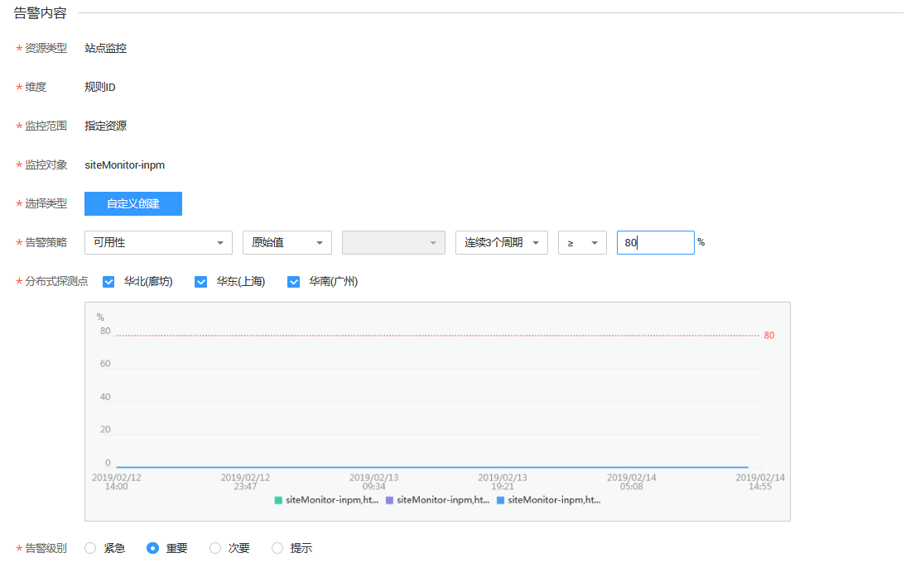
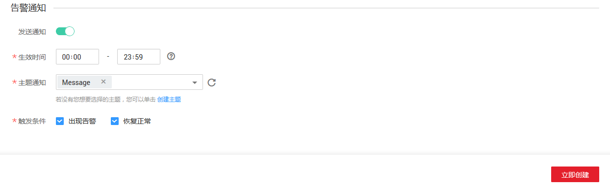

# 创建告警规则

## 操作场景

本章节指导用户对已创建的站点进行告警规则的配置。

## 前提条件

已创建站点监控。

## 操作步骤

1.  登录管理控制台。
2.  单击“管理与部署 \> 云监控 \> 站点监控”。
3.  在“站点监控”界面，单击监控站点所在行的“创建告警规则”。
4.  在“创建告警规则”界面，根据界面提示配置参数。
    1.  根据界面提示，配置规则信息参数。

        **图 1**  配置规则信息  
        

        **表 1**  配置规则信息

        
        <table><thead align="left"><tr id="row18694135418312"><th class="cellrowborder" valign="top" width="14.97%" id="mcps1.2.4.1.1">
参数

        </th>
        <th class="cellrowborder" valign="top" width="62.96000000000001%" id="mcps1.2.4.1.2">
参数说明

        </th>
        <th class="cellrowborder" valign="top" width="22.07%" id="mcps1.2.4.1.3">
取值样例

        </th>
        </tr>
        </thead>
        <tbody><tr id="row17694105423111"><td class="cellrowborder" valign="top" width="14.97%" headers="mcps1.2.4.1.1 ">
名称

        </td>
        <td class="cellrowborder" valign="top" width="62.96000000000001%" headers="mcps1.2.4.1.2 ">
系统会随机产生一个名称，用户也可以进行修改。

        </td>
        <td class="cellrowborder" valign="top" width="22.07%" headers="mcps1.2.4.1.3 ">
alarm-b6al

        </td>
        </tr>
        <tr id="row13694165413316"><td class="cellrowborder" valign="top" width="14.97%" headers="mcps1.2.4.1.1 ">
描述

        </td>
        <td class="cellrowborder" valign="top" width="62.96000000000001%" headers="mcps1.2.4.1.2 ">
告警规则描述（此参数非必填项）。

        </td>
        <td class="cellrowborder" valign="top" width="22.07%" headers="mcps1.2.4.1.3 ">
-

        </td>
        </tr>
        </tbody>
        </table>

    2.  选择监控对象，配置告警内容参数。

        **图 2**  配置告警内容  
        

        **表 2**  配置告警内容

        
        <table><thead align="left"><tr id="row79491995423"><th class="cellrowborder" valign="top" width="14.970000000000002%" id="mcps1.2.4.1.1">
参数

        </th>
        <th class="cellrowborder" valign="top" width="63.73000000000001%" id="mcps1.2.4.1.2">
参数说明

        </th>
        <th class="cellrowborder" valign="top" width="21.3%" id="mcps1.2.4.1.3">
取值样例

        </th>
        </tr>
        </thead>
        <tbody><tr id="row89519954220"><td class="cellrowborder" valign="top" width="14.970000000000002%" headers="mcps1.2.4.1.1 ">
告警策略

        </td>
        <td class="cellrowborder" valign="top" width="63.73000000000001%" headers="mcps1.2.4.1.2 ">
触发告警规则的告警策略。

        
例如：可用性，监控周期为5分钟，连续三个周期平均值≤90%

        </td>
        <td class="cellrowborder" valign="top" width="21.3%" headers="mcps1.2.4.1.3 ">
-

        </td>
        </tr>
        <tr id="row3951891428"><td class="cellrowborder" valign="top" width="14.970000000000002%" headers="mcps1.2.4.1.1 ">
分布式探测点

        </td>
        <td class="cellrowborder" valign="top" width="63.73000000000001%" headers="mcps1.2.4.1.2 ">
目前支持华北（廊坊）、华东（上海）、华南（广州）。

        
 说明： 

当监控指标为可用性、丢包率、响应时间、HTTP响应码时可选分布式探测点。

        

        </td>
        <td class="cellrowborder" valign="top" width="21.3%" headers="mcps1.2.4.1.3 ">
按需选择

        </td>
        </tr>
        <tr id="row5951129114220"><td class="cellrowborder" valign="top" width="14.970000000000002%" headers="mcps1.2.4.1.1 ">
告警级别

        </td>
        <td class="cellrowborder" valign="top" width="63.73000000000001%" headers="mcps1.2.4.1.2 ">
根据告警的严重程度不同等级，可选择紧急、重要、次要、提示。

        </td>
        <td class="cellrowborder" valign="top" width="21.3%" headers="mcps1.2.4.1.3 ">
重要

        </td>
        </tr>
        </tbody>
        </table>

        > **说明：**   
        >[表2](#table1951189104216)未提及的参数为默认值，无需配置。  

    3.  根据界面提示，配置告警通知参数。

        **图 3**  配置告警通知  
        

        **表 3**  配置告警通知

        
        <table><thead align="left"><tr id="row13415173554216"><th class="cellrowborder" valign="top" width="14.970000000000002%" id="mcps1.2.4.1.1">
参数

        </th>
        <th class="cellrowborder" valign="top" width="64.35000000000001%" id="mcps1.2.4.1.2">
参数说明

        </th>
        <th class="cellrowborder" valign="top" width="20.680000000000003%" id="mcps1.2.4.1.3">
取值样例

        </th>
        </tr>
        </thead>
        <tbody><tr id="row3415103514420"><td class="cellrowborder" valign="top" width="14.970000000000002%" headers="mcps1.2.4.1.1 ">
发送通知

        </td>
        <td class="cellrowborder" valign="top" width="64.35000000000001%" headers="mcps1.2.4.1.2 ">
配置是否发送邮件、短信、HTTP和HTTPS通知用户。

        
选择“是”（推荐选择），会发送通知；选择“否”，不会发送通知。

        </td>
        <td class="cellrowborder" valign="top" width="20.680000000000003%" headers="mcps1.2.4.1.3 ">
是

        </td>
        </tr>
        <tr id="row18415153564213"><td class="cellrowborder" valign="top" width="14.970000000000002%" headers="mcps1.2.4.1.1 ">
生效时间

        </td>
        <td class="cellrowborder" valign="top" width="64.35000000000001%" headers="mcps1.2.4.1.2 ">
该告警规则仅在生效时间内发送通知消息。

        
如生效时间为00:00-8:00，则该告警规则仅在00:00-8:00发送通知消息。

        </td>
        <td class="cellrowborder" valign="top" width="20.680000000000003%" headers="mcps1.2.4.1.3 ">
-

        </td>
        </tr>
        <tr id="row164156354426"><td class="cellrowborder" valign="top" width="14.970000000000002%" headers="mcps1.2.4.1.1 ">
主题通知

        </td>
        <td class="cellrowborder" valign="top" width="64.35000000000001%" headers="mcps1.2.4.1.2 ">
需要发送告警通知的主题名称。

        
当发送通知选择“是”时，需要选择已有的主题名称，若此处没有需要的主题则需先创建主题，该功能会调用消息通知服务（SMN），创建主题请参见《消息通知服务用户指南》。

        </td>
        <td class="cellrowborder" valign="top" width="20.680000000000003%" headers="mcps1.2.4.1.3 ">
-

        </td>
        </tr>
        <tr id="row1416153504210"><td class="cellrowborder" valign="top" width="14.970000000000002%" headers="mcps1.2.4.1.1 ">
触发条件

        </td>
        <td class="cellrowborder" valign="top" width="64.35000000000001%" headers="mcps1.2.4.1.2 ">
可以选择“出现告警”、“恢复正常两种状态，作为触发告警通知的条件。

        </td>
        <td class="cellrowborder" valign="top" width="20.680000000000003%" headers="mcps1.2.4.1.3 ">
-

        </td>
        </tr>
        </tbody>
        </table>

    4.  配置完成后，单击“立即创建”，完成告警规则的创建。

