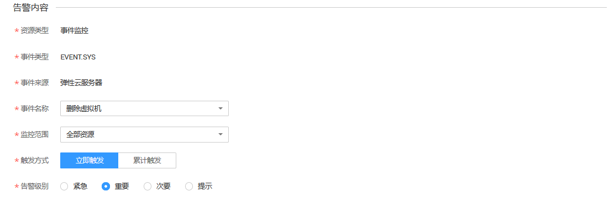

# 创建告警规则

## 操作场景

本章节指导用户针对事件监控创建告警规则。

## 操作步骤

1.  登录管理控制台。
2.  单击“管理与部署 \> 云监控”。
3.  单击页面左侧的“事件监控”，在事件列表页面，单击相应事件右侧的创建告警规则。
4.  在“创建告警规则”界面，根据界面提示配置参数。
    1.  根据界面提示，配置规则信息参数。

        **图 1**  配置规则信息  
        

        **表 1**  配置规则信息

        
        <table><thead align="left"><tr id="row18694135418312"><th class="cellrowborder" valign="top" width="14.97%" id="mcps1.2.4.1.1">
参数

        </th>
        <th class="cellrowborder" valign="top" width="62.96000000000001%" id="mcps1.2.4.1.2">
参数说明

        </th>
        <th class="cellrowborder" valign="top" width="22.07%" id="mcps1.2.4.1.3">
取值样例

        </th>
        </tr>
        </thead>
        <tbody><tr id="row17694105423111"><td class="cellrowborder" valign="top" width="14.97%" headers="mcps1.2.4.1.1 ">
名称

        </td>
        <td class="cellrowborder" valign="top" width="62.96000000000001%" headers="mcps1.2.4.1.2 ">
系统会随机产生一个名称，用户也可以进行修改。

        </td>
        <td class="cellrowborder" valign="top" width="22.07%" headers="mcps1.2.4.1.3 ">
alarm-b6al

        </td>
        </tr>
        <tr id="row13694165413316"><td class="cellrowborder" valign="top" width="14.97%" headers="mcps1.2.4.1.1 ">
描述

        </td>
        <td class="cellrowborder" valign="top" width="62.96000000000001%" headers="mcps1.2.4.1.2 ">
告警规则描述（此参数非必填项）。

        </td>
        <td class="cellrowborder" valign="top" width="22.07%" headers="mcps1.2.4.1.3 ">
-

        </td>
        </tr>
        </tbody>
        </table>

    2.  选择监控对象，配置告警内容参数。

        **图 2**  配置告警内容  
        

        **表 2**  创建告警规则

        
        <table><thead align="left"><tr id="row6587347154311"><th class="cellrowborder" valign="top" width="14.97%" id="mcps1.2.4.1.1">
参数

        </th>
        <th class="cellrowborder" valign="top" width="63.43%" id="mcps1.2.4.1.2">
参数说明

        </th>
        <th class="cellrowborder" valign="top" width="21.6%" id="mcps1.2.4.1.3">
取值样例

        </th>
        </tr>
        </thead>
        <tbody><tr id="row15621154718433"><td class="cellrowborder" valign="top" width="14.97%" headers="mcps1.2.4.1.1 ">
资源类型

        </td>
        <td class="cellrowborder" valign="top" width="63.43%" headers="mcps1.2.4.1.2 ">
配置告警规则监控的服务名称。

        </td>
        <td class="cellrowborder" valign="top" width="21.6%" headers="mcps1.2.4.1.3 ">
事件监控

        </td>
        </tr>
        <tr id="row1264004774318"><td class="cellrowborder" valign="top" width="14.97%" headers="mcps1.2.4.1.1 ">
维度

        </td>
        <td class="cellrowborder" valign="top" width="63.43%" headers="mcps1.2.4.1.2 ">
用于指定告警规则对应指标的维度名称。

        </td>
        <td class="cellrowborder" valign="top" width="21.6%" headers="mcps1.2.4.1.3 ">
系统事件

        </td>
        </tr>
        <tr id="row16651184714314"><td class="cellrowborder" valign="top" width="14.97%" headers="mcps1.2.4.1.1 ">
选择类型

        </td>
        <td class="cellrowborder" valign="top" width="63.43%" headers="mcps1.2.4.1.2 ">
选择自定义创建。

        </td>
        <td class="cellrowborder" valign="top" width="21.6%" headers="mcps1.2.4.1.3 ">
自定义创建

        </td>
        </tr>
        <tr id="row6659184717435"><td class="cellrowborder" valign="top" width="14.97%" headers="mcps1.2.4.1.1 ">
事件来源

        </td>
        <td class="cellrowborder" valign="top" width="63.43%" headers="mcps1.2.4.1.2 ">
事件来源的云服务名称。

        </td>
        <td class="cellrowborder" valign="top" width="21.6%" headers="mcps1.2.4.1.3 ">
ECS

        </td>
        </tr>
        <tr id="row1967024718433"><td class="cellrowborder" valign="top" width="14.97%" headers="mcps1.2.4.1.1 ">
事件名称

        </td>
        <td class="cellrowborder" valign="top" width="63.43%" headers="mcps1.2.4.1.2 ">
用户操作系统资源的动作，如登录，登出。

        
事件监控支持的操作事件请参见<a href="事件监控支持的操作事件说明.md">事件监控支持的操作事件说明</a>。

        </td>
        <td class="cellrowborder" valign="top" width="21.6%" headers="mcps1.2.4.1.3 ">
Delete ECS

        </td>
        </tr>
        <tr id="row36841447164320"><td class="cellrowborder" valign="top" width="14.97%" headers="mcps1.2.4.1.1 ">
监控范围

        </td>
        <td class="cellrowborder" valign="top" width="63.43%" headers="mcps1.2.4.1.2 ">
创建事件监控针对的资源范围。

        </td>
        <td class="cellrowborder" valign="top" width="21.6%" headers="mcps1.2.4.1.3 ">
全部资源

        </td>
        </tr>
        <tr id="row569424784317"><td class="cellrowborder" valign="top" width="14.97%" headers="mcps1.2.4.1.1 ">
监控对象

        </td>
        <td class="cellrowborder" valign="top" width="63.43%" headers="mcps1.2.4.1.2 ">
当选择指定资源时需配置该参数。

        </td>
        <td class="cellrowborder" valign="top" width="21.6%" headers="mcps1.2.4.1.3 ">
-

        </td>
        </tr>
        <tr id="row19705144712437"><td class="cellrowborder" valign="top" width="14.97%" headers="mcps1.2.4.1.1 ">
触发方式

        </td>
        <td class="cellrowborder" valign="top" width="63.43%" headers="mcps1.2.4.1.2 ">
用户可根据该操作的严重程度选择立即触发或累计触发。

        </td>
        <td class="cellrowborder" valign="top" width="21.6%" headers="mcps1.2.4.1.3 ">
立即触发

        </td>
        </tr>
        <tr id="row19715147164312"><td class="cellrowborder" valign="top" width="14.97%" headers="mcps1.2.4.1.1 ">
告警级别

        </td>
        <td class="cellrowborder" valign="top" width="63.43%" headers="mcps1.2.4.1.2 ">
根据告警的严重程度不同等级，可选择紧急、重要、次要、提示。

        </td>
        <td class="cellrowborder" valign="top" width="21.6%" headers="mcps1.2.4.1.3 ">
重要

        </td>
        </tr>
        </tbody>
        </table>

    3.  根据界面提示，配置告警通知参数。

        **图 3**  配置告警通知  
        

        **表 3**  配置告警通知

        
        <table><thead align="left"><tr id="row13415173554216"><th class="cellrowborder" valign="top" width="14.970000000000002%" id="mcps1.2.4.1.1">
参数

        </th>
        <th class="cellrowborder" valign="top" width="64.35000000000001%" id="mcps1.2.4.1.2">
参数说明

        </th>
        <th class="cellrowborder" valign="top" width="20.680000000000003%" id="mcps1.2.4.1.3">
取值样例

        </th>
        </tr>
        </thead>
        <tbody><tr id="row3415103514420"><td class="cellrowborder" valign="top" width="14.970000000000002%" headers="mcps1.2.4.1.1 ">
发送通知

        </td>
        <td class="cellrowborder" valign="top" width="64.35000000000001%" headers="mcps1.2.4.1.2 ">
配置是否发送邮件、短信、HTTP和HTTPS通知用户。

        
选择“是”（推荐选择），会发送通知；选择“否”，不会发送通知。

        </td>
        <td class="cellrowborder" valign="top" width="20.680000000000003%" headers="mcps1.2.4.1.3 ">
是

        </td>
        </tr>
        <tr id="row18415153564213"><td class="cellrowborder" valign="top" width="14.970000000000002%" headers="mcps1.2.4.1.1 ">
生效时间

        </td>
        <td class="cellrowborder" valign="top" width="64.35000000000001%" headers="mcps1.2.4.1.2 ">
该告警规则仅在生效时间内发送通知消息。

        
如生效时间为00:00-8:00，则该告警规则仅在00:00-8:00发送通知消息。

        </td>
        <td class="cellrowborder" valign="top" width="20.680000000000003%" headers="mcps1.2.4.1.3 ">
-

        </td>
        </tr>
        <tr id="row164156354426"><td class="cellrowborder" valign="top" width="14.970000000000002%" headers="mcps1.2.4.1.1 ">
主题通知

        </td>
        <td class="cellrowborder" valign="top" width="64.35000000000001%" headers="mcps1.2.4.1.2 ">
需要发送告警通知的主题名称。

        
当发送通知选择“是”时，需要选择已有的主题名称，若此处没有需要的主题则需先创建主题，该功能会调用消息通知服务（SMN），创建主题请参见《消息通知服务用户指南》。

        </td>
        <td class="cellrowborder" valign="top" width="20.680000000000003%" headers="mcps1.2.4.1.3 ">
-

        </td>
        </tr>
        <tr id="row1416153504210"><td class="cellrowborder" valign="top" width="14.970000000000002%" headers="mcps1.2.4.1.1 ">
触发条件

        </td>
        <td class="cellrowborder" valign="top" width="64.35000000000001%" headers="mcps1.2.4.1.2 ">
可以选择“出现告警”、“恢复正常两种状态，作为触发告警通知的条件。

        </td>
        <td class="cellrowborder" valign="top" width="20.680000000000003%" headers="mcps1.2.4.1.3 ">
-

        </td>
        </tr>
        </tbody>
        </table>

    4.  配置完成后，单击“立即创建”，完成告警规则的创建。

