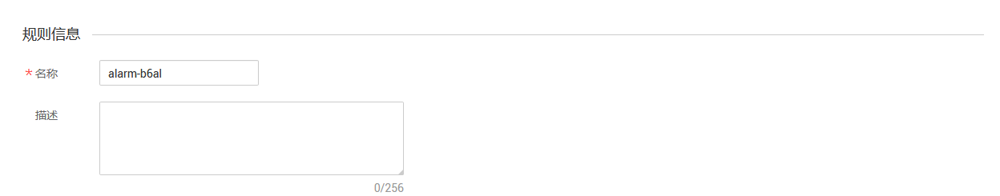
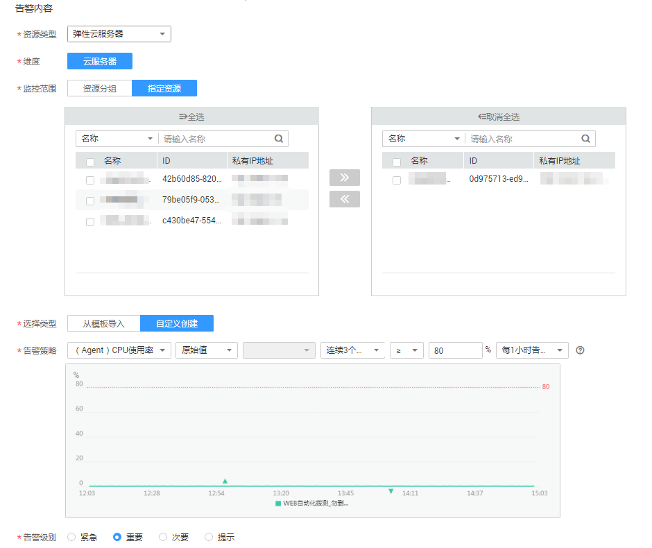
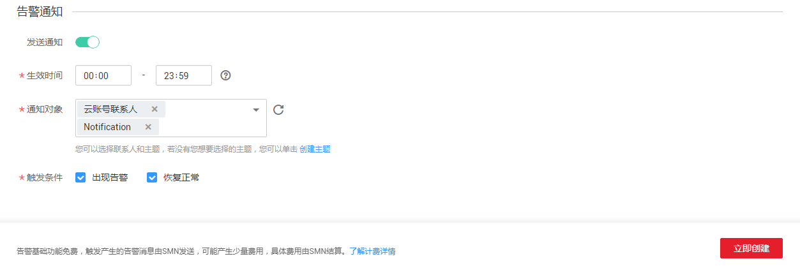

# 创建告警规则

## 操作场景

本章节指导用户对ECS或BMS的细颗粒度监控指标创建告警规则。

## 操作步骤

1.  登录管理控制台。
2.  在管理控制台左上角单击图标，选择区域和项目。
3.  单击“管理与部署 \> 云监控”。
4.  单击页面左侧的“主机监控”，进入主机监控页面。
5.  单击ECS或BMS主机所在栏右侧的“更多”按钮，选择下拉出的“创建告警规则”。
6.  在“创建告警规则”界面，根据界面提示配置参数。
    1.  根据界面提示，配置规则信息参数。

        **图 1**  配置规则信息  
        

        **表 1**  配置规则信息

        
        <table><thead align="left"><tr id="row18694135418312"><th class="cellrowborder" valign="top" width="14.97%" id="mcps1.2.4.1.1">
参数

        </th>
        <th class="cellrowborder" valign="top" width="62.96000000000001%" id="mcps1.2.4.1.2">
参数说明

        </th>
        <th class="cellrowborder" valign="top" width="22.07%" id="mcps1.2.4.1.3">
取值样例

        </th>
        </tr>
        </thead>
        <tbody><tr id="row17694105423111"><td class="cellrowborder" valign="top" width="14.97%" headers="mcps1.2.4.1.1 ">
名称

        </td>
        <td class="cellrowborder" valign="top" width="62.96000000000001%" headers="mcps1.2.4.1.2 ">
系统会随机产生一个名称，用户也可以进行修改。

        </td>
        <td class="cellrowborder" valign="top" width="22.07%" headers="mcps1.2.4.1.3 ">
alarm-b6al

        </td>
        </tr>
        <tr id="row13694165413316"><td class="cellrowborder" valign="top" width="14.97%" headers="mcps1.2.4.1.1 ">
描述

        </td>
        <td class="cellrowborder" valign="top" width="62.96000000000001%" headers="mcps1.2.4.1.2 ">
告警规则描述（此参数非必填项）。

        </td>
        <td class="cellrowborder" valign="top" width="22.07%" headers="mcps1.2.4.1.3 ">
-

        </td>
        </tr>
        </tbody>
        </table>

    2.  选择监控对象，配置告警内容参数。

        **图 2**  配置告警内容  
        

        **表 2**  配置告警内容

        
        <table><thead align="left"><tr id="row1139752563410"><th class="cellrowborder" valign="top" width="14.970000000000002%" id="mcps1.2.4.1.1">
参数

        </th>
        <th class="cellrowborder" valign="top" width="63.12000000000001%" id="mcps1.2.4.1.2">
参数说明

        </th>
        <th class="cellrowborder" valign="top" width="21.91%" id="mcps1.2.4.1.3">
取值样例

        </th>
        </tr>
        </thead>
        <tbody><tr id="row742952516349"><td class="cellrowborder" valign="top" width="14.970000000000002%" headers="mcps1.2.4.1.1 ">
资源类型

        </td>
        <td class="cellrowborder" valign="top" width="63.12000000000001%" headers="mcps1.2.4.1.2 ">
配置告警规则监控的服务名称。

        </td>
        <td class="cellrowborder" valign="top" width="21.91%" headers="mcps1.2.4.1.3 ">
弹性云服务器

        </td>
        </tr>
        <tr id="row1244342513412"><td class="cellrowborder" valign="top" width="14.970000000000002%" headers="mcps1.2.4.1.1 ">
维度

        </td>
        <td class="cellrowborder" valign="top" width="63.12000000000001%" headers="mcps1.2.4.1.2 ">
用于指定告警规则对应指标的维度名称

        </td>
        <td class="cellrowborder" valign="top" width="21.91%" headers="mcps1.2.4.1.3 ">
云服务器

        </td>
        </tr>
        <tr id="row84511325173416"><td class="cellrowborder" valign="top" width="14.970000000000002%" headers="mcps1.2.4.1.1 ">
监控范围

        </td>
        <td class="cellrowborder" valign="top" width="63.12000000000001%" headers="mcps1.2.4.1.2 ">
告警规则适用的资源范围。

        </td>
        <td class="cellrowborder" valign="top" width="21.91%" headers="mcps1.2.4.1.3 ">
指定资源

        </td>
        </tr>
        <tr id="row13462172515346"><td class="cellrowborder" valign="top" width="14.970000000000002%" headers="mcps1.2.4.1.1 ">
监控对象

        </td>
        <td class="cellrowborder" valign="top" width="63.12000000000001%" headers="mcps1.2.4.1.2 ">
监控对象为当前选择的弹性云服务器，无需配置。

        </td>
        <td class="cellrowborder" valign="top" width="21.91%" headers="mcps1.2.4.1.3 ">
-

        </td>
        </tr>
        <tr id="row194731325183416"><td class="cellrowborder" valign="top" width="14.970000000000002%" headers="mcps1.2.4.1.1 ">
选择类型

        </td>
        <td class="cellrowborder" valign="top" width="63.12000000000001%" headers="mcps1.2.4.1.2 ">
根据需要可选择从模板导入或自定义创建。

        </td>
        <td class="cellrowborder" valign="top" width="21.91%" headers="mcps1.2.4.1.3 ">
自定义创建

        </td>
        </tr>
        <tr id="row74821125113418"><td class="cellrowborder" valign="top" width="14.970000000000002%" headers="mcps1.2.4.1.1 ">
模板

        </td>
        <td class="cellrowborder" valign="top" width="63.12000000000001%" headers="mcps1.2.4.1.2 ">
选择需要导入的模板。

        </td>
        <td class="cellrowborder" valign="top" width="21.91%" headers="mcps1.2.4.1.3 ">
-

        </td>
        </tr>
        <tr id="row649114256342"><td class="cellrowborder" valign="top" width="14.970000000000002%" headers="mcps1.2.4.1.1 ">
告警策略

        </td>
        <td class="cellrowborder" valign="top" width="63.12000000000001%" headers="mcps1.2.4.1.2 ">
触发告警规则的告警策略。

        
例如：CPU使用率，监控周期为5分钟，连续三个周期平均值≥80%

        </td>
        <td class="cellrowborder" valign="top" width="21.91%" headers="mcps1.2.4.1.3 ">
-

        </td>
        </tr>
        <tr id="row6500102573410"><td class="cellrowborder" valign="top" width="14.970000000000002%" headers="mcps1.2.4.1.1 ">
挂载点

        </td>
        <td class="cellrowborder" valign="top" width="63.12000000000001%" headers="mcps1.2.4.1.2 ">
当监控指标为细颗粒度的磁盘类监控指标时需配置该参数。

        
Windows系统请输入对应的驱动器号，比如C、D或者E等，Linux系统请输入对应的挂载点，比如/dev、/opt等。

        </td>
        <td class="cellrowborder" valign="top" width="21.91%" headers="mcps1.2.4.1.3 ">
/dev

        </td>
        </tr>
        <tr id="row1051172563420"><td class="cellrowborder" valign="top" width="14.970000000000002%" headers="mcps1.2.4.1.1 ">
告警级别

        </td>
        <td class="cellrowborder" valign="top" width="63.12000000000001%" headers="mcps1.2.4.1.2 ">
根据告警的严重程度不同等级，可选择紧急、重要、次要、提示。

        </td>
        <td class="cellrowborder" valign="top" width="21.91%" headers="mcps1.2.4.1.3 ">
重要

        </td>
        </tr>
        </tbody>
        </table>

    3.  根据界面提示，配置告警通知参数。

        **图 3**  配置告警通知  
        

        **表 3**  配置告警通知

        
        <table><thead align="left"><tr id="row13415173554216"><th class="cellrowborder" valign="top" width="14.970000000000002%" id="mcps1.2.4.1.1">
参数

        </th>
        <th class="cellrowborder" valign="top" width="64.35000000000001%" id="mcps1.2.4.1.2">
参数说明

        </th>
        <th class="cellrowborder" valign="top" width="20.680000000000003%" id="mcps1.2.4.1.3">
取值样例

        </th>
        </tr>
        </thead>
        <tbody><tr id="row3415103514420"><td class="cellrowborder" valign="top" width="14.970000000000002%" headers="mcps1.2.4.1.1 ">
发送通知

        </td>
        <td class="cellrowborder" valign="top" width="64.35000000000001%" headers="mcps1.2.4.1.2 ">
配置是否发送邮件、短信、HTTP和HTTPS通知用户。

        
选择“是”（推荐选择），会发送通知；选择“否”，不会发送通知。

        </td>
        <td class="cellrowborder" valign="top" width="20.680000000000003%" headers="mcps1.2.4.1.3 ">
是

        </td>
        </tr>
        <tr id="row18415153564213"><td class="cellrowborder" valign="top" width="14.970000000000002%" headers="mcps1.2.4.1.1 ">
生效时间

        </td>
        <td class="cellrowborder" valign="top" width="64.35000000000001%" headers="mcps1.2.4.1.2 ">
该告警规则仅在生效时间内发送通知消息。

        
如生效时间为00:00-8:00，则该告警规则仅在00:00-8:00发送通知消息。

        </td>
        <td class="cellrowborder" valign="top" width="20.680000000000003%" headers="mcps1.2.4.1.3 ">
-

        </td>
        </tr>
        <tr id="row164156354426"><td class="cellrowborder" valign="top" width="14.970000000000002%" headers="mcps1.2.4.1.1 ">
主题通知

        </td>
        <td class="cellrowborder" valign="top" width="64.35000000000001%" headers="mcps1.2.4.1.2 ">
需要发送告警通知的主题名称。

        
当发送通知选择“是”时，需要选择已有的主题名称，若此处没有需要的主题则需先创建主题，该功能会调用消息通知服务（SMN），创建主题请参见《消息通知服务用户指南》。

        </td>
        <td class="cellrowborder" valign="top" width="20.680000000000003%" headers="mcps1.2.4.1.3 ">
-

        </td>
        </tr>
        <tr id="row1416153504210"><td class="cellrowborder" valign="top" width="14.970000000000002%" headers="mcps1.2.4.1.1 ">
触发条件

        </td>
        <td class="cellrowborder" valign="top" width="64.35000000000001%" headers="mcps1.2.4.1.2 ">
可以选择“出现告警”、“恢复正常两种状态，作为触发告警通知的条件。

        </td>
        <td class="cellrowborder" valign="top" width="20.680000000000003%" headers="mcps1.2.4.1.3 ">
-

        </td>
        </tr>
        </tbody>
        </table>

    4.  配置完成后，单击“立即创建”，完成告警规则的创建。

告警规则添加完成后，当监控指标触发设定的阈值时，云监控会在第一时间通过消息通知服务实时告知您云上资源异常，以免因此造成业务损失。

