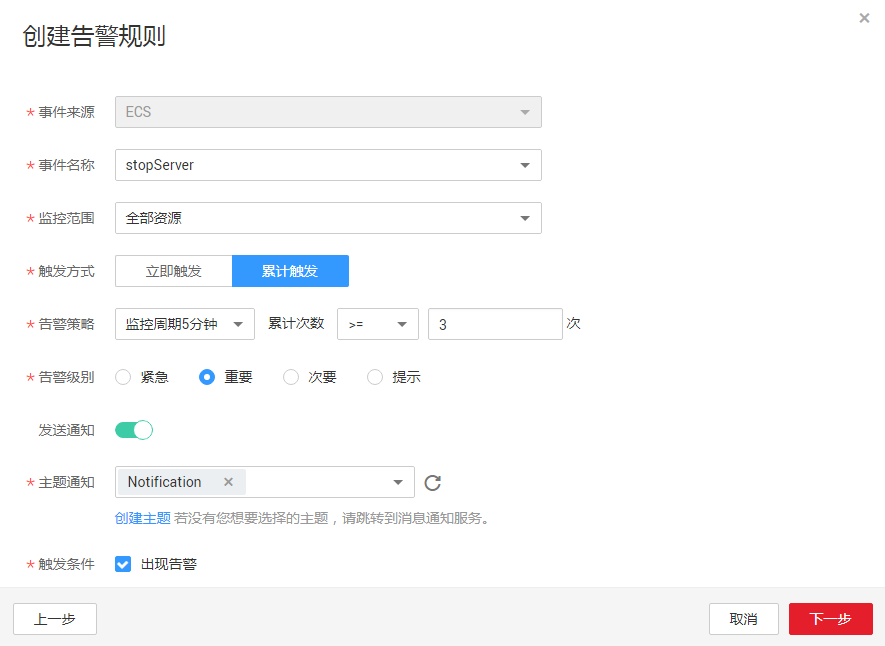

# 创建告警规则（事件监控）

## 操作场景

本章节指导用户针对事件监控创建告警规则。

## 操作步骤

1.  登录管理控制台。
2.  单击“管理与部署 \> 云监控”。
3.  单击页面左侧的“事件监控”，在事件列表页面，单击相应事件右侧的创建告警规则。
4.  根据页面提示，配置参数，参数说明如[表1](#zh-cn_topic_0109299893_table121943547193)所示。

    **图 1**  创建告警规则（事件监控）  
    

    **表 1**  创建告警规则

    
    <table><thead align="left"><tr id="zh-cn_topic_0109299893_row81911454121913"><th class="cellrowborder" valign="top" width="17%" id="mcps1.2.4.1.1">
参数

    </th>
    <th class="cellrowborder" valign="top" width="51%" id="mcps1.2.4.1.2">
参数说明

    </th>
    <th class="cellrowborder" valign="top" width="32%" id="mcps1.2.4.1.3">
取值样例

    </th>
    </tr>
    </thead>
    <tbody><tr id="zh-cn_topic_0109299893_row919265418194"><td class="cellrowborder" valign="top" width="17%" headers="mcps1.2.4.1.1 ">
选择类型

    </td>
    <td class="cellrowborder" valign="top" width="51%" headers="mcps1.2.4.1.2 ">
选择自定义创建。

    </td>
    <td class="cellrowborder" valign="top" width="32%" headers="mcps1.2.4.1.3 ">
自定义创建

    </td>
    </tr>
    <tr id="zh-cn_topic_0109299893_row1990911251102"><td class="cellrowborder" valign="top" width="17%" headers="mcps1.2.4.1.1 ">
事件来源

    </td>
    <td class="cellrowborder" valign="top" width="51%" headers="mcps1.2.4.1.2 ">
事件来源的云服务名称。

    </td>
    <td class="cellrowborder" valign="top" width="32%" headers="mcps1.2.4.1.3 ">
ECS

    </td>
    </tr>
    <tr id="zh-cn_topic_0109299893_row44972174713"><td class="cellrowborder" valign="top" width="17%" headers="mcps1.2.4.1.1 ">
事件名称

    </td>
    <td class="cellrowborder" valign="top" width="51%" headers="mcps1.2.4.1.2 ">
用户操作系统资源的动作，如登录，登出。

    
事件监控支持的操作事件请参见<a href="事件监控支持的操作事件说明.md">事件监控支持的操作事件说明</a>。

    </td>
    <td class="cellrowborder" valign="top" width="32%" headers="mcps1.2.4.1.3 ">
deleteServer

    </td>
    </tr>
    <tr id="zh-cn_topic_0109299893_row71513301398"><td class="cellrowborder" valign="top" width="17%" headers="mcps1.2.4.1.1 ">
监控范围

    </td>
    <td class="cellrowborder" valign="top" width="51%" headers="mcps1.2.4.1.2 ">
创建事件监控针对的资源范围。

    </td>
    <td class="cellrowborder" valign="top" width="32%" headers="mcps1.2.4.1.3 ">
全部资源

    </td>
    </tr>
    <tr id="zh-cn_topic_0109299893_row7117201918102"><td class="cellrowborder" valign="top" width="17%" headers="mcps1.2.4.1.1 ">
监控对象

    </td>
    <td class="cellrowborder" valign="top" width="51%" headers="mcps1.2.4.1.2 ">
当选择指定资源时需配置该参数。

    </td>
    <td class="cellrowborder" valign="top" width="32%" headers="mcps1.2.4.1.3 ">
-

    </td>
    </tr>
    <tr id="zh-cn_topic_0109299893_row819245421917"><td class="cellrowborder" valign="top" width="17%" headers="mcps1.2.4.1.1 ">
触发方式

    </td>
    <td class="cellrowborder" valign="top" width="51%" headers="mcps1.2.4.1.2 ">
用户可根据该操作的严重程度选择立即触发或累计触发。

    </td>
    <td class="cellrowborder" valign="top" width="32%" headers="mcps1.2.4.1.3 ">
立即触发

    </td>
    </tr>
    <tr id="row1684313306478"><td class="cellrowborder" valign="top" width="17%" headers="mcps1.2.4.1.1 ">
告警策略

    </td>
    <td class="cellrowborder" valign="top" width="51%" headers="mcps1.2.4.1.2 ">
触发告警的告警策略。

    
例如：监控周期为5分钟，累计达到3次。

    
 说明： 

当触发方式为累计触发时需配置该参数。

    

    </td>
    <td class="cellrowborder" valign="top" width="32%" headers="mcps1.2.4.1.3 ">
-

    </td>
    </tr>
    <tr id="zh-cn_topic_0109299893_row11928164865516"><td class="cellrowborder" valign="top" width="17%" headers="mcps1.2.4.1.1 ">
告警级别

    </td>
    <td class="cellrowborder" valign="top" width="51%" headers="mcps1.2.4.1.2 ">
根据告警的严重程度不同等级，可选择紧急、重要、次要、提示。

    </td>
    <td class="cellrowborder" valign="top" width="32%" headers="mcps1.2.4.1.3 ">
重要

    </td>
    </tr>
    <tr id="zh-cn_topic_0109299893_row019355410196"><td class="cellrowborder" valign="top" width="17%" headers="mcps1.2.4.1.1 ">
发送通知

    </td>
    <td class="cellrowborder" valign="top" width="51%" headers="mcps1.2.4.1.2 ">
配置是否发送邮件、短信、HTTP和HTTPS通知用户。

    
选择“是”（推荐选择），会发送通知；选择“否”，不会发送通知。

    </td>
    <td class="cellrowborder" valign="top" width="32%" headers="mcps1.2.4.1.3 ">
是

    </td>
    </tr>
    <tr id="row033332312910"><td class="cellrowborder" valign="top" width="17%" headers="mcps1.2.4.1.1 ">
生效时间

    </td>
    <td class="cellrowborder" valign="top" width="51%" headers="mcps1.2.4.1.2 ">
该告警规则仅在生效时间内发送通知消息。

    
如生效时间为00:00-8:00，则该告警规则仅在00:00-8:00发送通知消息。

    </td>
    <td class="cellrowborder" valign="top" width="32%" headers="mcps1.2.4.1.3 ">
-

    </td>
    </tr>
    <tr id="zh-cn_topic_0109299893_row8194155410198"><td class="cellrowborder" valign="top" width="17%" headers="mcps1.2.4.1.1 ">
主题名称

    </td>
    <td class="cellrowborder" valign="top" width="51%" headers="mcps1.2.4.1.2 ">
需要发送告警通知的主题名称。

    
当发送通知选择“是”时，需要选择已有的主题名称，若此处没有需要的主题则需先创建主题，该功能会调用消息通知服务（SMN），创建主题请参见《消息通知服务用户指南》。

    </td>
    <td class="cellrowborder" valign="top" width="32%" headers="mcps1.2.4.1.3 ">
-

    </td>
    </tr>
    <tr id="zh-cn_topic_0109299893_row2194145410191"><td class="cellrowborder" valign="top" width="17%" headers="mcps1.2.4.1.1 ">
触发条件

    </td>
    <td class="cellrowborder" valign="top" width="51%" headers="mcps1.2.4.1.2 ">
选择发送通知后，出现告警为必选项。

    </td>
    <td class="cellrowborder" valign="top" width="32%" headers="mcps1.2.4.1.3 ">
出现告警

    </td>
    </tr>
    </tbody>
    </table>

5.  规则信息，根据界面提示配置参数，如[表2](#zh-cn_topic_0109299893_table7623731163957)所示。配置完成后，单击“创建”，完成自定义告警规则的创建。

    **表 2**  规则信息

    
    <table><thead align="left"><tr id="zh-cn_topic_0109299893_row1169056163957"><th class="cellrowborder" valign="top" width="16.42%" id="mcps1.2.4.1.1">
参数

    </th>
    <th class="cellrowborder" valign="top" width="50.62%" id="mcps1.2.4.1.2">
参数说明

    </th>
    <th class="cellrowborder" valign="top" width="32.96%" id="mcps1.2.4.1.3">
取值样例

    </th>
    </tr>
    </thead>
    <tbody><tr id="zh-cn_topic_0109299893_row36013392163957"><td class="cellrowborder" valign="top" width="16.42%" headers="mcps1.2.4.1.1 ">
名称

    </td>
    <td class="cellrowborder" valign="top" width="50.62%" headers="mcps1.2.4.1.2 ">
系统会随机产生一个名称，用户也可以进行修改。

    </td>
    <td class="cellrowborder" valign="top" width="32.96%" headers="mcps1.2.4.1.3 ">
alarm-b6al

    </td>
    </tr>
    <tr id="zh-cn_topic_0109299893_row2717654163957"><td class="cellrowborder" valign="top" width="16.42%" headers="mcps1.2.4.1.1 ">
描述

    </td>
    <td class="cellrowborder" valign="top" width="50.62%" headers="mcps1.2.4.1.2 ">
告警规则描述（此参数非必填项）。

    </td>
    <td class="cellrowborder" valign="top" width="32.96%" headers="mcps1.2.4.1.3 ">
-

    </td>
    </tr>
    </tbody>
    </table>

