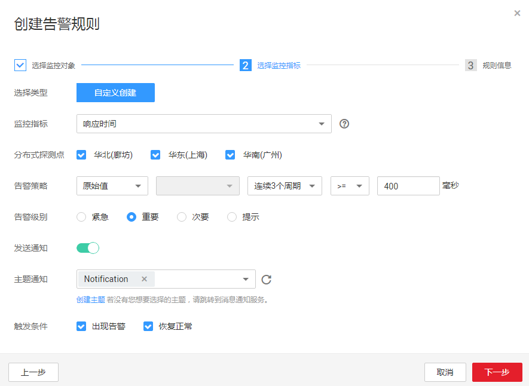

# 创建告警规则（站点监控）

## 操作场景

本章节指导用户对已创建的站点进行告警规则的配置。

## 前提条件

已创建站点监控。

## 操作步骤

1.  登录管理控制台。
2.  单击“管理与部署 \> 云监控 \> 站点监控”。
3.  在“站点监控”界面，单击监控站点所在行的“创建告警规则”。
4.  在“创建告警规则”界面，根据界面提示配置参数，如[表1](#table990794410201)所示。

    **表 1**  选择监控对象

    
    <table><thead align="left"><tr id="row1190894411208"><th class="cellrowborder" valign="top" width="17.171717171717173%" id="mcps1.2.4.1.1">
参数

    </th>
    <th class="cellrowborder" valign="top" width="49.494949494949495%" id="mcps1.2.4.1.2">
参数说明

    </th>
    <th class="cellrowborder" valign="top" width="33.333333333333336%" id="mcps1.2.4.1.3">
取值样例

    </th>
    </tr>
    </thead>
    <tbody><tr id="row20908144417200"><td class="cellrowborder" valign="top" width="17.171717171717173%" headers="mcps1.2.4.1.1 ">
资源类型

    </td>
    <td class="cellrowborder" valign="top" width="49.494949494949495%" headers="mcps1.2.4.1.2 ">
默认值，无需配置。

    </td>
    <td class="cellrowborder" valign="top" width="33.333333333333336%" headers="mcps1.2.4.1.3 ">
-

    </td>
    </tr>
    <tr id="row99081144182017"><td class="cellrowborder" valign="top" width="17.171717171717173%" headers="mcps1.2.4.1.1 ">
监控对象

    </td>
    <td class="cellrowborder" valign="top" width="49.494949494949495%" headers="mcps1.2.4.1.2 ">
默认值，无需配置。

    </td>
    <td class="cellrowborder" valign="top" width="33.333333333333336%" headers="mcps1.2.4.1.3 ">
-

    </td>
    </tr>
    </tbody>
    </table>

5.  单击“下一步”，进入选择监控指标界面，根据界面提示配置参数，如[图1](#fig320514412027)所示，参数说明如[表2](#table136271727428)所示。

    **图 1**  创建告警规则  
    

    **表 2**  选择监控指标

    
    <table><thead align="left"><tr id="row1462582710220"><th class="cellrowborder" valign="top" width="17%" id="mcps1.2.4.1.1">
参数

    </th>
    <th class="cellrowborder" valign="top" width="51%" id="mcps1.2.4.1.2">
参数说明

    </th>
    <th class="cellrowborder" valign="top" width="32%" id="mcps1.2.4.1.3">
取值样例

    </th>
    </tr>
    </thead>
    <tbody><tr id="row2625182718217"><td class="cellrowborder" valign="top" width="17%" headers="mcps1.2.4.1.1 ">
监控指标

    </td>
    <td class="cellrowborder" valign="top" width="51%" headers="mcps1.2.4.1.2 ">
按照用户创建监控站点的时候设置的监控频率作为采集粒度。

    
 说明： 
<ul id="ul1962572719220"><li>当监控指标为可用性指标时，以小时为周期进行统计，开通监控后，1小时后可查看可用性监控图标。</li><li>当站点类型为HTTP时，监控指标可选择HTTP响应码。</li></ul>
    

    </td>
    <td class="cellrowborder" valign="top" width="32%" headers="mcps1.2.4.1.3 ">
响应时间

    </td>
    </tr>
    <tr id="row1668163814390"><td class="cellrowborder" valign="top" width="17%" headers="mcps1.2.4.1.1 ">
分布式探测点

    </td>
    <td class="cellrowborder" valign="top" width="51%" headers="mcps1.2.4.1.2 ">
目前支持华北（廊坊）、华东（上海）、华南（广州）。

    
 说明： 

当监控指标为可用性、丢包率、响应时间时可选分布式探测点。

    

    </td>
    <td class="cellrowborder" valign="top" width="32%" headers="mcps1.2.4.1.3 ">
按需选择

    </td>
    </tr>
    <tr id="row14341143123712"><td class="cellrowborder" valign="top" width="17%" headers="mcps1.2.4.1.1 ">
告警策略

    </td>
    <td class="cellrowborder" valign="top" width="51%" headers="mcps1.2.4.1.2 ">
触发告警的告警策略。

    
例如：监控周期为5分钟，连续三个周期原始值≥400毫秒

    </td>
    <td class="cellrowborder" valign="top" width="32%" headers="mcps1.2.4.1.3 ">
-

    </td>
    </tr>
    <tr id="row862618275211"><td class="cellrowborder" valign="top" width="17%" headers="mcps1.2.4.1.1 ">
告警级别

    </td>
    <td class="cellrowborder" valign="top" width="51%" headers="mcps1.2.4.1.2 ">
根据告警的严重程度不同等级，可选择紧急、重要、次要、提示。

    </td>
    <td class="cellrowborder" valign="top" width="32%" headers="mcps1.2.4.1.3 ">
重要

    </td>
    </tr>
    <tr id="row146267271625"><td class="cellrowborder" valign="top" width="17%" headers="mcps1.2.4.1.1 ">
发送通知

    </td>
    <td class="cellrowborder" valign="top" width="51%" headers="mcps1.2.4.1.2 ">
配置是否发送邮件、短信、HTTP和HTTPS通知用户。

    
选择“是”（推荐选择），会发送通知；选择“否”，不会发送通知。

    </td>
    <td class="cellrowborder" valign="top" width="32%" headers="mcps1.2.4.1.3 ">
是

    </td>
    </tr>
    <tr id="row16658195014914"><td class="cellrowborder" valign="top" width="17%" headers="mcps1.2.4.1.1 ">
生效时间

    </td>
    <td class="cellrowborder" valign="top" width="51%" headers="mcps1.2.4.1.2 ">
该告警规则仅在生效时间内发送通知消息。

    
如生效时间为00:00-8:00，则该告警规则仅在00:00-8:00发送通知消息。

    </td>
    <td class="cellrowborder" valign="top" width="32%" headers="mcps1.2.4.1.3 ">
-

    </td>
    </tr>
    <tr id="row116261827925"><td class="cellrowborder" valign="top" width="17%" headers="mcps1.2.4.1.1 ">
主题通知

    </td>
    <td class="cellrowborder" valign="top" width="51%" headers="mcps1.2.4.1.2 ">
需要发送告警通知的主题名称。

    
当发送通知选择“是”时，需要选择已有的主题名称，若此处没有需要的主题则需先创建主题，该功能会调用消息通知服务（SMN），创建主题请参见《消息通知服务用户指南》。

    </td>
    <td class="cellrowborder" valign="top" width="32%" headers="mcps1.2.4.1.3 ">
-

    </td>
    </tr>
    <tr id="row17627427923"><td class="cellrowborder" valign="top" width="17%" headers="mcps1.2.4.1.1 ">
触发条件

    </td>
    <td class="cellrowborder" valign="top" width="51%" headers="mcps1.2.4.1.2 ">
可以选择出现告警、恢复正常，作为说明触发告警的条件。

    </td>
    <td class="cellrowborder" valign="top" width="32%" headers="mcps1.2.4.1.3 ">
-

    </td>
    </tr>
    </tbody>
    </table>

6.  单击“下一步”，进入选择规则界面，根据界面提示配置参数，如[表3](#table35161133122812)所示。

    **表 3**  规则信息

    
    <table><thead align="left"><tr id="row1551683316287"><th class="cellrowborder" valign="top" width="17%" id="mcps1.2.4.1.1">
参数

    </th>
    <th class="cellrowborder" valign="top" width="51%" id="mcps1.2.4.1.2">
参数说明

    </th>
    <th class="cellrowborder" valign="top" width="32%" id="mcps1.2.4.1.3">
取值样例

    </th>
    </tr>
    </thead>
    <tbody><tr id="row9516143315284"><td class="cellrowborder" valign="top" width="17%" headers="mcps1.2.4.1.1 ">
名称

    </td>
    <td class="cellrowborder" valign="top" width="51%" headers="mcps1.2.4.1.2 ">
系统会随机产生一个名称，用户也可以进行修改。

    </td>
    <td class="cellrowborder" valign="top" width="32%" headers="mcps1.2.4.1.3 ">
alarm-b6al

    </td>
    </tr>
    <tr id="row951613313282"><td class="cellrowborder" valign="top" width="17%" headers="mcps1.2.4.1.1 ">
描述

    </td>
    <td class="cellrowborder" valign="top" width="51%" headers="mcps1.2.4.1.2 ">
告警规则描述（此参数非必填项）。

    </td>
    <td class="cellrowborder" valign="top" width="32%" headers="mcps1.2.4.1.3 ">
-

    </td>
    </tr>
    </tbody>
    </table>

7.  单击“创建”，完成站点监控告警规则的创建。

