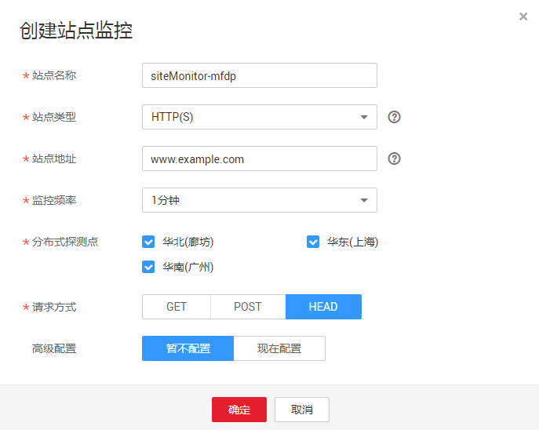

# 创建站点监控

## 操作场景

本章节指导用户创建站点监控。

> **说明：**   
>一个账户最多创建20个站点监控。  

## 操作步骤

1.  登录管理控制台。
2.  单击“管理与部署 \> 云监控”。
3.  在“站点监控”界面，单击右上角“创建站点监控”，进入“创建站点监控”界面。
4.  在弹出的“创建站点监控”对话框中根据界面提示配置参数，如[创建站点监控](创建站点监控.md)所示，参数说明如[表1](#table133239595719)所示。

    **图 1**  创建站点监控  
    

    **表 1**  配置参数

    
    <table><thead align="left"><tr id="row1232075145712"><th class="cellrowborder" valign="top" width="16%" id="mcps1.2.4.1.1">
参数

    </th>
    <th class="cellrowborder" valign="top" width="52%" id="mcps1.2.4.1.2">
参数说明

    </th>
    <th class="cellrowborder" valign="top" width="32%" id="mcps1.2.4.1.3">
取值样例

    </th>
    </tr>
    </thead>
    <tbody><tr id="row0320051572"><td class="cellrowborder" valign="top" width="16%" headers="mcps1.2.4.1.1 ">
站点名称

    </td>
    <td class="cellrowborder" valign="top" width="52%" headers="mcps1.2.4.1.2 ">
配置站点监控的名称。

    </td>
    <td class="cellrowborder" valign="top" width="32%" headers="mcps1.2.4.1.3 ">
stationMonitor-tuq0

    </td>
    </tr>
    <tr id="row332055105710"><td class="cellrowborder" valign="top" width="16%" headers="mcps1.2.4.1.1 ">
站点类型

    </td>
    <td class="cellrowborder" valign="top" width="52%" headers="mcps1.2.4.1.2 ">
目前可针对四种协议进行监控：HTTP、PING、TCP、UDP。

    
更多站点类型正在部署中。

    </td>
    <td class="cellrowborder" valign="top" width="32%" headers="mcps1.2.4.1.3 ">
HTTP

    </td>
    </tr>
    <tr id="row932025105711"><td class="cellrowborder" valign="top" width="16%" headers="mcps1.2.4.1.1 ">
站点地址

    </td>
    <td class="cellrowborder" valign="top" width="52%" headers="mcps1.2.4.1.2 ">
要监控的地址。

    
 说明： 
<ul id="ul886286181615"><li>如需监控HTTPS协议站点，请注意填写协议头https://。</li><li>站点监控不支持以下私有IP段的IP：
10.0.0.0—10.255.255.255

    
172.16.0.0-172.31.255.255

    
192.168.0.0-192.168.255.255

    
127.0.0.0-127.255.255.255

    </li></ul>
    

    </td>
    <td class="cellrowborder" valign="top" width="32%" headers="mcps1.2.4.1.3 ">
https://www.example.com

    </td>
    </tr>
    <tr id="row143216525714"><td class="cellrowborder" valign="top" width="16%" headers="mcps1.2.4.1.1 ">
监控频率

    </td>
    <td class="cellrowborder" valign="top" width="52%" headers="mcps1.2.4.1.2 ">
站点监控探测引擎执行一次探测任务的时间间隔。

    
 说明： 

监控频率可设置为1分钟、5分钟、20分钟。

    

    </td>
    <td class="cellrowborder" valign="top" width="32%" headers="mcps1.2.4.1.3 ">
5分钟

    </td>
    </tr>
    <tr id="row93211250573"><td class="cellrowborder" valign="top" width="16%" headers="mcps1.2.4.1.1 ">
分布式探测点

    </td>
    <td class="cellrowborder" valign="top" width="52%" headers="mcps1.2.4.1.2 ">
目前站点监控支持华北（廊坊）、华东（上海）、华南（广州）三个探测地点。

    </td>
    <td class="cellrowborder" valign="top" width="32%" headers="mcps1.2.4.1.3 ">
华北（廊坊）

    </td>
    </tr>
    <tr id="row1832115175714"><td class="cellrowborder" valign="top" width="16%" headers="mcps1.2.4.1.1 ">
请求方式

    </td>
    <td class="cellrowborder" valign="top" width="52%" headers="mcps1.2.4.1.2 ">
当站点类型为HTTP时可配置此参数。

    
HTTP标准的请求方法，包括GET、POST、HEAD，其中 POST 支持提交内容。

    </td>
    <td class="cellrowborder" valign="top" width="32%" headers="mcps1.2.4.1.3 ">
GET

    </td>
    </tr>
    <tr id="row13215575717"><td class="cellrowborder" valign="top" width="16%" headers="mcps1.2.4.1.1 ">
端口号

    </td>
    <td class="cellrowborder" valign="top" width="52%" headers="mcps1.2.4.1.2 ">
当站点类型为TCP或UDP时可配置此参数。

    </td>
    <td class="cellrowborder" valign="top" width="32%" headers="mcps1.2.4.1.3 ">
8080

    </td>
    </tr>
    <tr id="row133231356574"><td class="cellrowborder" valign="top" width="16%" headers="mcps1.2.4.1.1 ">
高级配置

    </td>
    <td class="cellrowborder" valign="top" width="52%" headers="mcps1.2.4.1.2 ">
不同站点类型对应的高级配置不同。

    <ul id="ul11323115195716"><li>当站点类型为HTTP协议时，请参见<a href="#table1632335195715">表2</a>。</li><li>当站点类型为TCP协议时，请参见<a href="#table83287512573">表3</a>。</li><li>当站点类型为UDP协议时，请参见<a href="#table13328165135714">表4</a>。</li></ul>
    </td>
    <td class="cellrowborder" valign="top" width="32%" headers="mcps1.2.4.1.3 ">
-

    </td>
    </tr>
    </tbody>
    </table>

    **表 2**  HTTP协议高级配置参数

    
    <table><thead align="left"><tr id="row932315511576"><th class="cellrowborder" valign="top" width="15.841584158415841%" id="mcps1.2.4.1.1">
参数

    </th>
    <th class="cellrowborder" valign="top" width="51.48514851485149%" id="mcps1.2.4.1.2">
参数说明

    </th>
    <th class="cellrowborder" valign="top" width="32.67326732673268%" id="mcps1.2.4.1.3">
取值样例

    </th>
    </tr>
    </thead>
    <tbody><tr id="row1133191113375"><td class="cellrowborder" valign="top" width="15.841584158415841%" headers="mcps1.2.4.1.1 ">
提交内容

    </td>
    <td class="cellrowborder" valign="top" width="51.48514851485149%" headers="mcps1.2.4.1.2 ">
请求方式为POST时要配置该参数。

    </td>
    <td class="cellrowborder" valign="top" width="32.67326732673268%" headers="mcps1.2.4.1.3 ">
-

    </td>
    </tr>
    <tr id="row193231853570"><td class="cellrowborder" valign="top" width="15.841584158415841%" headers="mcps1.2.4.1.1 ">
Cookie

    </td>
    <td class="cellrowborder" valign="top" width="51.48514851485149%" headers="mcps1.2.4.1.2 ">
您期望探测目标网站需要的cookie，多条信息用换行隔开。

    </td>
    <td class="cellrowborder" valign="top" width="32.67326732673268%" headers="mcps1.2.4.1.3 ">
key1=value1

    </td>
    </tr>
    <tr id="row732318515718"><td class="cellrowborder" valign="top" width="15.841584158415841%" headers="mcps1.2.4.1.1 ">
HTTP请求头信息

    </td>
    <td class="cellrowborder" valign="top" width="51.48514851485149%" headers="mcps1.2.4.1.2 ">
您期望探测目标网站需要的http header信息，多条信息用换行隔开。

    
 说明： 

当提交内容为key=value格式时，HTTP请求头必须为Content-Type: application/x-www-form-urlencoded。

    

    </td>
    <td class="cellrowborder" valign="top" width="32.67326732673268%" headers="mcps1.2.4.1.3 ">
key1=value1

    </td>
    </tr>
    <tr id="row1448218344366"><td class="cellrowborder" valign="top" width="15.841584158415841%" headers="mcps1.2.4.1.1 ">
匹配响应内容

    </td>
    <td class="cellrowborder" valign="top" width="51.48514851485149%" headers="mcps1.2.4.1.2 ">
期望的 HTTP 响应内容。

    </td>
    <td class="cellrowborder" valign="top" width="32.67326732673268%" headers="mcps1.2.4.1.3 ">
-

    </td>
    </tr>
    </tbody>
    </table>

    **表 3**  TCP协议高级配置参数

    
    <table><thead align="left"><tr id="row93238575716"><th class="cellrowborder" valign="top" width="17%" id="mcps1.2.4.1.1">
参数

    </th>
    <th class="cellrowborder" valign="top" width="50%" id="mcps1.2.4.1.2">
参数说明

    </th>
    <th class="cellrowborder" valign="top" width="33%" id="mcps1.2.4.1.3">
取值样例

    </th>
    </tr>
    </thead>
    <tbody><tr id="row18326185145717"><td class="cellrowborder" valign="top" width="17%" headers="mcps1.2.4.1.1 ">
请求内容格式

    </td>
    <td class="cellrowborder" valign="top" width="50%" headers="mcps1.2.4.1.2 ">
支持16进制格式和文本两种形式。

    </td>
    <td class="cellrowborder" valign="top" width="33%" headers="mcps1.2.4.1.3 ">
16进制格式

    </td>
    </tr>
    <tr id="row732616510577"><td class="cellrowborder" valign="top" width="17%" headers="mcps1.2.4.1.1 ">
TCP请求内容

    </td>
    <td class="cellrowborder" valign="top" width="50%" headers="mcps1.2.4.1.2 ">
预设的 TCP 请求内容。

    </td>
    <td class="cellrowborder" valign="top" width="33%" headers="mcps1.2.4.1.3 ">
0xcf

    </td>
    </tr>
    <tr id="row1632814565715"><td class="cellrowborder" valign="top" width="17%" headers="mcps1.2.4.1.1 ">
匹配响应内容格式

    </td>
    <td class="cellrowborder" valign="top" width="50%" headers="mcps1.2.4.1.2 ">
支持16进制格式和文本两种形式。

    </td>
    <td class="cellrowborder" valign="top" width="33%" headers="mcps1.2.4.1.3 ">
16进制格式

    </td>
    </tr>
    <tr id="row6328105185718"><td class="cellrowborder" valign="top" width="17%" headers="mcps1.2.4.1.1 ">
匹配响应内容

    </td>
    <td class="cellrowborder" valign="top" width="50%" headers="mcps1.2.4.1.2 ">
期望的 TCP 响应内容。

    </td>
    <td class="cellrowborder" valign="top" width="33%" headers="mcps1.2.4.1.3 ">
-

    </td>
    </tr>
    </tbody>
    </table>

    **表 4**  UDP协议高级配置参数

    
    <table><thead align="left"><tr id="row7328957573"><th class="cellrowborder" valign="top" width="17.171717171717173%" id="mcps1.2.4.1.1">
参数

    </th>
    <th class="cellrowborder" valign="top" width="49.494949494949495%" id="mcps1.2.4.1.2">
参数说明

    </th>
    <th class="cellrowborder" valign="top" width="33.333333333333336%" id="mcps1.2.4.1.3">
取值样例

    </th>
    </tr>
    </thead>
    <tbody><tr id="row332812519576"><td class="cellrowborder" valign="top" width="17.171717171717173%" headers="mcps1.2.4.1.1 ">
请求内容格式

    </td>
    <td class="cellrowborder" valign="top" width="49.494949494949495%" headers="mcps1.2.4.1.2 ">
支持16进制格式和文本两种形式。

    </td>
    <td class="cellrowborder" valign="top" width="33.333333333333336%" headers="mcps1.2.4.1.3 ">
16进制格式

    </td>
    </tr>
    <tr id="row103285511576"><td class="cellrowborder" valign="top" width="17.171717171717173%" headers="mcps1.2.4.1.1 ">
UDP请求内容

    </td>
    <td class="cellrowborder" valign="top" width="49.494949494949495%" headers="mcps1.2.4.1.2 ">
预设的UDP请求内容。

    </td>
    <td class="cellrowborder" valign="top" width="33.333333333333336%" headers="mcps1.2.4.1.3 ">
0xcf

    </td>
    </tr>
    <tr id="row1932845125710"><td class="cellrowborder" valign="top" width="17.171717171717173%" headers="mcps1.2.4.1.1 ">
匹配响应内容格式

    </td>
    <td class="cellrowborder" valign="top" width="49.494949494949495%" headers="mcps1.2.4.1.2 ">
支持16进制格式和文本两种形式。

    </td>
    <td class="cellrowborder" valign="top" width="33.333333333333336%" headers="mcps1.2.4.1.3 ">
16进制格式

    </td>
    </tr>
    <tr id="row203288535711"><td class="cellrowborder" valign="top" width="17.171717171717173%" headers="mcps1.2.4.1.1 ">
匹配响应内容

    </td>
    <td class="cellrowborder" valign="top" width="49.494949494949495%" headers="mcps1.2.4.1.2 ">
期望的UDP响应内容。

    </td>
    <td class="cellrowborder" valign="top" width="33.333333333333336%" headers="mcps1.2.4.1.3 ">
-

    </td>
    </tr>
    </tbody>
    </table>

5.  配置完成后，单击“确定”，完成创建站点监控。

