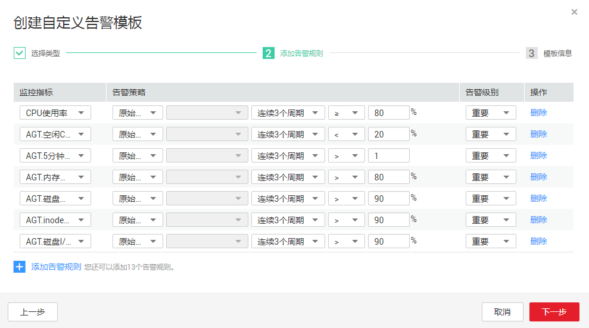
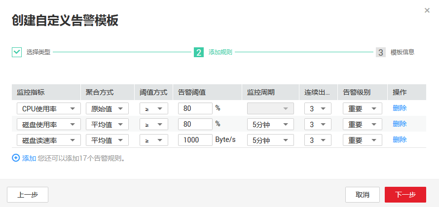

# 创建自定义告警模板

1.  在“告警模板”界面，单击“创建自定义告警模板”。
2.  在“选择类型”界面，参考[表1](#table1956141511220)进行参数配置。

    **图 1**  创建自定义告警模板  
    

    **表 1**  配置参数

    
    <table><thead align="left"><tr id="row17562201515222"><th class="cellrowborder" valign="top" width="26.57%" id="mcps1.2.4.1.1">
参数

    </th>
    <th class="cellrowborder" valign="top" width="45.550000000000004%" id="mcps1.2.4.1.2">
参数说明

    </th>
    <th class="cellrowborder" valign="top" width="27.88%" id="mcps1.2.4.1.3">
取值样例

    </th>
    </tr>
    </thead>
    <tbody><tr id="row19564181512228"><td class="cellrowborder" valign="top" width="26.57%" headers="mcps1.2.4.1.1 ">
资源类型

    </td>
    <td class="cellrowborder" valign="top" width="45.550000000000004%" headers="mcps1.2.4.1.2 ">
配置告警规则监控的服务名称。

    </td>
    <td class="cellrowborder" valign="top" width="27.88%" headers="mcps1.2.4.1.3 ">
弹性云服务器

    </td>
    </tr>
    <tr id="row956421512227"><td class="cellrowborder" valign="top" width="26.57%" headers="mcps1.2.4.1.1 ">
维度

    </td>
    <td class="cellrowborder" valign="top" width="45.550000000000004%" headers="mcps1.2.4.1.2 ">
用于指定告警规则对应指标的维度名称

    </td>
    <td class="cellrowborder" valign="top" width="27.88%" headers="mcps1.2.4.1.3 ">
云服务器

    </td>
    </tr>
    <tr id="row9565191518227"><td class="cellrowborder" valign="top" width="26.57%" headers="mcps1.2.4.1.1 ">
是否从现有模板导入

    </td>
    <td class="cellrowborder" valign="top" width="45.550000000000004%" headers="mcps1.2.4.1.2 "><ul id="ul14566181502211"><li>是<ul id="ul556661542218"><li>选择一个已有模板名称。</li></ul>
    </li><li>否。</li></ul>
    </td>
    <td class="cellrowborder" valign="top" width="27.88%" headers="mcps1.2.4.1.3 ">
-

    </td>
    </tr>
    </tbody>
    </table>

3.  参数配置完成后，点击“下一步”，进入“添加规则”页面，参考[表2](#table691022118227)进行参数配置。

    **图 2**  添加规则  
    

    **表 2**  配置参数

    
    <table><thead align="left"><tr id="row891192162214"><th class="cellrowborder" valign="top" width="19.43%" id="mcps1.2.4.1.1">
参数

    </th>
    <th class="cellrowborder" valign="top" width="52.690000000000005%" id="mcps1.2.4.1.2">
参数说明

    </th>
    <th class="cellrowborder" valign="top" width="27.88%" id="mcps1.2.4.1.3">
取值样例

    </th>
    </tr>
    </thead>
    <tbody><tr id="row9914182112229"><td class="cellrowborder" valign="top" width="19.43%" headers="mcps1.2.4.1.1 ">
监控指标

    </td>
    <td class="cellrowborder" valign="top" width="52.690000000000005%" headers="mcps1.2.4.1.2 ">
例如：

    <ul id="ul691572111221"><li>CPU使用率
该指标用于统计测量对象的CPU使用率，以百分比为单位。

    </li></ul>
    <ul id="ul20916182142211"><li>内存使用率
该指标用于统计测量对象的内存使用率，以百分比为单位。

    </li></ul>
    </td>
    <td class="cellrowborder" valign="top" width="27.88%" headers="mcps1.2.4.1.3 ">
-

    </td>
    </tr>
    <tr id="row95813546476"><td class="cellrowborder" valign="top" width="19.43%" headers="mcps1.2.4.1.1 ">
告警策略

    </td>
    <td class="cellrowborder" valign="top" width="52.690000000000005%" headers="mcps1.2.4.1.2 ">
触发告警的告警策略。

    
例如：监控周期为5分钟，连续三个周期原始值≥80%

    </td>
    <td class="cellrowborder" valign="top" width="27.88%" headers="mcps1.2.4.1.3 ">
-

    </td>
    </tr>
    <tr id="row1639201161214"><td class="cellrowborder" valign="top" width="19.43%" headers="mcps1.2.4.1.1 ">
告警级别

    </td>
    <td class="cellrowborder" valign="top" width="52.690000000000005%" headers="mcps1.2.4.1.2 ">
根据告警的严重程度不同等级，可选择紧急、重要、次要、提示。

    </td>
    <td class="cellrowborder" valign="top" width="27.88%" headers="mcps1.2.4.1.3 ">
重要

    </td>
    </tr>
    <tr id="row1791811213223"><td class="cellrowborder" valign="top" width="19.43%" headers="mcps1.2.4.1.1 ">
操作

    </td>
    <td class="cellrowborder" valign="top" width="52.690000000000005%" headers="mcps1.2.4.1.2 ">
当自定义监控指标大于等于两个时，可以删除自定义指标。

    </td>
    <td class="cellrowborder" valign="top" width="27.88%" headers="mcps1.2.4.1.3 ">
-

    </td>
    </tr>
    </tbody>
    </table>

4.  告警规则添加完成后，单击“下一步”，进入“模板信息”配置页面，参考[表3](#table722215293225)完成模板信息配置。

    **表 3**  配置参数

    
    <table><thead align="left"><tr id="row222382918227"><th class="cellrowborder" valign="top" width="20.18%" id="mcps1.2.4.1.1">
参数

    </th>
    <th class="cellrowborder" valign="top" width="52.129999999999995%" id="mcps1.2.4.1.2">
参数说明

    </th>
    <th class="cellrowborder" valign="top" width="27.689999999999998%" id="mcps1.2.4.1.3">
取值样例

    </th>
    </tr>
    </thead>
    <tbody><tr id="row1224132902213"><td class="cellrowborder" valign="top" width="20.18%" headers="mcps1.2.4.1.1 ">
名称

    </td>
    <td class="cellrowborder" valign="top" width="52.129999999999995%" headers="mcps1.2.4.1.2 ">
系统会随机产生一个名称，用户也可以进行修改。

    </td>
    <td class="cellrowborder" valign="top" width="27.689999999999998%" headers="mcps1.2.4.1.3 ">
alarmTemplate-ku0x

    </td>
    </tr>
    <tr id="row202252298225"><td class="cellrowborder" valign="top" width="20.18%" headers="mcps1.2.4.1.1 ">
描述

    </td>
    <td class="cellrowborder" valign="top" width="52.129999999999995%" headers="mcps1.2.4.1.2 ">
告警模板描述（此参数非必填项）。

    </td>
    <td class="cellrowborder" valign="top" width="27.689999999999998%" headers="mcps1.2.4.1.3 ">
-

    </td>
    </tr>
    </tbody>
    </table>

5.  单击“创建”，完成创建自定义模板。

