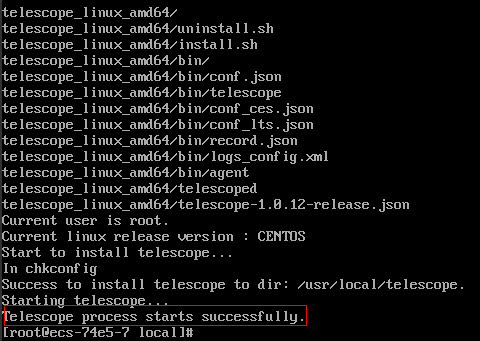

# 安装Agent<a name="ZH-CN_TOPIC_0127535833"></a>

## 操作场景<a name="zh-cn_topic_0078544024_section10035481163223"></a>

本章节主要介绍如何在ECS或BMS中手动安装Agent，为用户提供主机的系统级、主动式、细颗粒度的监控服务。

## 前提条件<a name="section1173079143610"></a>

-   确保[操作步骤](#section494503071814)中的安装目录都有读写权限，并且安装成功后的Telescope进程不会被其他软件关闭。

## 操作步骤<a name="section494503071814"></a>

1.  使用root账号，登录ECS或BMS。
2.  执行以下命令，安装Agent。

    华北-北京一：

    ```
    cd /usr/local && wget http://telescope.obs.cn-north-1.myhwclouds.com/scripts/agentInstall.sh && chmod 755 agentInstall.sh && ./agentInstall.sh
    ```

    华南-广州：

    ```
    cd /usr/local && wget http://telescope-cn-south-1.obs.cn-south-1.myhwclouds.com/scripts/agentInstall.sh && chmod 755 agentInstall.sh && ./agentInstall.sh
    ```

    华东-上海二：

    ```
    cd /usr/local && wget http://telescope-cn-east-2.obs.cn-east-2.myhwclouds.com/scripts/agentInstall.sh && chmod 755 agentInstall.sh && ./agentInstall.sh
    ```

    亚太-香港：

    ```
    cd /usr/local && wget https://telescope-ap-southeast-1.obs.ap-southeast-1.myhwclouds.com/scripts/agentInstall.sh && chmod 755 agentInstall.sh && ./agentInstall.sh
    ```

    当回显如[图1](#fig1948103311810)所示时，说明Agent安装成功。

    **图 1**  Agent安装成功<a name="fig1948103311810"></a>  
    

    > **说明：**   
    >若下载Agent安装包失败，说明DNS和安全组配置异常，请参考[修改DNS与添加安全组](https://support.huaweicloud.com/ces_faq/ces_faq_0038.html)修改DNS与安全组。  

3.  安装完成后，请参考[一键修复插件配置](一键修复插件配置.md)或[手动配置Agent](手动配置Agent.md)完成Agent的配置。

