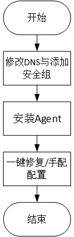

# 安装配置Agent场景说明

安装Agent场景如下所示：

-   购买ECS时安装Agent（Linux）请参见[购买ECS时安装Agent（仅支持Linux）](购买ECS时安装Agent（仅支持Linux）.md)。
-   在ECS/BMS中安装配置Agent（Linux）请参见[在ECS/BMS中安装配置Agent（Linux）](在ECS-BMS中安装配置Agent（Linux）.md)。
-   在ECS/BMS中安装配置Agent（Windows）参见[在ECS/BMS中安装配置Agent（Windows）](在ECS-BMS中安装配置Agent（Windows）.md)。
-   在ECS中批量安装Agent（Linux）请参见[在ECS中批量安装Agent（Linux）](在ECS中批量安装Agent（Linux）.md)。

安装配置Agent步骤如[图1](#fig81789101131)所示。

**图 1**  安装配置Agent流程图  

