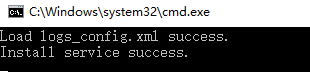

# 安装配置Agent（Windows）

## 操作场景

本章节主要介绍如何在ECS中安装Agent，为用户提供主机的系统级、主动式、细颗粒度的监控服务。

> **说明：**   
>Windows类型BMS暂不支持安装Agent。  

## 前提条件

-   已配置DNS与安全组，配置DNS与安全组请参见[修改DNS与添加安全组（Windows）](修改DNS与添加安全组（Windows）.md)。
-   使用具有administrator权限的账户安装，例如administrator用户。
-   确保安装成功后的Telescope进程不会被其他软件关闭。
-   已获取Agent安装包（windows）。

    **表 1**  安装包路径

    
    <table><thead align="left"><tr id="row72261433102017"><th class="cellrowborder" valign="top" width="23.98%" id="mcps1.2.4.1.1">
名称

    </th>
    <th class="cellrowborder" valign="top" width="9.41%" id="mcps1.2.4.1.2">
格式

    </th>
    <th class="cellrowborder" valign="top" width="66.61%" id="mcps1.2.4.1.3">
下载路径

    </th>
    </tr>
    </thead>
    <tbody><tr id="row10227153392011"><td class="cellrowborder" valign="top" width="23.98%" headers="mcps1.2.4.1.1 ">
Windows 64位Agent安装包

    </td>
    <td class="cellrowborder" valign="top" width="9.41%" headers="mcps1.2.4.1.2 ">
zip

    </td>
    <td class="cellrowborder" valign="top" width="66.61%" headers="mcps1.2.4.1.3 ">
华北-北京一：<a href="https://telescope.obs.cn-north-1.myhuaweicloud.com/agent/telescope_windows_amd64.zip" target="_blank" rel="noopener noreferrer">https://telescope.obs.cn-north-1.myhuaweicloud.com/agent/telescope_windows_amd64.zip</a>

    
华北-北京四：<a href="https://telescope-cn-north-4.obs.cn-north-4.myhuaweicloud.com/agent/telescope_windows_amd64.zip" target="_blank" rel="noopener noreferrer">https://telescope-cn-north-4.obs.cn-north-4.myhuaweicloud.com/agent/telescope_windows_amd64.zip</a>

    
华南-广州：<a href="https://telescope-cn-south-1.obs.cn-south-1.myhuaweicloud.com/agent/telescope_windows_amd64.zip" target="_blank" rel="noopener noreferrer">https://telescope-cn-south-1.obs.cn-south-1.myhuaweicloud.com/agent/telescope_windows_amd64.zip</a>

    
华东-上海二：<a href="https://telescope-cn-east-2.obs.cn-east-2.myhuaweicloud.com/agent/telescope_windows_amd64.zip" target="_blank" rel="noopener noreferrer">https://telescope-cn-east-2.obs.cn-east-2.myhuaweicloud.com/agent/telescope_windows_amd64.zip</a>

    
华东-上海一：<a href="https://obs.cn-east-3.myhuaweicloud.com/uniagent-cn-east-3/package/uniagent_windows_amd64.zip" target="_blank" rel="noopener noreferrer">https://obs.cn-east-3.myhuaweicloud.com/uniagent-cn-east-3/package/uniagent_windows_amd64.zip</a>

    
亚太-香港：<a href="https://telescope-ap-southeast-1.obs.ap-southeast-1.myhuaweicloud.com/agent/telescope_windows_amd64.zip" target="_blank" rel="noopener noreferrer">https://telescope-ap-southeast-1.obs.ap-southeast-1.myhuaweicloud.com/agent/telescope_windows_amd64.zip</a>

    
亚太-曼谷：<a href="https://telescope-ap-southeast-2.obs.ap-southeast-2.myhuaweicloud.com/agent/telescope_windows_amd64.zip" target="_blank" rel="noopener noreferrer">https://telescope-ap-southeast-2.obs.ap-southeast-2.myhuaweicloud.com/agent/telescope_windows_amd64.zip</a>

    
亚太-新加坡：<a href="https://telescope-ap-southeast-3.obs.ap-southeast-3.myhuaweicloud.com/agent/telescope_windows_amd64.zip" target="_blank" rel="noopener noreferrer">https://telescope-ap-southeast-3.obs.ap-southeast-3.myhuaweicloud.com/agent/telescope_windows_amd64.zip</a>

    
非洲-约翰内斯堡：<a href="https://telescope-af-south-1.obs.af-south-1.myhuaweicloud.com/agent/telescope_windows_amd64.zip" target="_blank" rel="noopener noreferrer">https://telescope-af-south-1.obs.af-south-1.myhuaweicloud.com/agent/telescope_windows_amd64.zip</a>

    </td>
    </tr>
    </tbody>
    </table>

## 操作步骤

1.  使用具有“管理员”权限的账号（例如，administrator）登录Windows弹性云服务器。
2.  在浏览器地址栏输入Agent安装包地址，下载并保存安装包。
3.  创建安装包存放目录（如D:\\Agent），解压Agent安装包telescope\_windows\_amd64.zip到该目录下。
4.  双击执行install.bat脚本，安装并启动Agent。

    当界面显示Install service success时，说明Agent安装成功并启动。

    **图 1**  安装Agent  
    

    > **说明：**   
    >Agent插件配置完成后，因监控数据暂未上报，插件状态仍显示“未安装”，等待3-5分钟，刷新即可。  

5.  在主机监控界面，勾选需要配置插件的主机，单击“修复插件配置”。
6.  在弹出页面上，单击"一键修复"。

    完成配置Agent。

    当插件状态为“运行中”并且监控状态开启时，说明Agent已安装成功并开始采集细粒度监控指标。

    **图 2**  修复插件配置  
    

