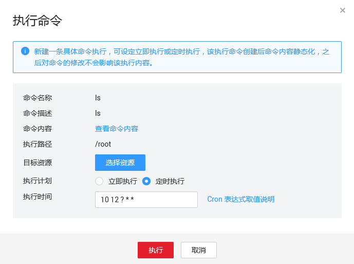

# 执行命令

新建云助手命令后，您可以在一台或者多台ECS中执行命令。多台ECS间的执行状态和执行结果互不影响。

## 前提条件

-   一次执行命令操作最多可以选择50台ECS资源。
-   ECS的状态必须处于运行中（Running）。
-   ECS已安装主机监控插件Agent，且处于正常运行状态。

## 操作步骤

1.  登录管理控制台。
2.  单击“管理与部署 \> 云监控服务 \> 云助手”。
3.  在“云助手”界面，单击命令所在行的“执行”，在“执行命令”界面：
    1.  单击查看命令内容确认内容是否正确。
    2.  目标资源：选择需要执行命令的ECS资源。
    3.  执行计划：可选择立即执行或定时执行，定时执行参数配置请参见[Cron表达式取值说明](Cron表达式取值说明.md)。

        **图 1**  执行命令  
        

4.  配置完成后，单击“执行”完成执行命令。

