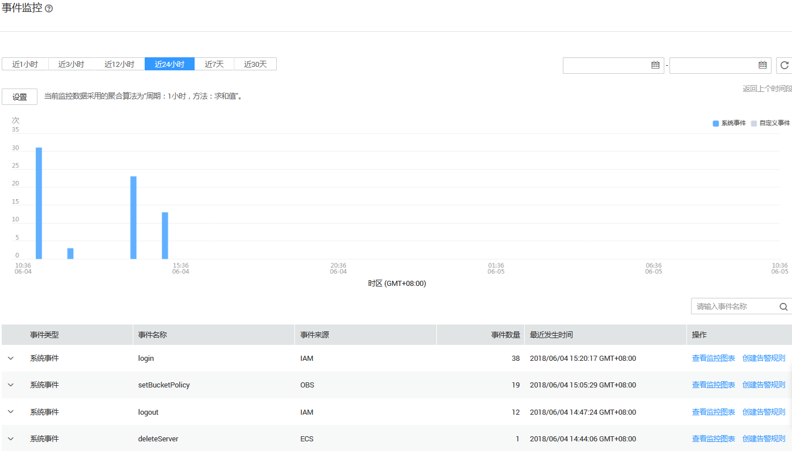
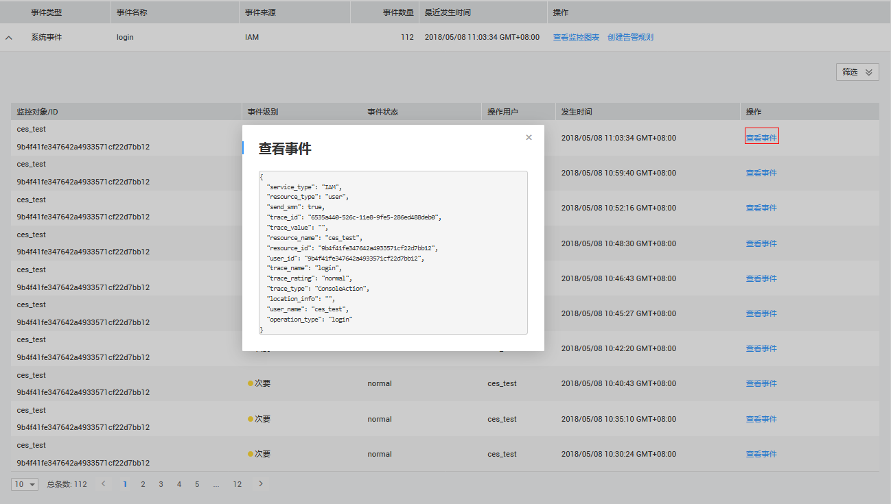

# 查看事件监控数据

## 操作场景

本章节指导用户查看事件监控的监控数据。

## 操作步骤

1.  登录管理控制台。
2.  单击“管理与部署 \> 云监控服务”。
3.  单击业务左侧导航栏的“事件监控”。

    进入“事件监控”页面。在“事件监控”页面，默认展示近24小时的所有系统事件。

    您也可以根据需要选择“近1小时”“近3小时”“近12小时”“近24小时”“近7天”“近30天”，分别查看不同时段的事件。

    **图 1**  事件监控  
    

4.  单击具体事件右侧的操作列的“查看事件”，可查看具体事件的内容。

    **图 2**  查看事件详情  
    

