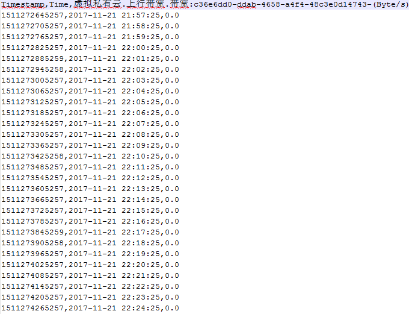

# 查看云服务监控指标原始数据

## 操作场景

本节介绍如何在OBS中通过下载监控数据文件查看已保存至OBS桶的监控数据。

## 前提条件

-   已在云监控中成功配置数据存储。配置数据存储请参见[配置数据存储](配置数据存储.md)。
-   已安装java，并配置好环境变量。
-   已下载格式转换以及内容拼接工具metric-transfer-merge.jar，下载地址[https://metric-json-trans-csv.obs.myhwclouds.com/metric-transfer-merge.jar](https://metric-json-trans-csv.obs.myhwclouds.com/metric-transfer-merge.jar)。

## 操作步骤

1.  登录管理控制台。
2.  单击“管理与部署 \> 云监控”。
3.  单击页面左侧的“云服务监控”，进入“云服务监控”页面，选择待查看的云服务资源所在行“永久数据存储”列下的指定的OBS桶名称，页面跳转到OBS管理控制台中对应OBS桶的对象管理界面。

    或单击页面左侧的“主机监控”，单击待查看的ECS所在行的“永久数据存储”列下的指定的OBS桶名称，页面跳转到OBS管理控制台中对应OBS桶的对象管理界面。

4.  在OBS桶中选择需要查看的监控数据文件，按照监控数据文件存储路径选择“_OBS桶名 \> Cloud_Eye_  \> 地区标示 \> 时间标示：年 \> 时间标示：月 \> 时间标示：日 \> 服务类型目录_\>资源类型目录_”，_单击右侧的“下载”，文件将下载到浏览器默认下载路径，如需要将监控数据文件保存到自定义路径下，请单击右侧的“下载为”按键。

    监控数据文件命名格式：

    **_监控数据文件前缀_\_Cloud_Eye_\__地区标示_\__日志文件上传至OBS__的时间标示：年-__月-__日_T_时-分-秒_Z\__系统随机生成字符_.json**

    例如：_**File Prefix**_**\_Cloud_Eye_\_region\_2016-05-30T16-20-56Z\_21d36ced8c8af71e.json**

    > **说明：**   
    >-   OBS桶名和事件前缀为用户设置，其余参数均为系统自动生成。  
    >-   监控数据原始文件是时间粒度的分片文件，文件中包含该时间分片下某一个资源下所有指标的监控数据，以Json格式存储。  
    >-   为了方便用户使用，云监控为用户提供了格式转换以及内容拼接工具。使用该工具，用户可以把某一个特定资源下的若干个时间片的文件按照时间序列合并为一个按时间拼接的文件，文件格式为csv。同时可以对资源下的每个指标生成独立的时间拼接文件，文件格式为csv。  

5.  在windows系统中进入cmd工具，进入metric-transfer-merge.jar所在的文件夹，执行“java -jar metric-transfer-merge.jar j2c inputDirectory outputDirectory  mergFileName”。

    在Linux系统中，用户在shell命令行中执行“java -jar metric-transfer-merge.jar inputDirectory outputDirectory  mergFileName”

    > **说明：**   
    >-   j2c为json转化为csv的命令。  
    >-   inputDirectory为存放下载Json文件的目录。  
    >-   outputDirectory为存放生成文件的目录。  
    >-   mergFileName为用户指定的合并文件的文件名，此参数可以忽略，工具会默认合并文件的文件名称为mergeResult.csv。  

    执行完java命令之后，用户可在outputDirectory目录中可以看到转换后的文件，其中每一个文件对应一个指标在所有时间点上的数据。mergeResult.csv为一个将所有指标的数据合并生成的大文件。转换后的文件内容如[图1](#fig7637101745815)所示。

    **图 1**  监控数据内容  
    

