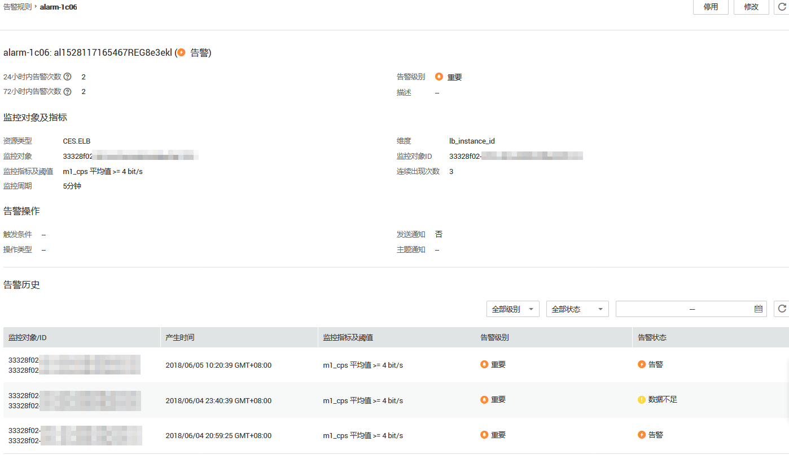

# 查看历史告警

告警历史可以展示近30天所有告警规则的状态变化，用户可以统一、方便地回溯和查看告警记录。

## 操作步骤

1.  登录管理控制台。
2.  单击“管理与部署 \> 云监控”。
3.  单击“告警 \> 告警历史”，进入“告警历史”界面。

    在告警历史页面，可查看近30天所有告警规则的状态变化。

    > **说明：**   
    >在“告警历史”列表右上角可选择日历，查看近30天内的任意时间段内的告警历史。  
    >在“告警历史”列表右上角可选择查看“所有状态”、“告警级别”、“所有资源类型”、“告警名称”的历史告警。  

4.  单击待查看的告警规则名称，进入告警规则详情页面，页面下方呈现了该告警规则近30天内的“告警历史”列表。

    **图 1**  告警历史  
    

    > **说明：**   
    >-   正常状况下，由于告警需要计算触发，告警产生时间可能略晚于最新的数据触发时间几秒。  
    >-   如果已有监控数据，创建或修改告警规则，导致触发告警，告警产生时间以触发告警的操作时间（创建告警规则或修改告警规则的时间）为准。  

