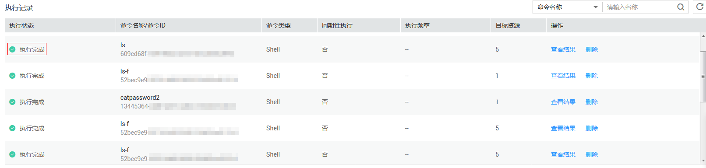
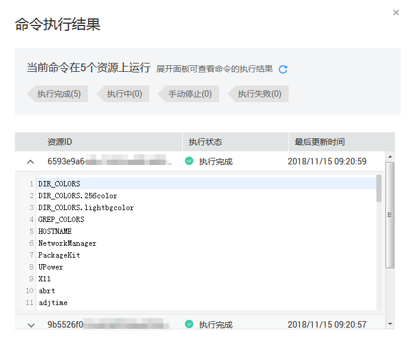

# 查看执行状态与命令执行结果

在云监控控制台运行云助手命令与您登录ECS后运行命令一样，只有命令所需条件满足后才会运行成功。当出现ECS资源缺乏相关依赖、网络异常、命令语义错误、脚本调试失败等异常等情况时，立即执行或者定时执行的云助手命令会呈现不同的命令执行状态与结果。建议您在运行命令后查看命令状态与结果，确保目标操作已完成。

## 前提条件

已执行云助手命令。

## 操作步骤

1.  登录管理控制台。
2.  单击“管理与部署 \> 云监控服务 \> 云助手”。
3.  在“执行记录”界面，找到需要查看命令执行状态的执行记录，在执行状态栏中查看命令执行状态，如所[图1](#fig102251923109)示。

    **图 1**  执行状态  
    

4.  在“执行记录”界面，找到需要查看命令执行状态的执行记录，在查看结果中查看命令执行结果，如[图2](#fig143084941211)指示。

    **图 2**  命令执行结果  
    

