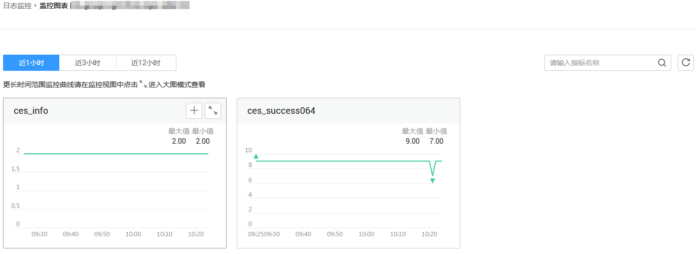

# 查看监控图表

## 操作步骤

1.  登录管理控制台。
2.  单击“管理与部署 \> 云监控”。
3.  单击左侧导航栏的“日志监控”。
4.  选择待查看日志组所在行的“查看监控指标”，进入“_监控指标_”页面。

    **图 1**  监控图表  
    

5.  在这个页面，用户可以选择页面左上方的时间范围按钮，查看该云服务资源“近1小时”、“近3小时”和“近12小时”的监控原始数据曲线图，同时监控指标视图右上角会动态显示对应时段内监控指标的最大值与最小值。

