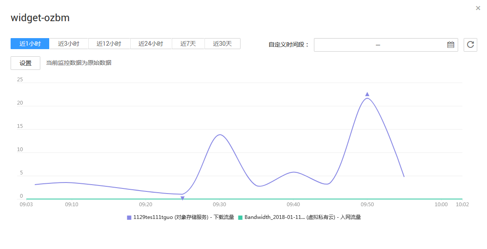

# 查看监控视图

监控视图添加完成后，您可以在监控面板页面查看该监控项近3小时内的监控走势图。系统提供固定时长和自定义时长两种方式查看近一个月的监控走势图，本节内容介绍如何查看更多时长的监控走势图。

## 操作步骤

1.  登录管理控制台。
2.  单击“管理与部署 \> 云监控”。
3.  单击“总览 \> 监控面板”，进入“监控面板”，即可查看该监控面板下的所有监控视图。

    > **说明：**   
    >-   用户可根据业务需求，拖动其中的监控视图，调整监控视图的顺序。  
    >-   单击监控视图上方的“近1小时”、“近3小时”、“近12小时”、“近7天”、“近30天”，可切换该监控面板下的所有视图的监控周期。  

4.  在监控视图右上角，单击，进入监控项详情页面。您可以选择系统提供的固定时长或自定义时间段来查看云服务的监控周期内的走势图。

    其中“近1小时”以内的监控时长系统默认显示原始指标数据，其他时长周期默认显示聚合指标数据。

    **图 1**  查看监控视图  
    

> **说明：**   
>-   自定义时长支持用户在最近一个星期内选择监控时间起点和终点，作为用户监控周期。  
>-   点击监控大图右侧的放大按钮后，可拖动鼠标选择自定义时间段。  

在弹出的查看指标详情窗口下方，以列表形式默认显示各个对比指标监控项的简要说明项，用户可以单击某一个监控指标项关闭该监控项的走势图，再次单击该监控指标即可开启显示该指标走势。

> **说明：**   
>监控视图每60s自动刷新，需在监控面板界面开启自动刷新功能。  

