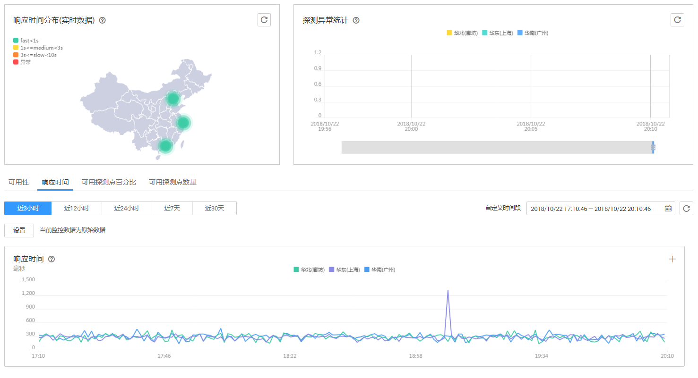

# 查看站点监控数据

## 操作场景

本章节指导用户如何查看站点的监控数据，从可用性、响应时间、可用探测点等趋势来展示当前站点的访问情况。

## 操作步骤

1.  登录管理控制台。
2.  单击“管理与部署 \> 云监控 \> 站点监控”。
3.  在“站点监控”界面，展示用户当前所有的站点概况。包括站点名称、站点地址、探测类型、监控频率、可用探测点百分比、平均响应时间等。
4.  在站点监控列表中单击站点名称所在行的“查看监控图表”进入监控图表页面。

    在这个页面，用户可以选择页面左上方的时间范围按钮，查看该站点“近3小时”、“近12小时”和“近24小时”的监控原始数据曲线图。

    **图 1**  查看监控图表  
    

    > **说明：**   
    >-   当监控指标为可用性指标时，监控图表显示的为一小时内的平均值。  
    >-   聚合周期大于1小时，可用性指标按照聚合周期进行显示。  

