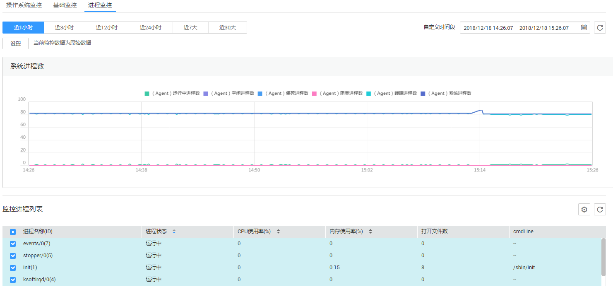

# 查看进程监控

进程监控是针对主机内活跃进程进行的监控，默认采集活跃进程消耗的CPU、内存，以及打开的文件数量等信息。当您配置了自定义进程监控，还会监控包含关键字的进程个数。

插件会每分钟统计一次1分钟内消耗 CPU Top5的进程，Top5的进程不固定，进程列表中会展示出最近24小时内所有消耗CPU Top5的进程。

> **说明：**   
>查看进程监控需安装操作系统监控插件Agent。  

## 操作步骤

1.  登录管理控制台。
2.  单击“管理与部署 \> 云监控”。
3.  单击页面左侧的“主机监控”，进入“主机监控”页面。
4.  在“主机监控”页面，单击资源所在行的“监控状态”开关，开启“操作系统监控”功能。
5.  单击资源所在行的“查看监控指标”，进入“操作系统监控”页面。
6.  单击“操作系统监控”右侧的“进程监控”，进入“进程监控”页面。
7.  单击“进程监控列表”右侧的，进入TOP进程列表。
8.  在TOP进程列表中选择您要开启的“进程监控开关”，单击确定。
9.  在“进程列表”页面，系统会默认勾选状态为“运行中”的进程，在下方的监控图表中显示出当前进程的“近1小时”CPU使用率的原始监控数据曲线图。

    您也可以勾选需要显示的进程，在下方的监控图表中显示出当前进程的“近1小时”CPU使用率的原始监控数据曲线图。

    单击监控图表上方的CPU 使用率、内存使用率、打开文件数可查看当前进程的不同指标的数据曲线图，如[图1](#fig6577204618125)所示，相关指标说明请参见[表1](#table15621123928)。

    **图 1**  进程监控  
    

    **表 1**  进程监控相关指标说明

    
    <table><thead align="left"><tr id="row2695231025"><th class="cellrowborder" valign="top" width="9.900990099009901%" id="mcps1.2.6.1.1">
指标名称

    </th>
    <th class="cellrowborder" valign="top" width="24.752475247524753%" id="mcps1.2.6.1.2">
指标含义

    </th>
    <th class="cellrowborder" valign="top" width="8.91089108910891%" id="mcps1.2.6.1.3">
取值范围

    </th>
    <th class="cellrowborder" valign="top" width="29.7029702970297%" id="mcps1.2.6.1.4">
采集方式（Linux）

    </th>
    <th class="cellrowborder" valign="top" width="26.732673267326735%" id="mcps1.2.6.1.5">
采集方式（Windows）

    </th>
    </tr>
    </thead>
    <tbody><tr id="row978523628"><td class="cellrowborder" valign="top" width="9.900990099009901%" headers="mcps1.2.6.1.1 ">
CPU使用率

    </td>
    <td class="cellrowborder" valign="top" width="24.752475247524753%" headers="mcps1.2.6.1.2 ">
进程消耗的CPU百分比，pHashId是进程名和进程ID的hashID。

    </td>
    <td class="cellrowborder" valign="top" width="8.91089108910891%" headers="mcps1.2.6.1.3 ">
0-1

    </td>
    <td class="cellrowborder" valign="top" width="29.7029702970297%" headers="mcps1.2.6.1.4 ">
测量对象：云服务器或裸金属服务器

    
 说明： 

通过计算/proc/pid/stat的变化得出。

    

    </td>
    <td class="cellrowborder" valign="top" width="26.732673267326735%" headers="mcps1.2.6.1.5 ">
测量对象：云服务器或裸金属服务器

    
 说明： 

通过Windows API GetProcessTimes获取进程CPU使用率。

    

    </td>
    </tr>
    <tr id="row1983723126"><td class="cellrowborder" valign="top" width="9.900990099009901%" headers="mcps1.2.6.1.1 ">
内存使用率

    </td>
    <td class="cellrowborder" valign="top" width="24.752475247524753%" headers="mcps1.2.6.1.2 ">
进程消耗的内存百分比，pHashId是进程名和进程ID的hashID。

    </td>
    <td class="cellrowborder" valign="top" width="8.91089108910891%" headers="mcps1.2.6.1.3 ">
0-1

    </td>
    <td class="cellrowborder" valign="top" width="29.7029702970297%" headers="mcps1.2.6.1.4 ">
测量对象：云服务器或裸金属服务器

    
计算方式：RSS*PAGESIZE/MemTotal

    
 说明： 

计算方式：RSS*PAGESIZE/MemTotal

    
RSS: 通过获取/proc/pid/statm第二列得到。

    
PAGESIZE: 通过命令getconf PAGESIZE获取。

    
MemTotal：通过/proc/meminfo获取。

    

    </td>
    <td class="cellrowborder" valign="top" width="26.732673267326735%" headers="mcps1.2.6.1.5 ">
测量对象：云服务器或裸金属服务器

    
 说明： 

使用Windows  API procGlobalMemoryStatusEx获取内存总量，通过GetProcessMemoryInfo获取内存已使用量，计算两者比值得到内存使用率。

    

    </td>
    </tr>
    <tr id="row159022312211"><td class="cellrowborder" valign="top" width="9.900990099009901%" headers="mcps1.2.6.1.1 ">
打开文件数

    </td>
    <td class="cellrowborder" valign="top" width="24.752475247524753%" headers="mcps1.2.6.1.2 ">
进程消耗的打开文件数，pHashId是进程名和进程ID的hashID。

    </td>
    <td class="cellrowborder" valign="top" width="8.91089108910891%" headers="mcps1.2.6.1.3 ">
≥ 0

    </td>
    <td class="cellrowborder" valign="top" width="29.7029702970297%" headers="mcps1.2.6.1.4 ">
测量对象：云服务器或裸金属服务器

    
 说明： 

通过执行ls -l /proc/pid/fd命令可以查看数量。

    

    </td>
    <td class="cellrowborder" rowspan="6" valign="top" width="26.732673267326735%" headers="mcps1.2.6.1.5 ">
暂不支持

    </td>
    </tr>
    <tr id="row892833383817"><td class="cellrowborder" valign="top" headers="mcps1.2.6.1.1 ">
运行中进程数

    </td>
    <td class="cellrowborder" valign="top" headers="mcps1.2.6.1.2 ">
该指标用于统计测量对象处于运行状态的进程数

    </td>
    <td class="cellrowborder" valign="top" headers="mcps1.2.6.1.3 ">
≥ 0

    </td>
    <td class="cellrowborder" rowspan="6" valign="top" headers="mcps1.2.6.1.4 ">
测量对象：云服务器或裸金属服务器

    
 说明： 

通过统计 /proc/pid/status 中Status值获取每个进程的状态，进而统计各个状态进程总数。

    

    </td>
    </tr>
    <tr id="row16939640123817"><td class="cellrowborder" valign="top" headers="mcps1.2.6.1.1 ">
空闲进程数

    </td>
    <td class="cellrowborder" valign="top" headers="mcps1.2.6.1.2 ">
该指标用于统计测量对象处于空闲状态的进程数

    </td>
    <td class="cellrowborder" valign="top" headers="mcps1.2.6.1.3 ">
≥ 0

    </td>
    </tr>
    <tr id="row19614193116380"><td class="cellrowborder" valign="top" headers="mcps1.2.6.1.1 ">
僵死进程数

    </td>
    <td class="cellrowborder" valign="top" headers="mcps1.2.6.1.2 ">
该指标用于统计测量对象处于僵死状态的进程数

    </td>
    <td class="cellrowborder" valign="top" headers="mcps1.2.6.1.3 ">
≥ 0

    </td>
    </tr>
    <tr id="row173741543143815"><td class="cellrowborder" valign="top" headers="mcps1.2.6.1.1 ">
阻塞进程数

    </td>
    <td class="cellrowborder" valign="top" headers="mcps1.2.6.1.2 ">
该指标用于统计测量对象被阻塞的进程数

    </td>
    <td class="cellrowborder" valign="top" headers="mcps1.2.6.1.3 ">
≥ 0

    </td>
    </tr>
    <tr id="row20798194523814"><td class="cellrowborder" valign="top" headers="mcps1.2.6.1.1 ">
睡眠进程数

    </td>
    <td class="cellrowborder" valign="top" headers="mcps1.2.6.1.2 ">
该指标用于统计测量对象处于睡眠状态的进程数

    </td>
    <td class="cellrowborder" valign="top" headers="mcps1.2.6.1.3 ">
≥ 0

    </td>
    </tr>
    <tr id="row13126829133810"><td class="cellrowborder" valign="top" headers="mcps1.2.6.1.1 ">
系统进程数

    </td>
    <td class="cellrowborder" valign="top" headers="mcps1.2.6.1.2 ">
该指标用于统计测量对象的总进程数。

    </td>
    <td class="cellrowborder" valign="top" headers="mcps1.2.6.1.3 ">
≥ 0

    </td>
    <td class="cellrowborder" valign="top" headers="mcps1.2.6.1.4 ">
测量对象：云服务器或裸金属服务器

    
 说明： 

通过psapi.dll系统进程状态支持模块得到进程总数。

    

    </td>
    </tr>
    </tbody>
    </table>

10. 在监控指标视图右上角，单击可查看监控指标视图详情。

    页面左上方提供查看“近1小时”、“近3小时”、“近12小时”、“近24小时”、“近7天”和“近30天”6个固定时长的监控周期，同时也支持以通过“自定义时间段”选择查看近六个月内任意时间段的历史监控数据。

    选择页面左上方的“设置”按钮，进入“聚合”设置页面，对监控数据的聚合方法进行更改。

    > **说明：**   
    >-   查询的时间范围内，Top5 的进程不固定，进程列表中会展示这段时间内全部进入过 Top5 的进程，列表中的时间表示该进程创建的时间。  
    >-   只有在“Top进程列表”页面打开进程监控开关的进程，才会采集进程的 CPU 使用率、内存使用率和打开文件数。  
    >-   当前进程的 CPU 使用率、内存使用率，参考 Linux top 命令**。**  
    >    当前进程打开文件数，参考 Linux ls /proc/pid/fd  |wc -l 命令。  
    >-   客户端浏览器的时间如果和被监控弹性云服务器的时间不一致，可能会出现监控图表无指标数据的情况，请调整本地时间和主机时间保持一致。  

