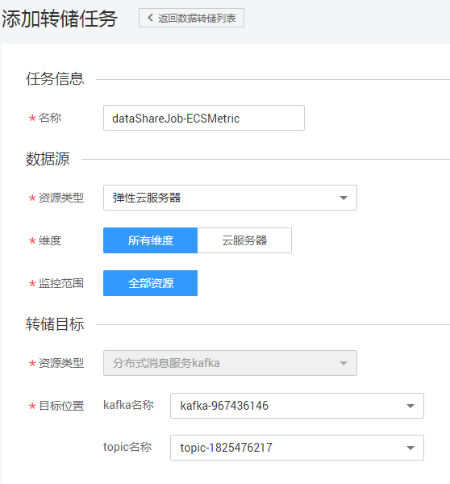

# 添加数据转储

## 操作场景

当您需要通过分布式消息服务Kafka的控制台或使用开源Kafka客户端查询云服务的监控指标时，可以使用云监控服务提供的数据转储功能。数据转储可以实时将云服务监控数据转储到分布式消息服务Kafka中。

> **说明：**   
>一个账户最多创建20个数据转储任务。  

## 操作步骤

1.  登录管理控制台。
2.  单击“管理与部署 \> 云监控服务”。
3.  在左侧导航树中选择“数据转储”。
4.  单击“添加数据转储”。
5.  在弹出的“添加转储任务”页面根据界面提示配置参数，如[图1](#fig1063291814577)所示，参数说明如[表1](#table133239595719)所示。

    **图 1**  添加转储任务  
    

    **表 1**  转储任务配置参数说明

    
    <table><thead align="left"><tr id="row1232075145712"><th class="cellrowborder" valign="top" width="23.53%" id="mcps1.2.3.1.1">
参数

    </th>
    <th class="cellrowborder" valign="top" width="76.47%" id="mcps1.2.3.1.2">
参数说明

    </th>
    </tr>
    </thead>
    <tbody><tr id="row0320051572"><td class="cellrowborder" valign="top" width="23.53%" headers="mcps1.2.3.1.1 ">
名称

    </td>
    <td class="cellrowborder" valign="top" width="76.47%" headers="mcps1.2.3.1.2 ">
转储任务名。

    
取值范围：只能由中文、英文字母、数字、下划线、中划线组成。长度范围：1-128个字符。

    
取值样例：dataShareJob-ECSMetric

    </td>
    </tr>
    <tr id="row332055105710"><td class="cellrowborder" valign="top" width="23.53%" headers="mcps1.2.3.1.1 ">
资源类型

    </td>
    <td class="cellrowborder" valign="top" width="76.47%" headers="mcps1.2.3.1.2 ">
云监控服务监控的资源类型。

    
取值样例：弹性云服务器。

    </td>
    </tr>
    <tr id="row932025105711"><td class="cellrowborder" valign="top" width="23.53%" headers="mcps1.2.3.1.1 ">
维度

    </td>
    <td class="cellrowborder" valign="top" width="76.47%" headers="mcps1.2.3.1.2 ">
监控对象的范围。

    
各服务监控对象的维度值请参考监控指标说明页面的“监控指标”和“维度”表格中描述。

    
选择“所有维度”时，表示该服务的所有监控对象均会转储到分布式消息服务Kafka中。

    
选择其他维度时，表示仅该监控对象的监控指标会转储到分布式消息服务Kafka中。

    
取值样例：所有维度

    </td>
    </tr>
    <tr id="row143216525714"><td class="cellrowborder" valign="top" width="23.53%" headers="mcps1.2.3.1.1 ">
监控范围

    </td>
    <td class="cellrowborder" valign="top" width="76.47%" headers="mcps1.2.3.1.2 ">
目前仅支持“全部资源”，表示选择的服务的指定监控对象的全部指标都会转储到分布式消息服务Kafka中。

    </td>
    </tr>
    <tr id="row93211250573"><td class="cellrowborder" valign="top" width="23.53%" headers="mcps1.2.3.1.1 ">
资源类型

    </td>
    <td class="cellrowborder" valign="top" width="76.47%" headers="mcps1.2.3.1.2 ">
目前仅支持“分布式消息服务Kafka”。

    </td>
    </tr>
    <tr id="row1832115175714"><td class="cellrowborder" valign="top" width="23.53%" headers="mcps1.2.3.1.1 ">
目标位置

    </td>
    <td class="cellrowborder" valign="top" width="76.47%" headers="mcps1.2.3.1.2 ">
指标发送到的Kafka实例名和Topic名称。

    
如果没有合适的Kafka实例或Topic，请参考<a href="https://support.huaweicloud.com/usermanual-kafka/kafka-ug-180604013.html" target="_blank" rel="noopener noreferrer">购买Kafka实例</a>和<a href="https://support.huaweicloud.com/usermanual-kafka/kafka-ug-180604018.html  " target="_blank" rel="noopener noreferrer">创建Topic</a>。

    </td>
    </tr>
    </tbody>
    </table>

6.  配置完成后，单击“确定”。

