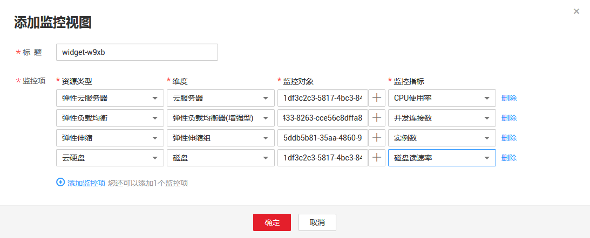

# 添加监控视图

在完成监控面板的创建后，您就可以添加监控视图对云服务进行监控。目前每个监控面板最多支持24个监控视图。

在同一个监控视图里，您可以添加20个监控指标，支持跨服务、跨维度、跨指标进行对比监控。

## 操作步骤

1.  登录管理控制台。
2.  单击“管理与部署 \> 云监控”。
3.  选择“总览 \> 监控面板”，切换到需要添加监控视图的监控面板，然后单击，或单击“添加监控视图”。

    系统弹出“添加监控视图”窗口。

    **图 1**  添加监控视图  
    

4.  在“添加监控视图”界面，参照[表1](#table49303610201913)完成参数配置。

    > **说明：**   
    >添加监控项时，需要从左向右的级联顺序添加，只有完成前一选项的添加才可以继续对后面的选项进行添加。  

    **表 1**  配置参数

    
    <table><thead align="left"><tr id="row45163464201913"><th class="cellrowborder" valign="top" width="16.161616161616163%" id="mcps1.2.4.1.1">
<strong id="b1994854291953">参数</strong>

    </th>
    <th class="cellrowborder" valign="top" width="50.505050505050505%" id="mcps1.2.4.1.2">
<strong id="b521920591953">参数说明</strong>

    </th>
    <th class="cellrowborder" valign="top" width="33.333333333333336%" id="mcps1.2.4.1.3">
<strong id="b2010245291953">取值样例</strong>

    </th>
    </tr>
    </thead>
    <tbody><tr id="row6669499513283"><td class="cellrowborder" valign="top" width="16.161616161616163%" headers="mcps1.2.4.1.1 ">
标题

    </td>
    <td class="cellrowborder" valign="top" width="50.505050505050505%" headers="mcps1.2.4.1.2 ">
自定义关注指标组件的标题名称，该名称只能由中文、英文字母、数字、下划线、中划线组成。

    </td>
    <td class="cellrowborder" valign="top" width="33.333333333333336%" headers="mcps1.2.4.1.3 ">
用户自定义。

    </td>
    </tr>
    <tr id="row28440509201913"><td class="cellrowborder" valign="top" width="16.161616161616163%" headers="mcps1.2.4.1.1 ">
资源类型

    </td>
    <td class="cellrowborder" valign="top" width="50.505050505050505%" headers="mcps1.2.4.1.2 ">
所关注指标对应的服务名称。

    </td>
    <td class="cellrowborder" valign="top" width="33.333333333333336%" headers="mcps1.2.4.1.3 ">
弹性云服务器

    </td>
    </tr>
    <tr id="row3263078104332"><td class="cellrowborder" valign="top" width="16.161616161616163%" headers="mcps1.2.4.1.1 ">
维度

    </td>
    <td class="cellrowborder" valign="top" width="50.505050505050505%" headers="mcps1.2.4.1.2 ">
所关注指标的维度名称。

    </td>
    <td class="cellrowborder" valign="top" width="33.333333333333336%" headers="mcps1.2.4.1.3 ">
云服务器

    </td>
    </tr>
    <tr id="row4738957214147"><td class="cellrowborder" valign="top" width="16.161616161616163%" headers="mcps1.2.4.1.1 ">
监控对象

    </td>
    <td class="cellrowborder" valign="top" width="50.505050505050505%" headers="mcps1.2.4.1.2 ">
所关注指标对应的监控对象。

    
可支持一次勾选多个监控对象。

    </td>
    <td class="cellrowborder" valign="top" width="33.333333333333336%" headers="mcps1.2.4.1.3 ">
-

    </td>
    </tr>
    <tr id="row3293048201913"><td class="cellrowborder" valign="top" width="16.161616161616163%" headers="mcps1.2.4.1.1 ">
监控指标

    </td>
    <td class="cellrowborder" valign="top" width="50.505050505050505%" headers="mcps1.2.4.1.2 ">
所关注指标的名称。

    </td>
    <td class="cellrowborder" valign="top" width="33.333333333333336%" headers="mcps1.2.4.1.3 ">
CPU使用率

    </td>
    </tr>
    </tbody>
    </table>

5.  单击“确定”，完成监控视图的添加。

    监控面板上可以查看新添加监控视图的监控走势图，单击，可放大查看详细的指标对比数据。

