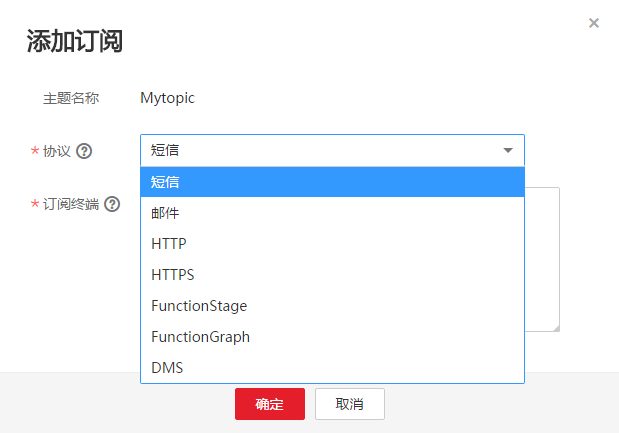

# 添加订阅

主题是消息通知服务发送广播的通道。因此完成主题的创建之后，需要为这个主题添加相关的订阅者，这样，在监控指标触发告警条件时才能够将告警信息通过主题发送给订阅这个主题的订阅者。

## 添加订阅步骤

1.  登录管理控制台。
2.  选择“应用服务” \> “消息通知服务”。

    进入消息通知服务页面。

3.  在左侧导航栏，选择“主题管理” \> “主题”。

    进入主题页面。

4.  在主题列表中，选择您要向其添加订阅者的主题，在右侧“操作”栏单击“添加订阅”。

    此时将显示“添加订阅”对话框。

    **图 1**  添加订阅  
    

5.  在“协议”下拉框中选择订阅终端支持的协议，在“订阅终端”输入框中输入对应的订阅终端。
6.  单击“确定”。

    新增订阅将显示在页面下方的订阅列表中。

