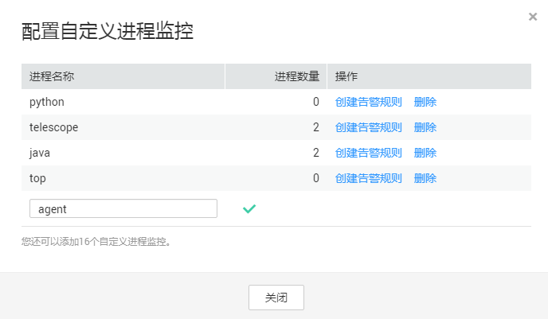

# 添加进程监控<a name="ZH-CN_TOPIC_0137301203"></a>

进程监控是针对主机内活跃进程进行的监控，默认采集活跃进程消耗的CPU、内存，以及打开的文件数量等信息。自定义进程监控可采集关键进程的数量，随时获取关键进程的运行状态。

> **说明：**   
>自定义进程监控暂时只支持华为-北京一（cn-north-1）、华南-广州（cn-south-1）、华东-上海二（cn-east-2），如果您想要使用自定义进程监控，请联系客服开通。  

## 监控指定进程数量<a name="section19991919151310"></a>

假设主机上当前运行如下几个进程 ：

```
/usr/bin/java
/usr/bin/ntpd
/telescope
/usr/bin/python
```

您配置了3个进程关键字，则采集结果分别如下：

-   配置关键字为：java，采集到的进程数：1。
-   配置关键字为：telescope，采集到的进程数：1。
-   配置关键字为：/usr/bin，采集到的进程数：3。

**添加指定进程的操作步骤**：

1.  登录管理控制台。
2.  单击“管理与部署 \> 云监控服务”。
3.  单击页面左侧的“主机监控”，进入“主机监控”页面。
4.  在“主机监控”页面，单击资源所在行的“监控状态”开关，开启“操作系统监控”功能。
5.  单击资源所在行的“查看监控指标”，进入“操作系统监控”页面。
6.  单击“操作系统监控”右侧的“进程监控”，进入“进程监控”页面。
7.  在“进程监控”页面，单击自定义进程数右侧的“配置”，进入“配置自定义进程监控”页面，配置进程名称或进程名关键字，如[图1](#fig1191910596285)所示。

    **图 1**  配置自定义进程监控<a name="fig1191910596285"></a>  
    

    > **说明：**   
    >上图中的“进程数量”在配置自定义监控时不需要配置，在您配置进程关键字后系统随后会自动刷新展示匹配关键字的进程数量。  

    配置完成后，您可以在“进程监控”页面的“自定义进程数”区域框查看您设置的自定义进程的数量。


## 创建自定义进程监控的告警通知<a name="section9424320181118"></a>

配置了自定义进程数量的告警通知，当进程的数量减少或增加时，云监控服务会第一时间通知到您。

**设置自定义进程数量异常告警通知的操作步骤**：

1.  登录管理控制台。
2.  单击“管理与部署 \> 云监控服务”。
3.  单击页面左侧的“主机监控”，进入“主机监控”页面。
4.  在“主机监控”页面，单击资源所在行的“监控状态”开关，开启“操作系统监控”功能。
5.  单击资源所在行的“查看监控指标”，进入“操作系统监控”页面。
6.  单击“操作系统监控”右侧的“进程监控”，进入“进程监控”页面。
7.  在“进程监控”页面，单击自定义进程数右侧的“配置”。

    进入“配置自定义进程监控”页面。

8.  单击需要创建告警规则的进程后的“创建告警规则”。
9.  配置告警规则基本信息，在“告警策略”参数配置为“（Agent）指定进程数”。其他参数配置请参考[创建主机监控的告警通知](创建主机监控的告警通知.md)[添加进程监控](添加进程监控.md)。

