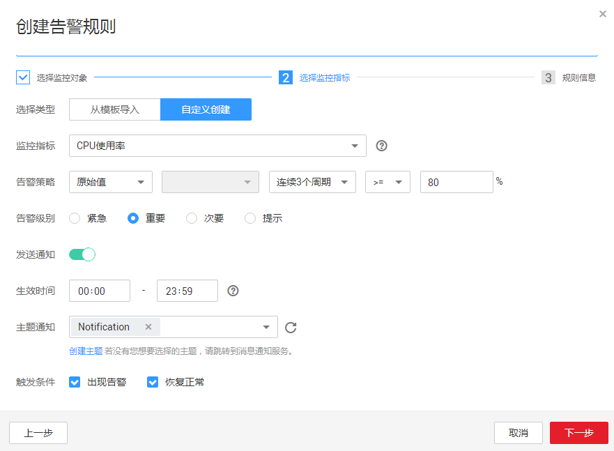

# 用户为某一监控指标创建自定义告警规则

云监控提供的创建自定义告警功能，旨在帮助用户对单个或多个相同云服务的单个监控指标创建告警规则，便于用户对该类服务的某一指标进行统一监控。

## 添加自定义告警规则

1.  登录管理控制台。
2.  单击“管理与部署 \> 云监控”。
3.  在“告警 \> 告警规则”界面，单击“创建告警规则”。
4.  在“创建告警规则”界面，根据界面提示配置参数。
    1.  选择监控对象，根据界面提示配置参数，如[表1](#table35986202162751)所示。然后单击“下一步”。

        **图 1**  创建告警规则（自定义）  
        

        **表 1**  配置参数

        
        <table><thead align="left"><tr id="row7480685162751"><th class="cellrowborder" valign="top" width="16.6%" id="mcps1.2.4.1.1">
参数

        </th>
        <th class="cellrowborder" valign="top" width="50.07%" id="mcps1.2.4.1.2">
参数说明

        </th>
        <th class="cellrowborder" valign="top" width="33.33%" id="mcps1.2.4.1.3">
取值样例

        </th>
        </tr>
        </thead>
        <tbody><tr id="row37125236162751"><td class="cellrowborder" valign="top" width="16.6%" headers="mcps1.2.4.1.1 ">
资源类型

        </td>
        <td class="cellrowborder" valign="top" width="50.07%" headers="mcps1.2.4.1.2 ">
配置告警规则监控的云服务资源名称。

        </td>
        <td class="cellrowborder" valign="top" width="33.33%" headers="mcps1.2.4.1.3 ">
弹性云服务器

        </td>
        </tr>
        <tr id="row10616740162751"><td class="cellrowborder" valign="top" width="16.6%" headers="mcps1.2.4.1.1 ">
维度

        </td>
        <td class="cellrowborder" valign="top" width="50.07%" headers="mcps1.2.4.1.2 ">
用于指定告警规则对应指标的维度名称

        </td>
        <td class="cellrowborder" valign="top" width="33.33%" headers="mcps1.2.4.1.3 ">
云服务器

        </td>
        </tr>
        <tr id="row628311193011"><td class="cellrowborder" valign="top" width="16.6%" headers="mcps1.2.4.1.1 ">
监控范围

        </td>
        <td class="cellrowborder" valign="top" width="50.07%" headers="mcps1.2.4.1.2 ">
告警规则适用的资源范围，可选择资源分组或指定资源。

        
 说明： 

当选择资源分组时，该分组下任何资源满足告警策略时，都会触发告警通知。

        

        </td>
        <td class="cellrowborder" valign="top" width="33.33%" headers="mcps1.2.4.1.3 ">
指定资源

        </td>
        </tr>
        <tr id="row53988257162836"><td class="cellrowborder" valign="top" width="16.6%" headers="mcps1.2.4.1.1 ">
监控对象

        </td>
        <td class="cellrowborder" valign="top" width="50.07%" headers="mcps1.2.4.1.2 ">
用来配置该告警规则针对的具体资源，可以是一个或多个。

        </td>
        <td class="cellrowborder" valign="top" width="33.33%" headers="mcps1.2.4.1.3 ">
-

        </td>
        </tr>
        </tbody>
        </table>

    2.  选择监控指标，选择“自定义创建”，参照[表2](#table4534051437)完成参数配置。

        **图 2**  自定义创建  
        

        **表 2**  配置参数

        
        <table><thead align="left"><tr id="row3530951333"><th class="cellrowborder" valign="top" width="17%" id="mcps1.2.4.1.1">
参数

        </th>
        <th class="cellrowborder" valign="top" width="50%" id="mcps1.2.4.1.2">
参数说明

        </th>
        <th class="cellrowborder" valign="top" width="33%" id="mcps1.2.4.1.3">
取值样例

        </th>
        </tr>
        </thead>
        <tbody><tr id="row45306511317"><td class="cellrowborder" valign="top" width="17%" headers="mcps1.2.4.1.1 ">
选择类型

        </td>
        <td class="cellrowborder" valign="top" width="50%" headers="mcps1.2.4.1.2 ">
选择自定义创建。

        </td>
        <td class="cellrowborder" valign="top" width="33%" headers="mcps1.2.4.1.3 ">
自定义创建

        </td>
        </tr>
        <tr id="row45317514311"><td class="cellrowborder" valign="top" width="17%" headers="mcps1.2.4.1.1 ">
监控指标

        </td>
        <td class="cellrowborder" valign="top" width="50%" headers="mcps1.2.4.1.2 ">
例如：

        <ul id="ul1753119519317"><li>CPU使用率
该指标用于统计测量对象的CPU使用率，以百分比为单位。

        </li></ul>
        <ul id="ul1531145138"><li>内存使用率
该指标用于统计测量对象的内存使用率，以百分比为单位。

        </li></ul>
        </td>
        <td class="cellrowborder" valign="top" width="33%" headers="mcps1.2.4.1.3 ">
CPU使用率

        </td>
        </tr>
        <tr id="row137702043153419"><td class="cellrowborder" valign="top" width="17%" headers="mcps1.2.4.1.1 ">
告警策略

        </td>
        <td class="cellrowborder" valign="top" width="50%" headers="mcps1.2.4.1.2 ">
触发告警的告警策略。

        
例如：监控周期为5分钟，连续三个周期原始值≥80%

        </td>
        <td class="cellrowborder" valign="top" width="33%" headers="mcps1.2.4.1.3 ">
-

        </td>
        </tr>
        <tr id="row125695754311"><td class="cellrowborder" valign="top" width="17%" headers="mcps1.2.4.1.1 ">
告警级别

        </td>
        <td class="cellrowborder" valign="top" width="50%" headers="mcps1.2.4.1.2 ">
根据告警的严重程度不同等级，可选择紧急、重要、次要、提示。

        </td>
        <td class="cellrowborder" valign="top" width="33%" headers="mcps1.2.4.1.3 ">
重要

        </td>
        </tr>
        <tr id="row14533185337"><td class="cellrowborder" valign="top" width="17%" headers="mcps1.2.4.1.1 ">
发送通知

        </td>
        <td class="cellrowborder" valign="top" width="50%" headers="mcps1.2.4.1.2 ">
配置是否发送邮件、短信、HTTP和HTTPS通知用户。

        
选择“是”（推荐选择），会发送通知；选择“否”，不会发送通知。

        </td>
        <td class="cellrowborder" valign="top" width="33%" headers="mcps1.2.4.1.3 ">
是

        </td>
        </tr>
        <tr id="row18118102123613"><td class="cellrowborder" valign="top" width="17%" headers="mcps1.2.4.1.1 ">
生效时间

        </td>
        <td class="cellrowborder" valign="top" width="50%" headers="mcps1.2.4.1.2 ">
该告警规则仅在生效时间内发送通知消息。

        
如生效时间为00:00-8:00，则该告警规则仅在00:00-8:00发送通知消息。

        </td>
        <td class="cellrowborder" valign="top" width="33%" headers="mcps1.2.4.1.3 ">
-

        </td>
        </tr>
        <tr id="row115341653311"><td class="cellrowborder" valign="top" width="17%" headers="mcps1.2.4.1.1 ">
主题通知

        </td>
        <td class="cellrowborder" valign="top" width="50%" headers="mcps1.2.4.1.2 ">
需要发送告警通知的主题名称。

        
当发送通知选择“是”时，需要选择已有的主题名称，若此处没有需要的主题则需先创建主题，该功能会调用消息通知服务（SMN），创建主题请参见《消息通知服务用户指南》。

        </td>
        <td class="cellrowborder" valign="top" width="33%" headers="mcps1.2.4.1.3 ">
-

        </td>
        </tr>
        <tr id="row17534558319"><td class="cellrowborder" valign="top" width="17%" headers="mcps1.2.4.1.1 ">
触发条件

        </td>
        <td class="cellrowborder" valign="top" width="50%" headers="mcps1.2.4.1.2 ">
可以选择“出现告警”、“恢复正常”两种状态，作为触发告警通知的条件。

        </td>
        <td class="cellrowborder" valign="top" width="33%" headers="mcps1.2.4.1.3 ">
-

        </td>
        </tr>
        </tbody>
        </table>

    3.  规则信息，根据界面提示配置参数，如[表3](#table7623731163957)所示。配置完成后，单击“添加”，完成自定义告警规则的添加。

        **表 3**  配置参数

        
        <table><thead align="left"><tr id="row1169056163957"><th class="cellrowborder" valign="top" width="16.42%" id="mcps1.2.4.1.1">
参数

        </th>
        <th class="cellrowborder" valign="top" width="50.62%" id="mcps1.2.4.1.2">
参数说明

        </th>
        <th class="cellrowborder" valign="top" width="32.96%" id="mcps1.2.4.1.3">
取值样例

        </th>
        </tr>
        </thead>
        <tbody><tr id="row36013392163957"><td class="cellrowborder" valign="top" width="16.42%" headers="mcps1.2.4.1.1 ">
名称

        </td>
        <td class="cellrowborder" valign="top" width="50.62%" headers="mcps1.2.4.1.2 ">
系统会随机产生一个名称，用户也可以进行修改。

        </td>
        <td class="cellrowborder" valign="top" width="32.96%" headers="mcps1.2.4.1.3 ">
alarm-b6al

        </td>
        </tr>
        <tr id="row2717654163957"><td class="cellrowborder" valign="top" width="16.42%" headers="mcps1.2.4.1.1 ">
描述

        </td>
        <td class="cellrowborder" valign="top" width="50.62%" headers="mcps1.2.4.1.2 ">
告警规则描述（此参数非必填项）。

        </td>
        <td class="cellrowborder" valign="top" width="32.96%" headers="mcps1.2.4.1.3 ">
-

        </td>
        </tr>
        </tbody>
        </table>

