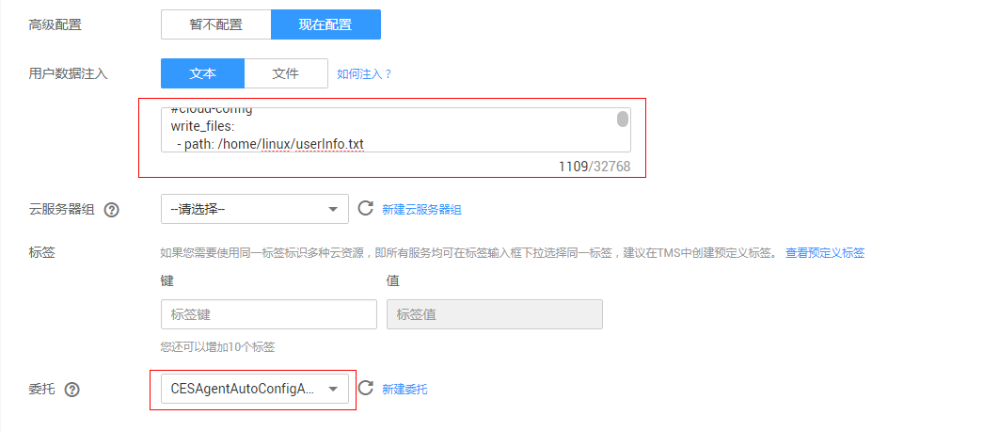

# 购买ECS时安装Agent（仅支持Linux）<a name="ZH-CN_TOPIC_0085245598"></a>

## 操作场景<a name="zh-cn_topic_0085189469_zh-cn_topic_0078544024_section10035481163223"></a>

本章节主要介绍如何在购买弹性云服务器时，将用户数据脚本内容（cloud-config）粘贴到“高级配置 \> 现在配置 \> 用户数据注入”的文本框，在ECS启动后执行Cloud-init，自动安装Agent，为用户提供主机的系统级、主动式、细颗粒度的监控服务。

> **说明：**   
>-   自动安装暂不支持BMS。  
>-   镜像选择请参见[Agent支持的系统有哪些？](https://support.huaweicloud.com/ces_faq/ces_faq_0024.html)。  

## 前提条件<a name="zh-cn_topic_0085189469_section10281815125918"></a>

-   已修改VPC的子网DNS地址并配置安全组，为购买后的ECS添加域名解析，具体操作步骤请参见[修改DNS与安全组](https://support.huaweicloud.com/ces_faq/ces_faq_0038.html)。
-   已创建委托：CESAgentAutoConfigAgency，请参见[如何创建委托？](https://support.huaweicloud.com/ces_faq/ces_faq_0028.html)。
-   已下载cloud-config配置，下载路径[https://telescope.obs.cn-north-1.myhuaweicloud.com/agent/cloudinit\_conf\_template.txt](https://telescope.obs.cn-north-1.myhuaweicloud.com/agent/cloudinit_conf_template.txt)。

    **表 1**  获取安装包

    <a name="table13927113195815"></a>
    <table><thead align="left"><tr id="row192710134585"><th class="cellrowborder" valign="top" width="29.29%" id="mcps1.2.3.1.1"><p id="p8927141395810"><a name="p8927141395810"></a><a name="p8927141395810"></a>文件名</p>
    </th>
    <th class="cellrowborder" valign="top" width="70.71%" id="mcps1.2.3.1.2"><p id="p209270139583"><a name="p209270139583"></a><a name="p209270139583"></a>获取路径</p>
    </th>
    </tr>
    </thead>
    <tbody><tr id="row192771365815"><td class="cellrowborder" valign="top" width="29.29%" headers="mcps1.2.3.1.1 "><p id="p992791315818"><a name="p992791315818"></a><a name="p992791315818"></a>cloudinit_conf_template.txt</p>
    </td>
    <td class="cellrowborder" valign="top" width="70.71%" headers="mcps1.2.3.1.2 "><p id="p1092731335812"><a name="p1092731335812"></a><a name="p1092731335812"></a>下载路径：<a href="https://telescope.obs.cn-north-1.myhuaweicloud.com/agent/cloudinit_conf_template.txt" target="_blank" rel="noopener noreferrer">https://telescope.obs.cn-north-1.myhuaweicloud.com/agent/cloudinit_conf_template.txt</a></p>
    </td>
    </tr>
    </tbody>
    </table>


## 操作步骤<a name="zh-cn_topic_0085189469_section1585217366514"></a>

1.  登录管理控制台。
2.  单击“计算 \> 弹性云服务器”。
3.  在“弹性云服务器”界面，单击“购买弹性云服务器”。
4.  在“购买弹性云服务器”界面，配置弹性云服务器的规格参数。以下参数请按照要求配置，未提及参数请参考[购买并登录Linux弹性服务器](https://support.huaweicloud.com/qs-ecs/zh-cn_topic_0092494193.html)**。**
    -   “虚拟私有云”选择已配置好DNS的VPC。

        **图 1**  配置参数<a name="zh-cn_topic_0085189469_fig162431872498"></a>  
        

    -   登录方式选择“密钥对”。
    -   单击“高级配置”右侧的“现在配置”，拷贝如下样例或已下载的cloud-config配置，复制到“用户数据注入”文本框中，填入目的是在创建ECS后利用Cloudinit功能将安装配置Agent的步骤全部自动化。
    -   委托选择已创建的CESAgentAutoConfigAgency。

        **ProjectId、AccessKey、SecretKey、RegionId**、**Agent包地址**等参数说明请参见[表2](#table98161118365)。

        ```
        #cloud-config
        write_files:
          - path: /home/linux/userInfo.txt
            content: |
              {        
                "ProjectId": "XXXXXXXXXXXXXXXXXXXXXXXXXXXXXXXX",
                "AccessKey": "XXXXXXXXXXXXXXXXXXXX",
                "SecretKey": "XXXXXXXXXXXXXXXXXXXXXXXXXXXXXXXXXXXXXXXX",
                "RegionId": "cn-north-1"
              }
        
        runcmd:
          - cd /usr/local/ && wget https://obs.cn-north-1.myhuaweicloud.com/telescope/agent/telescope_linux_amd64.tar.gz && tar -zxvf telescope_linux_amd64.tar.gz
          - chmod 755 /usr/local/telescope_linux_amd64/install.sh && /usr/local/telescope_linux_amd64/install.sh
          - mv /home/linux/userInfo.txt /usr/local/telescope/bin/conf.json
          - cd /usr/local/ && wget http://169.254.169.254/openstack/latest/meta_data.json
          - cat meta_data.json | python -c 'import json,sys;uuid=json.load(sys.stdin)["uuid"];print (uuid)' > instanceId
          - if [ ! -s instanceId ]; then cat meta_data.json | python3 -c 'import json,sys;uuid=json.load(sys.stdin)["uuid"];print (uuid)' > instanceId;fi
          - sed -i "2i \  \"InstanceId\":\"$(cat instanceId)\"," /usr/local/telescope/bin/conf.json
          - rm /usr/local/meta_data.json /usr/local/instanceId
        ```

        **表 2**  公共配置参数

        <a name="table98161118365"></a>
        <table><thead align="left"><tr id="row3797119360"><th class="cellrowborder" valign="top" width="16.99%" id="mcps1.2.3.1.1"><p id="p2079191103613"><a name="p2079191103613"></a><a name="p2079191103613"></a>参数</p>
        </th>
        <th class="cellrowborder" valign="top" width="83.00999999999999%" id="mcps1.2.3.1.2"><p id="p17916113366"><a name="p17916113366"></a><a name="p17916113366"></a>说明</p>
        </th>
        </tr>
        </thead>
        <tbody><tr id="row4796114365"><td class="cellrowborder" valign="top" width="16.99%" headers="mcps1.2.3.1.1 "><p id="p37921163615"><a name="p37921163615"></a><a name="p37921163615"></a>ProjectId</p>
        </td>
        <td class="cellrowborder" valign="top" width="83.00999999999999%" headers="mcps1.2.3.1.2 "><p id="p87916119363"><a name="p87916119363"></a><a name="p87916119363"></a>ProjectId可不用配置，保持"ProjectId": "",即可。若需要配置，请参考已下获取方式。</p>
        <p id="p379171120367"><a name="p379171120367"></a><a name="p379171120367"></a>项目ID，获取方式如下：</p>
        <a name="ol147951116369"></a><a name="ol147951116369"></a><ol id="ol147951116369"><li>登录管理控制台，单击右上角“用户名”，选择“我的凭证”；</li><li>在项目列表中，查看ECS或BMS资源对应的所属区域的项目ID。</li></ol>
        </td>
        </tr>
        <tr id="row138001153620"><td class="cellrowborder" valign="top" width="16.99%" headers="mcps1.2.3.1.1 "><p id="p679611113619"><a name="p679611113619"></a><a name="p679611113619"></a>AccessKey/SecretKey</p>
        </td>
        <td class="cellrowborder" valign="top" width="83.00999999999999%" headers="mcps1.2.3.1.2 "><p id="p179201117365"><a name="p179201117365"></a><a name="p179201117365"></a>访问密钥，获取方式如下：</p>
        <p id="p6796117360"><a name="p6796117360"></a><a name="p6796117360"></a>登录管理控制台，单击右上角“用户名”，选择“我的凭证 &gt; 管理访问秘钥”；</p>
        <a name="ul1280141119361"></a><a name="ul1280141119361"></a><ul id="ul1280141119361"><li>如已有访问密钥，查看创建时下载保存的credentials.csv文件中，获取文件中记录的Key值即可；</li><li>如未创建，则通过“新增访问密钥”可创建新的访问密钥，妥善保存credentials.csv文件，并获取文件中记录的Key值。<div class="notice" id="note6801211103615"><a name="note6801211103615"></a><a name="note6801211103615"></a><span class="noticetitle"> 注意： </span><div class="noticebody"><a name="ul68031116367"></a><a name="ul68031116367"></a><ul id="ul68031116367"><li>为了安全考虑，建议该用户为IAM用户，并且权限仅为CES Administrator和LTS Administrator，请参见<a href="https://support.huaweicloud.com/qs-iam/iam_01_0030.html" target="_blank" rel="noopener noreferrer">创建用户组并授权</a>、<a href="https://support.huaweicloud.com/qs-iam/iam_01_0031.html" target="_blank" rel="noopener noreferrer">创建用户并登录</a>。</li><li>配置的AccessKey必须在“我的凭证 &gt; 管理访问秘钥”列表中，否则将鉴权失败，云监控界面看不到操作系统监控数据。</li></ul>
        </div></div>
        </li></ul>
        </td>
        </tr>
        <tr id="row1780911163610"><td class="cellrowborder" valign="top" width="16.99%" headers="mcps1.2.3.1.1 "><p id="p2080161133616"><a name="p2080161133616"></a><a name="p2080161133616"></a>RegionId</p>
        </td>
        <td class="cellrowborder" valign="top" width="83.00999999999999%" headers="mcps1.2.3.1.2 "><p id="p78016115365"><a name="p78016115365"></a><a name="p78016115365"></a>区域ID，例如：ECS或BMS资源所属区域为“华北-北京一”，则RegionID为“cn-north-1”，其他区域的RegionID详见<a href="https://developer.huaweicloud.com/endpoint" target="_blank" rel="noopener noreferrer">https://developer.huaweicloud.com/endpoint</a>。</p>
        </td>
        </tr>
        <tr id="row188191123618"><td class="cellrowborder" valign="top" width="16.99%" headers="mcps1.2.3.1.1 "><p id="p2819114362"><a name="p2819114362"></a><a name="p2819114362"></a>Agent包地址</p>
        </td>
        <td class="cellrowborder" valign="top" width="83.00999999999999%" headers="mcps1.2.3.1.2 "><p id="p2081171173610"><a name="p2081171173610"></a><a name="p2081171173610"></a>示例中Agent包地址请按照各Region替换成具体的地址，具体地址请参见<a href="#table08212116368">表3</a>。</p>
        </td>
        </tr>
        </tbody>
        </table>

        **表 3**  安装包地址

        <a name="table08212116368"></a>
        <table><thead align="left"><tr id="row481201111361"><th class="cellrowborder" valign="top" width="26.47%" id="mcps1.2.4.1.1"><p id="p381141143612"><a name="p381141143612"></a><a name="p381141143612"></a>名称</p>
        </th>
        <th class="cellrowborder" valign="top" width="9.64%" id="mcps1.2.4.1.2"><p id="p38151173619"><a name="p38151173619"></a><a name="p38151173619"></a>格式</p>
        </th>
        <th class="cellrowborder" valign="top" width="63.89%" id="mcps1.2.4.1.3"><p id="p1981011163615"><a name="p1981011163615"></a><a name="p1981011163615"></a>获取路径</p>
        </th>
        </tr>
        </thead>
        <tbody><tr id="row48211133613"><td class="cellrowborder" valign="top" width="26.47%" headers="mcps1.2.4.1.1 "><p id="p581111103615"><a name="p581111103615"></a><a name="p581111103615"></a>Linux 64位Agent安装包</p>
        </td>
        <td class="cellrowborder" valign="top" width="9.64%" headers="mcps1.2.4.1.2 "><p id="p482311153613"><a name="p482311153613"></a><a name="p482311153613"></a>tar.gz</p>
        </td>
        <td class="cellrowborder" valign="top" width="63.89%" headers="mcps1.2.4.1.3 "><p id="p1882151133614"><a name="p1882151133614"></a><a name="p1882151133614"></a>下载路径</p>
        <p id="p1982711153613"><a name="p1982711153613"></a><a name="p1982711153613"></a>华北-北京一：<a href="https://telescope.obs.cn-north-1.myhuaweicloud.com/agent/telescope_linux_amd64.tar.gz">https://telescope.obs.cn-north-1.myhuaweicloud.com/agent/telescope_linux_amd64.tar.gz</a></p>
        <p id="p198216115364"><a name="p198216115364"></a><a name="p198216115364"></a>华北-北京四：<a href="https://telescope-cn-north-4.obs.cn-north-4.myhuaweicloud.com/agent/telescope_linux_amd64.tar.gz">https://telescope-cn-north-4.obs.cn-north-4.myhuaweicloud.com/agent/telescope_linux_amd64.tar.gz</a></p>
        <p id="p78216115362"><a name="p78216115362"></a><a name="p78216115362"></a>华南-广州：<a href="https://telescope-cn-south-1.obs.cn-south-1.myhuaweicloud.com/agent/telescope_linux_amd64.tar.gz">https://telescope-cn-south-1.obs.cn-south-1.myhuaweicloud.com/agent/telescope_linux_amd64.tar.gz</a></p>
        <p id="p108291115362"><a name="p108291115362"></a><a name="p108291115362"></a>华东-上海二：<a href="https://telescope-cn-east-2.obs.cn-east-2.myhuaweicloud.com/agent/telescope_linux_amd64.tar.gz">https://telescope-cn-east-2.obs.cn-east-2.myhuaweicloud.com/agent/telescope_linux_amd64.tar.gz</a></p>
        <p id="p98219115365"><a name="p98219115365"></a><a name="p98219115365"></a>亚太-香港：</p>
        <p id="p282711173617"><a name="p282711173617"></a><a name="p282711173617"></a><a href="https://telescope-ap-southeast-1.obs.ap-southeast-1.myhuaweicloud.com/agent/telescope_linux_amd64.tar.gz">https://telescope-ap-southeast-1.obs.ap-southeast-1.myhuaweicloud.com/agent/telescope_linux_amd64.tar.gz</a></p>
        <p id="p168281143617"><a name="p168281143617"></a><a name="p168281143617"></a>亚太-曼谷：<a href="https://telescope-ap-southeast-2.obs.ap-southeast-2.myhuaweicloud.com/agent/telescope_linux_amd64.tar.gz">https://telescope-ap-southeast-2.obs.ap-southeast-2.myhuaweicloud.com/agent/telescope_linux_amd64.tar.gz</a></p>
        </td>
        </tr>
        </tbody>
        </table>

        **图 2**  用户数据注入<a name="fig6831211163614"></a>  
        


5.  单击“立即购买”创建弹性云服务器。
6.  弹性云服务器购买成功后，等待10分钟左右（ECS创建成功后还需要执行一些初始化配置），在主机监控界面，勾选已安装插件的主机，单击"修复插件配置"，在弹出页面上，单击"一键修复"，完成配置Agent。
7.  等待3-5min左右，查看细粒度的监控数据。

