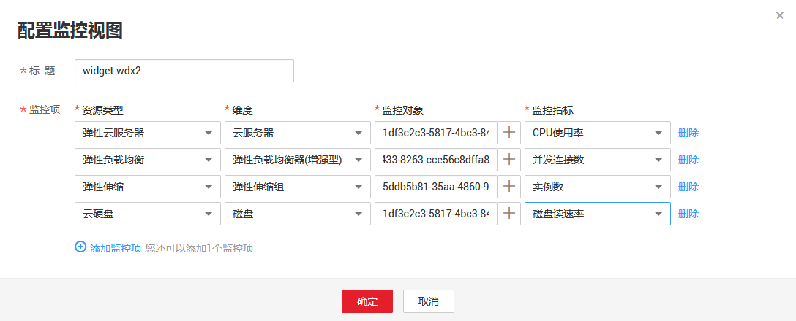

# 配置监控视图

随着云上服务的业务日趋增长，用户对云监控的使用也日渐成熟，监控视图已添加的监控指标已经无法满足当前的监控需求，用户需要对监控视图中的监控指标进行修改、替换等操作。本章节指导用户如何实现监控指标的增加、修改、删除等日常操作。

## 操作步骤

1.  登录管理控制台。
2.  在管理控制台左上角单击图标，选择区域和项目。
3.  单击“管理与部署 \> 云监控”。
4.  单击页面左侧的监控面板，选择需要修改的监控面板，在待配置的“监控视图”区域单击，弹出“配置监控视图”页面。

在该页面，用户可以对监控视图标题进行编辑，也可以增加监控指标、删除监控指标或修改当前已添加的监控指标。

**图 1**  配置监控视图  

> **说明：**   
>目前单个“监控视图”最多支持添加20个监控指标。  

